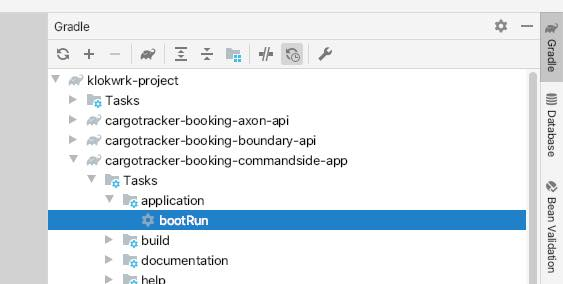
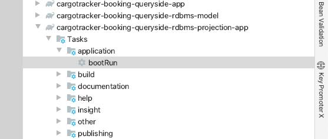
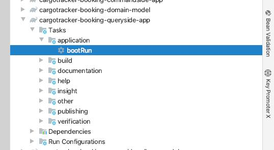
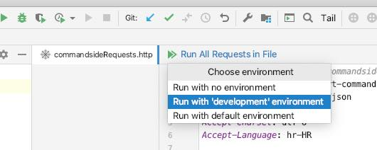

## Project information
Project Klokwrk is in its incubation phase so please note that significant changes are possible during a couple of initial releases. We encourage you to take a look, try it out and give us your
feedback and ideas for future development. After a couple of first releases we will also enable Issues. Until then, please feel free to send us your feedback directly via email.

## Starting up and trying the whole thing
Environment:
- OSX (should work with any desktop Linux distro and with Windows with appropriate bash-shell like git-bash)
- JDK 11 (should work with JDK 8)
- Gradle 6.3.0
- IDEA Ultimate 2020.1.1 (should work with IDEA Community except for http client which is part of the Ultimate edition)
- Docker
- httpie

### From the shell
Open your shell at the project root and execute following commands (shell-1):

    cd support/docker
    ./dockerComposeUpInfrastructure.sh

Open another shell (shell-2) at the project root and execute following command (generating Groovydoc is skipped to speed things up)

    ./gradlew clean assemble -x groovydocJar

There are three apps that needs to be run, and for each open a new shell at the project root (shell-3, shell-4 and shell-5)

    ./gradlew -p cargotracker/cargotracker-booking-commandside-app bootRun
    ./gradlew -p cargotracker/cargotracker-booking-queryside-rdbms-projection-app bootRun
    ./gradlew -p cargotracker/cargotracker-booking-queryside-app bootRun

Going back to shell-2, some HTTP requests can be tried via `httpie`:
- commandside

      http POST http://localhost:8080/cargotracker-booking-commandside/cargo-booking-command/cargo-book \
        Content-Type:application/json Accept:application/json Accept-Charset:utf-8 Accept-Language:hr-HR \
        originLocation=HRRJK \
        destinationLocation=HRZAG

      http POST http://localhost:8080/cargotracker-booking-commandside/cargo-booking-command/cargo-book \
        Content-Type:application/json Accept:application/json Accept-Charset:utf-8 Accept-Language:en \
        originLocation=HRRJK \
        destinationLocation=HRZAG

- queryside

    To be able to execute queryside request, from the previous commandside output we need to take the value of `aggregateIdentifier` element, and then try some queryside requests. For example:

      http POST http://localhost:8084/cargotracker-booking-queryside/cargo-booking-query/cargo-summary-query \
        Content-Type:application/json Accept:application/json Accept-Charset:utf-8 Accept-Language:hr-HR \
        aggregateIdentifier=9e4a13c8-cb74-4a01-9717-f41aaba5428d

      http POST http://localhost:8084/cargotracker-booking-queryside/cargo-booking-query/cargo-summary-query \
        Content-Type:application/json Accept:application/json Accept-Charset:utf-8 Accept-Language:en \
        aggregateIdentifier=9e4a13c8-cb74-4a01-9717-f41aaba5428d

When finished experimenting, applications can be stopped by `CTRL+C` (shell-3, shell-4, shell-5).

For stopping infrastructural components (shell-1), first we need to stop docker-compose log tailing by `CTRL+C`, and then do some cleanup with `./dockerComposeDownInfrastructure.sh`.

### From IDEA
Executing HTTP requests from CLI can be cumbersome, and many prefer some more user-friendly tool like Postman. If you develop from IDEA, you can also use IDEA's http client. Although it does not have
all niceties of Postman it can be really useful for storing series of requests as code artifacts in the project.

First, the project needs to be imported in IDEA as Gradle project. Next, either from the IDEA terminal or from external shell, infrastructural components needs to be started:

    cd support/docker
    ./dockerComposeUpInfrastructure.sh

Applications can also be started from CLI, but it might be preferable to use UI. Start applications exactly in listed order:
- Start commandside app by double-clicking on its `bootRun` Gradle task and wait until it is started up:

    

- Start queryside projection app by double-clicking on its `bootRun` Gradle task and wait until it is started up:

    

- Start queryside app by double-clicking on its `bootRun` Gradle task and wait until it is started up:

    

When all applications are started up, we can try executing some requests:
- Find and open `support/http-request/commandsideRequests.http`.
- Click on `Run All Requests in File` and select `Run with 'development' environment`.

    

- Repeat the same with `support/http-request/querysideRequests.http`.

When finished experimenting, applications can be stopped by `CMD+F2` shortcut or via IDEA "Run" tool window.

For stopping infrastructural components, stop docker-compose log tailing with `CTRL+C`, and then do some cleanup with `./dockerComposeDownInfrastructure.sh`.
