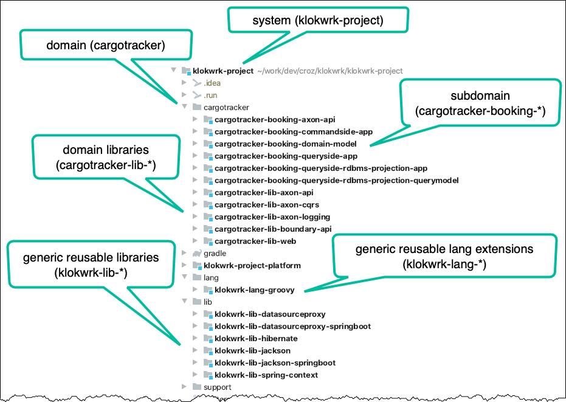
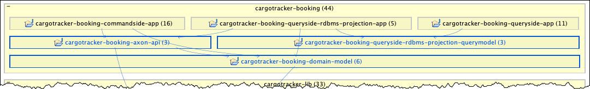
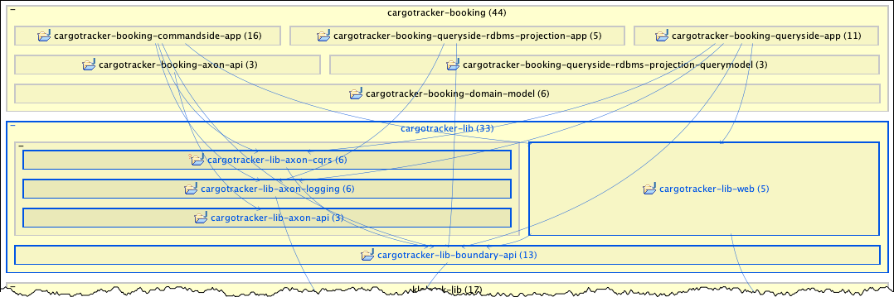
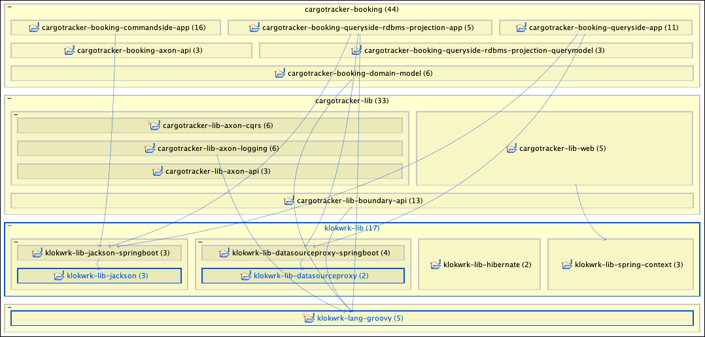
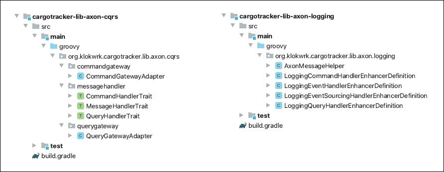
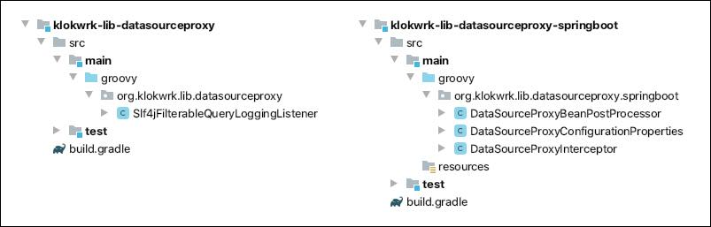
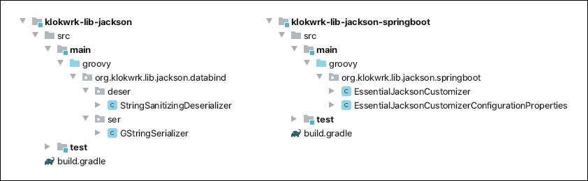
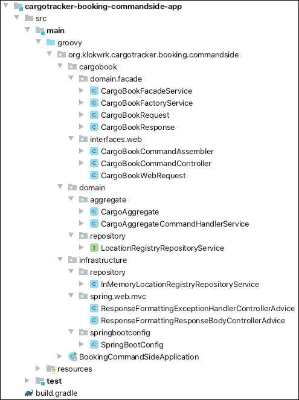

# Organizing modules and packages

## Introduction
It is not hard to find literature and references describing how to design and structure applications or even whole systems. For example, there are numerous books and articles describing decomposition
in domains and subdomains with domain-driven-design (DDD) or the ways to organize interaction between implementation artifacts with onion or clean architecture.

When it comes to mapping these concepts into more concrete artifacts in your source tree, it seems there is not so much guidance. It looks like many dilemmas are left unanswered. "How do I organize
my packages without disturbing the growth potential of my application?" or "How to organize application or system modules in a meaningful way that can lead to controlled management of dependencies
between modules and dependencies of each module towards 3rd party libraries?". However, articles and books about related topics do exist. We just need to be willing to dig deeper and beyond current
technical hypes, often ending up reading literature written a long time ago. Sometimes we cannot apply that venerable knowledge directly and need to draw our own conclusions that are hopefully
suitable for contemporary tech stacks.

It is not unusual concerns like these pop-up late in the development cycle, often after several releases are already in production. Even when they come to focus, it is typically tough to resolve
them since they might require dramatic refactoring of applications or the whole system. It might be easier if we have in place some suitable project structure from the start. It shouldn't disturb
development in the early phases and should be flexible enough to support the system's growth beyond initial expectations. The structure presented here is a conscious attempt trying to deal with some
hard issues that frequently occur in larger projects. With recent industry move towards microservices, organizing high-level development artifacts consciously has even more importance.

### Main goals
So, the **main goals** for our structure are:
- Provide means for organizing modules that will support future application and system growth and will enable controlled management of dependencies between modules and dependencies on 3rd party
  libraries.
- Provide a way for organizing packages that is flexible enough to support future development and feature expansion smoothly.

## Organizing modules
Let's start with modules of `klokwrk-project` that were available at the time of this writing (May 2020). Here is how they look in an IDE:

  
*Image 1 - Modules layout in an IDE*

### System
At the top is a **system artifact** (you can also call it "a platform" or "problem space") that represents a system being built. It maps to the whole problem space of our solution. In the early
stages, we will have only the parts of the whole, but as we add more pieces, they should have a proper place to be put-in. In our case system is named `klokwrk-project`, and all related artifacts
are placed under the system's directory.

### Domain
The `cargotracker` is the name of our core domain (or just domain in this context). The corresponding directory does not represent an artifact by itself. Instead, it just groups all artifacts
belonging to that domain. As system implementation grows, additional domain grouping directories might be added. Added domains might address important and distinguishing business features, or be more
supportive, or non-functional in nature (i.e., security-related).

#### Implementation note
Gradle build system does not directly support artifact-less directories that might be used for grouping. By its conventions, every directory known to the Gradle does produce some artifact (jar, war,
etc.). Fortunately, Gradle is flexible enough to support the described layout by some custom scripting in `settings.gradle`. The more elegant solution is to employ
[kordamp-gradle-plugins](https://github.com/kordamp/kordamp-gradle-plugins), the excellent portfolio of Gradle plugins with out-of-the-box support for our desired layout of the project (kordamp also
delivers support for some other project layouts).

### Subdomain
As explained in DDD, each business domain can be divided into subdomains. When modeling a solution for it, the business-level "subdomain" concept is mapped into a modeling-level "bounded context"
concept. In our example, the name of implementation artifact corresponding to the bounded context is prefixed with the domain name. Therefore, for `booking` subdomain of `cargotracker` domain, we
get `cargotracker-booking-*` modules.

There are multiple `cargotracker-booking` modules, but they are not all at the same level of abstraction. Modules with the `app` suffix are highest-level modules, representing runnable artifacts
([Spring Boot](https://spring.io/projects/spring-boot) microservice applications in this case). The products of other `cargotracker-booking` modules are non-runnable jar archives that are used as
dependencies by runnable modules. Although producing jars, these non-runnable modules do not have reusability potential outside of the `booking` subdomain. In other words, they are strictly specific
to the `booking` subdomain of the `cargotracker` domain, which is reflected in their naming.

Abstraction level and direction of compile-time dependencies is more clearly shown in the following image (partial `klokwrk-project` model from
[Structure101 Studio for Java](https://structure101.com)):

  
*Image 2 - Abstraction level and dependencies of booking subdomain modules*

#### Subdomain modules details
Let's take a look at the purpose of each `cargotracker-booking` module. First, we have `*-app` modules that utilize CQRS and event sourcing via
[Axon framework](https://github.com/AxonFramework/AxonFramework) and [related infrastructure](https://axoniq.io/product-overview/axon-server). Each of these apps implements a single high-level
CQRS/Event sourcing architectural component, so we ended up with `commandside` (command processing), `queryside` (query processing), and `queryside-rdbms-projection` (translating events into RDBMS
tables) applications.

Next we have `cargotracker-booking-axon-api` and `cargotracker-booking-queryside-rdbms-projection-model`. Both modules are at a similar abstraction level. They logically belong to the
subdomain's internal infrastructure and serve as a layer adapting to and using selected concrete technologies, and that requires compile-time access to some 3rd party libraries. Classes from these
modules are not exposed to the out-of-the-domain world. Module `cargotracker-booking-axon-api` defines commands and events that are data structures supporting Axon's implementation of CQRS/Event
sourcing. Commands and events are considered the primary internal APIs of CQRS/Event sourcing applications, which explains the name. Although commands and events are very close to the simple objects,
it is allowed for them to use Axon API at compile-time. Module `cargotracker-booking-queryside-rdbms-projection-model` hosts JPA-related classes responsible for implementing requirements of
abstract and technology-agnostic domain-level queries. Since the `booking` subdomain has selected an RDBMS system for building its primary projections and JPA as a database access technology, this
module will have a compile-time dependency on the JPA APIs.

Module `cargotracker-booking-domain-model` contains subdomain's value objects. It might look unusual we are mentioning only the value objects here. Where are aggregates and entities? In CQRS
applications, aggregates and entities are artifacts belonging to the commandside part of the application where they model their state and control consistency and invariants of inbound commands. Once
invariants are satisfied, commands are processed, the state of aggregates is updated, and events are emitted to the rest of the system. Where are the value objects then? In one part, domain value
objects model internal pieces of the aggregate state. But they are also used by events to convey these pieces to the listeners. Therefore, they are needed for both commandside and projections (even
queries might use them). Consequently, value objects are extracted into a sharable standalone module - `cargotracker-booking-domain-model`.

### Domain libraries
Expanded compile-time dependency graph, including `cargotracker` domain libraries, is shown in the next picture.

  
*Image 3 - `cargotracker` domain libraries dependencies*

Modules belonging to the group of domain libraries contain infrastructural code at the lower abstraction level then subdomain libraries. That code is reusable across the whole `cargotracker` domain
and is not specific to a particular subdomain. However, being infrastructural modules, they are related to the specific technology choices made for the domain in question. That can be seen in their
names to some extent, and in the selection of 3rd party libraries used by each module.

If we have multiple domains using the same tech stack, domain libraries should be pulled out into generic and reusable libraries group to make them more available. Besides, domain libraries can also
contain "incubating" libraries that are destined to be generic and widely reusable. But for various reasons, it is more convenient to keep them at the domain level temporarily.

Let's look quickly at what each of these modules contains. `cargotracker-lib-axon-cqrs` includes helpers that ease some aspects of working with Axon APIs. Module `cargotracker-lib-axon-logging`
provides logging infrastructure that gives more insight into the inner working of various Axon components. `cargotracker-lib-axon-api` brings in base classes and interfaces for working with commands
and events. Some may wonder why so many Axon related library modules? As we decided to have microservices for each significant runnable component in CQRS/Event sourcing application, it might be
expected for them to use different Axon dependencies (Axon framework is not delivered as a single jar, but rather contains multiple modules addressing different concerns). Beside high cohesion and
low coupling, differences in 3rd party dependencies are usually a significant hint for creating independent modules, even when high cohesion and low coupling attributes are not yet clearly visible
and apparent.

We have two modules left. `cargotracker-lib-web` contains classes related to the handling of HTTP requests and responses. In particular (at this stage of `klokwrk-project` development), these classes
deal with the formatting and localization of successful and exceptional JSON responses. Module `cargotracker-lib-boundary-api` formalizes general structures of domain boundary API that all inbound
channels (web, messaging, etc.) must follow to be able to speak with domain facades.

Boundary API refers to classes defining the data structures and exceptions that are part of the contract between the outside world interfaces (i.e., web, messaging) and domain hidden behind domain
facades. In general, boundary data structures and exceptions are allowed to be shared between domain and outside world interfaces. Domain facade will usually handle all boundary requests by
converting them into appropriate commands or queries. On the other side, deep domain artifacts like aggregates are allowed to throw boundary exceptions understood by the outside world when the
facade-level translation is not needed.

### Reusable generic libraries and language extensions
Going further down the abstraction ladder, we will find generic reusable libraries and language extensions. The reusability potential of these modules is high and is not tied to any domain. Here we
can discover supportive additions for various commonly used 3rd party libraries and helpers that expand SDK features of programming languages used in our system.

  
*Image 4 - `klokwrk` reusable libraries and language extensions*

The majority of these modules are used as direct compile-time dependencies from higher levels (blue arrows depict only compile-time dependencies). Still, we can also have runtime-only modules that
need to be available in the classpath but are not directly referenced from higher-level code (`klokwrk-lib-hibernate` is an example).

As the reusability of modules is high, and the abstraction level rather low, it is common for infrastructural code to reference these modules. In contrast, it is not expected that business-level
domain classes (i.e., aggregates, entities, and value objects) use them. However, language extensions are the exception. As they expand the capabilities of the programming language, the same language
in which domain classes are written, then it is allowed for domain classes to use these language extensions. In fact, some language extensions might be designed purposely to support the more
straightforward implementation of domain classes.

Another aspect worth keeping in mind is the potential number of dependencies that higher-level code might have on these modules. Successful reusable libraries can be used all over the place. Thus,
it is desirable to achieve the right level of implementation stability as soon as possible. In general, this will be easier to accomplish with modules narrower in their scope. A high level of code
coverage, proper and meaningful documentation, and several concrete usage scenarios are some tools that can all improve stability.

There are several modules in the group of reusable libraries. `klokwrk-lib-jackson` provides some custom serializers and deserializers not available in the
[Jackson](https://github.com/FasterXML/jackson) distribution. `klokwrk-lib-jackson-springboot` brings an opinionated way of setting Jackson's defaults and means for configuring them, if needed, from
the Spring Boot environment. Another pair of related modules deals with the excellent [datasource-proxy](https://github.com/ttddyy/datasource-proxy) library. `klokwrk-lib-datasourceproxy` introduces
useful extensions to the library, while `klokwrk-lib-datasourceproxy-springboot` provides support for setting up and configuring the library in Spring Boot context. Module `klokwrk-lib-spring-context`
contains customized extensions to the classes from the [Spring framework's](https://spring.io/projects/spring-framework) `spring-context` module. Currently, here we have support for creating a list
of message codes for resolving localized messages from resource bundles. Finally, `klokwrk-lib-hibernate` deals with some peculiarities of internal workings of
[Hibernate ORM](https://hibernate.org/orm/).

In the group of language extensions, we have a `klokwrk-lang-groovy` module. It contains some general-purpose constants, utility methods for convenient fetching of object's properties, and some
infrastructure helping with relaxing requirements of Groovy map constructor.

## Organizing packages
In the domain of separating **applications into packages**, several popular strategies are often mentioned. In most cases, we can hear about "packaging by layers" and "packaging by features" where
packaging by features usually dominates (at least on paper). Also, there is an approach that combines these two - "packaging by layered features" [1]. What about **packages in standalone libraries**?
There are no features or layers to offer at least some guidance. We have to turn our attention to different abstractions like "components" or "toolboxes" and even sometimes apply packaging by "kind"
in a very narrow scope, despite its lousy reputation [2].

The main principles are striving for a reasonable level of cohesion inside a package, trying to minimize accidental and unnecessary dependencies between packages, and avoiding cyclic dependencies at
all costs (tools like [Sonargraph](https://www.hello2morrow.com/products/sonargraph/explorer) and [Structure 101](https://structure101.com) can be of great help here). Sometimes it is an easy and
natural thing to do but often is not. Learning from others' experiences and being familiar with some formalized guidance can help [3][4]. However, you will commonly end up with your best judgment,
and if something does not feel right, it should probably be changed somehow.

When you are dealing with numerous modules, each containing a dozen of packages, applying some consistency rules can be a lifesaver. For example, in the `klokwrk-project`, each module's root package
name tries to use a hierarchy derived from a module name. With consistent and organized module naming in place, we can end up with root packages that do not collide between themself in the entire
system. For future maintenance and refactorings, this characteristic might be essential. Also, this is an excellent start for further packaging inside each module.

Let's look at how all this works in `klokwrk-project` on a few examples. We will start with packaging for libraries.

### Packaging for libraries
When organizing packages for libraries, `klokwrk-project` modules try to adhere to the principle of keeping high cohesion inside of packages while any circular dependency is strictly forbidden. At
the module level, cohesion is not that important as on package level, so we might have modules addressing different things. Yet these things still need to be close enough, allowing a module to have
a meaningful and concrete name (avoid modules containing words like "common", "misc", "utilities", etc.), and that required 3rd party libraries are not entirely heterogeneous. Since we are extending
or customizing features of concrete libraries, monitoring required 3rd party dependencies for a module is quite important. If they are disparate, we might need more fine-grained modules. On the other
hand, if we target specific higher-level consumers, we might want to include more heterogeneous features to avoid needless fine-grained modules that no one uses.

The first example (Image 5) shows the packaging of `cargotracker-lib-axon-cqrs` and `cargotracker-lib-axon-logging` modules dealing with different aspects of the Axon framework.

  
*Image 5 - general example of library packaging comparison*

Without exploring Axon's internal workings, packages seem to be understandable and coherent, keeping the right level of cohesion. After all, it is hard to fail with cohesion for that small number of
classes. Subpackages in `cargotracker-lib-axon-cqrs` are a bit more elaborate and look slightly unrelated, which lowers the cohesion of a module, but they all deal with similar enough things.

It might be surprising why these two modules are not combined into a single one. Putting aside that coming up with a meaningful name might be hard, if we look at consumers (Image 3), we can
see `cargotracker-lib-axon-cqrs` being used from `commandside` and `queryside` apps. At the same time, `cargotracker-lib-axon-logging` is also a dependency of the `projection` app. If lowered module
cohesion, problematic naming, and different consumers are not enough, taking into account that required 3rd party libraries are different gives us more than enough reasons for justifying the
existence of separate library modules.

Next, we have two low-level libraries supporting extension, customization, and configurability of 3rd party "datasource-proxy" library. Module `klokwrk-lib-datasourceproxy` provides extension itself,
while `klokwrk-lib-datasourceproxy-springboot` implements support and configurability for Spring Boot environment.

  
*Image 6 - datasourceproxy library packaging comparison*

After glancing over packages, one might think there is an error in `klokwrk-lib-datasourceproxy` since there are no subpackages. It's true. This is an error unless you take a less strict approach.
We have only a single class and no intention to add some more in the foreseeable future, so there is no real need for a subpackage. But if you don't feel being that loose, go ahead and add it.

If you only target Spring Boot apps, both modules can be combined. But with separate modules, you are allowing for core functionality to be used outside of the Spring Boot environment. Although for
slightly different reasons, approach with separate modules is usually taken from Spring Boot auto-configurable libraries, so we can justify our decision.

The last example is very similar, but now it's about the Jackson library.

  
*Image 7 - jackson library packaging comparison*

This time, in the core `klokwrk-lib-jackson` library, we need separated subpackages for splitting different functions. It is worth noting the names of subpackages. They are the same as for
corresponding packages in the Jackson library. This is standard practice when you are extending existing libraries, which aids in understanding and maintenance.

### Packaging for applications
So far, we were exploring mainly infrastructural concerns of our system. There was no real business logic involved. What happens when we try to add it? How should we organize it into packages? Is
there a way to logically and conveniently separate infrastructure from the domain?

For simpler systems, we can try organizing packages by architectural layers. And it might work just fine. But if our application is successful, stakeholders will likely ask for more features.
Suddenly what was working in our simple picture of the world becomes harder to maintain. Then we might attempt to improve the situation with organizing packages by features. A fresh perspective and
improved structure can quickly bring many benefits and ease the maintenance and addition of new functionalities. While cramming all feature-related classes into a single feature-package will work
for some, we might be desperately missing additional structures for categorizing our things. Besides being somewhat easier to the eye, it can be a real necessity for bringing in support for new
inbound channels and integrations with unexpected external systems. Therefore, why not try to combine features and layers? We just might come up with a flexible and extensible structure that
satisfies the needs of a complex system - "**package by layered feature**" [1]. With such packaging, features are a primary organizational mechanism, while layers are secondary.

Although packaging by features is attractive for implementing use cases, it should not influence central domain classes (aggregates, entities, value objects, etc.). In the organizational view,
essential domain classes stand on its own. They are in their isolated universe and do not depend on their surroundings. All dependencies always point toward central domain classes, and never in the
opposite direction. That way, primary domain classes are isolated from technical challenges in outer circles. No matter what happens with technical choices for inbound channels and integration
layers, business logic implemented in the domain should not change [5].

In should be noted that feature-ignorance does not necessarily apply to the non-primary domain classes closer to the outer circles, like domain facades. It makes sense to organize them by features.
Domain facades are a first-line defense from technological influences but are also domain coordinators that directly support implementations of particular use cases.

Let look at how all this looks in apps of the `klokwrk-project` system.

> While we are exploring `klokwrk-project` artifacts, keep in mind that you are looking at very early development stages. Many things might change, especially related to the layered-feature packaging
> as there are several related variants.

  
*Image 8 - commandside app packaging*

Package `cargobook` denotes the feature in charge of creating a booking for a cargo. In terms of layers, this feature is divided between the part related to domain facade - `domain.facade`, and the
part responsible for web requests handling - `interfaces.web`. Besides being confined in the `cargobook` package, feature-related classes are also prefixed with the feature name. While this is not
necessary (and sometimes can be cumbersome), it can significantly simplify searching for related artifacts in large codebases. As previously discussed, there are no features in the `domain` and
`infrastructure` packages.

## References
[1] [Package by type, -by layer, -by feature vs Package by layered features](https://proandroiddev.com/package-by-type-by-layer-by-feature-vs-package-by-layered-feature-e59921a4dffa)  
[2] [Four Strategies for Organizing Code](https://medium.com/@msandin/strategies-for-organizing-code-2c9d690b6f33)  
[3] [Package principles](https://en.wikipedia.org/wiki/Package_principles)  
[4] [The Principles of OOD](http://butunclebob.com/ArticleS.UncleBob.PrinciplesOfOod)  
[5] [The Clean Architecture](https://blog.cleancoder.com/uncle-bob/2012/08/13/the-clean-architecture.html)
