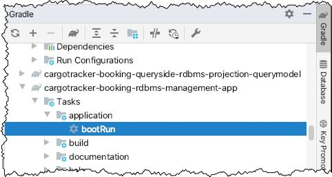
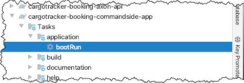
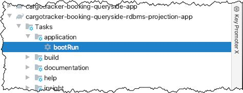
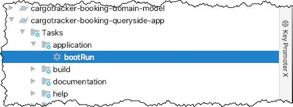
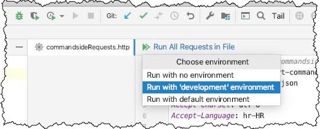
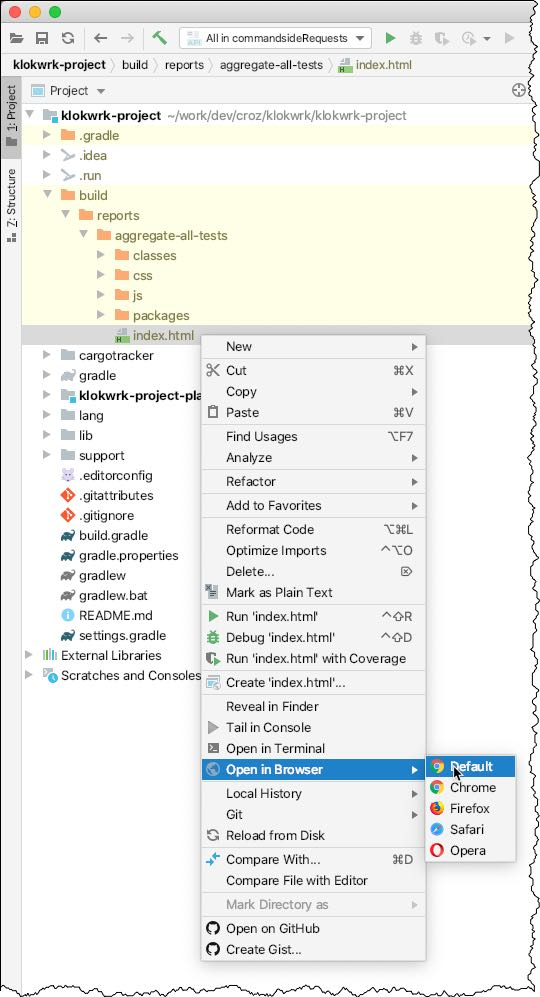
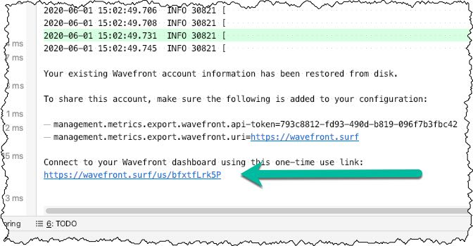

## Starting up and trying the whole thing
Environment:
- OSX (should work with any desktop Linux distro and with Windows with appropriate bash-shell like git-bash)
- JDK 11 (should work with JDK 8)
- Gradle 6.4.1
- IDEA Ultimate 2020.1.1 (should work with IDEA Community except for http client which is part of the Ultimate edition)
- Docker
- httpie

### Running from the shell
Open your shell at the project root and execute following commands (shell-1):

    cd support/docker
    ./dockerComposeInfrastructureUp.sh

Open another shell (shell-2) at the project root and execute following command (generating Groovydoc is skipped to speed things up)

    ./gradlew clean assemble -x groovydoc

Open next shell (shell-3) where we will run `cargotracker-booking-rdbms-management-app`. It will migrate the database schema to the state expected by applications (it wraps
[flyway](https://flywaydb.org/) for implementing database migrations).

    ./gradlew -p cargotracker/cargotracker-booking-rdbms-management-app bootRun

We have three functional apps that needs to be run, and for each open a new shell at the project root (shell-3, shell-4 and shell-5 where shell-3 is reused from previous step)

    ./gradlew -p cargotracker/cargotracker-booking-commandside-app bootRun
    ./gradlew -p cargotracker/cargotracker-booking-queryside-rdbms-projection-app bootRun
    ./gradlew -p cargotracker/cargotracker-booking-queryside-app bootRun

Going back to shell-2, some HTTP requests can be tried via `httpie`:
- commandside

      http POST http://localhost:8080/cargotracker-booking-commandside/book-cargo \
        Content-Type:application/json Accept:application/json Accept-Charset:utf-8 Accept-Language:hr-HR \
        originLocation=HRRJK \
        destinationLocation=HRZAG

      http POST http://localhost:8080/cargotracker-booking-commandside/book-cargo \
        Content-Type:application/json Accept:application/json Accept-Charset:utf-8 Accept-Language:en \
        originLocation=HRRJK \
        destinationLocation=HRZAG

- queryside

    To be able to execute queryside request, from the previous commandside output we need to take the value of `aggregateIdentifier` element, and then try some queryside requests. For example:

      http POST http://localhost:8084/cargotracker-booking-queryside/fetch-cargo-summary \
        Content-Type:application/json Accept:application/json Accept-Charset:utf-8 Accept-Language:hr-HR \
        aggregateIdentifier=9e4a13c8-cb74-4a01-9717-f41aaba5428d

      http POST http://localhost:8084/cargotracker-booking-queryside/fetch-cargo-summary \
        Content-Type:application/json Accept:application/json Accept-Charset:utf-8 Accept-Language:en \
        aggregateIdentifier=9e4a13c8-cb74-4a01-9717-f41aaba5428d

When finished experimenting, applications can be stopped by `CTRL+C` (shell-3, shell-4, shell-5). For stopping infrastructural components (shell-1), first we need to stop docker-compose log tailing
by `CTRL+C`, and then do some cleanup with `./dockerComposeInfrastructureDown.sh`.

### Running from IDEA
Executing HTTP requests from CLI can be cumbersome, and many prefer some more user-friendly tool like Postman. If you develop from IDEA, you can also use IDEA's http client. Although it does not have
all niceties of Postman it can be really useful for storing series of requests as code artifacts in the project.

First, the project needs to be imported in IDEA as Gradle project. Next, either from the IDEA terminal or from external shell, infrastructural components needs to be started:

    cd support/docker
    ./dockerComposeInfrastructureUp.sh

Applications can also be started from CLI, but it might be preferable to use UI.

After starting up infrastructural services, we need to run a utility application for database schema migration:

After migrating database schema, functional applications can be started in any order:
- Start commandside app by double-clicking on its `bootRun` Gradle task and wait until it is started up:

    

- Start queryside projection app by double-clicking on its `bootRun` Gradle task and wait until it is started up:

    

- Start queryside app by double-clicking on its `bootRun` Gradle task and wait until it is started up:

    

When all applications are started up, we can try executing some requests:
- Find and open `support/http-request/commandsideRequests.http`.
- Click on `Run All Requests in File` and select `Run with 'development' environment`.

    

- Repeat the same with `support/http-request/querysideRequests.http`.

When finished experimenting, applications can be stopped by `CMD+F2` shortcut or via IDEA "Run" tool window. For stopping infrastructural components, stop docker-compose log tailing with `CTRL+C`,
and then do some cleanup with `./dockerComposeInfrastructureDown.sh`.

### Supportive Gradle tasks
While working on a project, a developer often needs access to various pieces of information about the current state of a project. These reports might provide beneficial information about code quality
and can point to the areas which require some attention and improvements. Project Klokwrk has a dozen of Gradle tasks that provide such information. They can be run for each individual project, or
for a project root.

Before executing any of commands bellow, position your terminal prompt at the project's root:

- `./gradlew check -x codenarcMain -x codenarcTest`

  Executes all tests while providing convenient colored CLI output. For speeding things up, the creation of CodeNarc reports for individual projects is turned off. We will create aggregate CodeNarc
  reports instead.

- `./gradlew aggregateAllTestReports`

  Creates a cumulative report of all tests for all individual projects. Report can be accessed via `klokwrk-project/build/reports/aggregate-all-tests/index.html`. It is best to open it from IDEA
  using `Open in Browser` action.

  

  Behind the scenes, IDEA uses an internal HTTP server, which is very convenient for looking at statically generated pages like these.

- `./gradlew aggregateJacocoReport`

  Creates a cumulative code coverage report accessible at `klokwrk-project/build/reports/jacoco/aggregate/html/index.html`

- `./gradlew aggregateCodenarcMain`  
  `./gradlew aggregateCodenarcTest`

  These commands create a cumulative CodeNarc reports for `main` and `test` source sets, respectively. Reports can be accessed via `klokwrk-project/build/reports/codenarc/aggregateCodenarcMain.html`
  and `klokwrk-project/build/reports/codenarc/aggregateCodenarcTest.html`.

- `./gradlew aggregateGroovydoc`

  Creates a cumulative documentation for the whole project accessible at `klokwrk-project/build/docs/aggregate-groovydoc/index.html`.

### Exploring Wavefront integration
Since the 2.3.0 version, Spring Boot provides out-of-the-box free integration with Wavefront observability service. It offers zero-setup and feature-rich alternative to the standard observability
solutions like Prometheus (metrics collection), Zipkin (distributed tracing) and Grafana (visualization) combo. Wavefront is very convenient and effortless to use, even from a development environment.

Here is a very brief overview of Wavefront usage for a `klokwrk-project`:
- Start all applications as described previously. From the output of any application, copy the link to the Wavefront service.

  

- Execute a dozen of commandside and queryside requests as described above, to provide some data to the Wavefront.
- Open previously copied Wavefront link and start exploring. The following resources will get you quickly up to speed:  
  [Zero Cost, No Sign-up: Introducing Tanzu Observability for Spring Boot Applications](https://tanzu.vmware.com/content/practitioners-blog/zero-cost-no-sign-up-introducing-tanzu-observability-for-spring-boot-applications)  
  [Wavefront for Spring Boot](https://docs.wavefront.com/wavefront_springboot.html)
