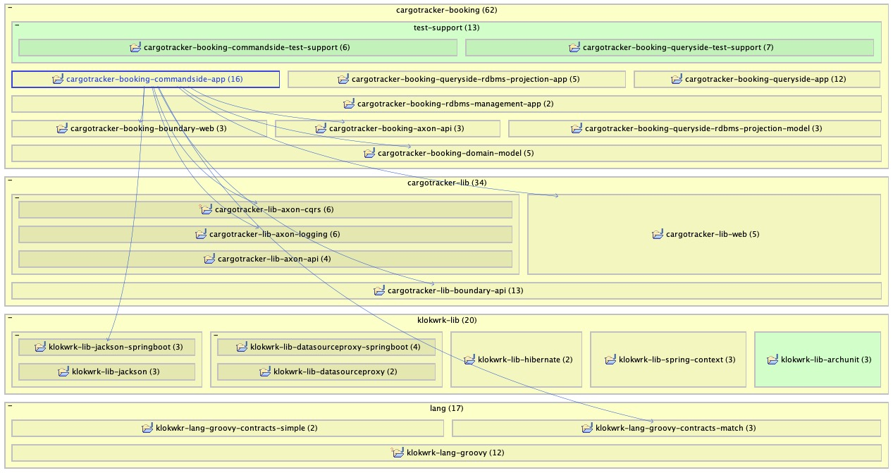

# ADR-0009 - Testing Inter-Module Dependencies
* **Status: accepted**
* Dates: proposed - 2020-11-04
* Authors: Damir Murat (`damir.murat.git at gmail.com`)
* Reviewers: None

## Context
Although architectural testing ([ADR-0008 - Testing Architecture](0008-testing-architecture.md)) verifies some application dependencies, there are still dependencies that might be overlooked.
In general, we are not talking about 3rd party dependencies but rather about in-project modules at the lower level of abstraction compared to applications.

Those project modules represent various pieces of functionality developed to streamline and simplify application development. The majority of lower-level modules will typically deal with
infrastructure concerns, but some of them might deal with the domain itself. If we have many of those modules, we might accidentally end up in situations where applications use something they should
not use. This might be just plain error, or it might be a suggestion that the lower-level module needs refactoring or splitting into more modules.

To avoid accidental inter-module dependencies, we should have in place a mechanism for verifying them. Also, as project modules grow, we should have some capable visual tooling that quickly can show
and explore inter-module dependencies for easier comprehension and communication.

### Architectural Context
* System (`klokwrk-project`)

## Decision
**We will use [Structure101 Studio for Java](https://structure101.com/products/studio/) for displaying, exploring, and ad-hoc monitoring inter-module dependencies.**

**We will use the [ArchUnit](https://www.archunit.org/) library for checking inter-module dependencies.**

Structure101 Studio is an excellent tool for visualizing and exploring bytecode-level dependencies between software artifacts. To quickly get an overview of dependencies between project modules, it
is enough to click on a module in an appropriate view, as is shown in a picture below.

  
*Image 1 - Revealed dependencies in Structure101 Studio*

Although Structure 101 is very useful for visualization, exploration, and time-to-time monitoring of dependencies, we are still missing automated dependency checks. We can implement them by
leveraging the ArchUnit library.

As an example, take a look at the `BookingCommandSideAppDependenciesSpecification` test. It is checking dependencies for the `cargotracking-booking-app-commandside` module. After a closer look,
it can be seen that we are testing dependencies displayed in the picture above. This is very convenient since we can use the Structure101 diagram as direct input for our test.

`BookingCommandSideAppDependenciesSpecification` test is a basic test since it enumerates all dependencies of a module without any additional criteria. Of course, the test can be expanded to verify
more precise details if needed.

## Consequences
### Positive
* Dependencies of project modules are actively monitored and tested.
* With tests in place, it is much harder to introduce accidental dependencies.
* Dependencies are checked with each build.

### Negative
* Structure101 Studio for Java is a commercial product.

### Neutral
* Using Structure101 and writing tests for dependencies requires some learning.

## Considered Options
* Not to test inter-module dependencies.

## References
* [ADR-0008 - Testing Architecture](0008-testing-architecture.md)
* [Structure101 Studio for Java](https://structure101.com/products/studio/)
* [ArchUnit](https://www.archunit.org/)
