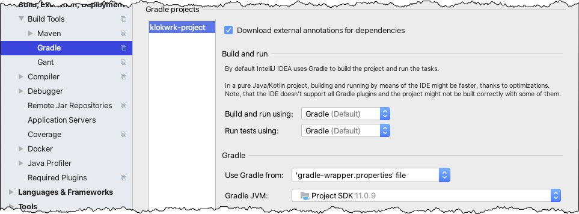
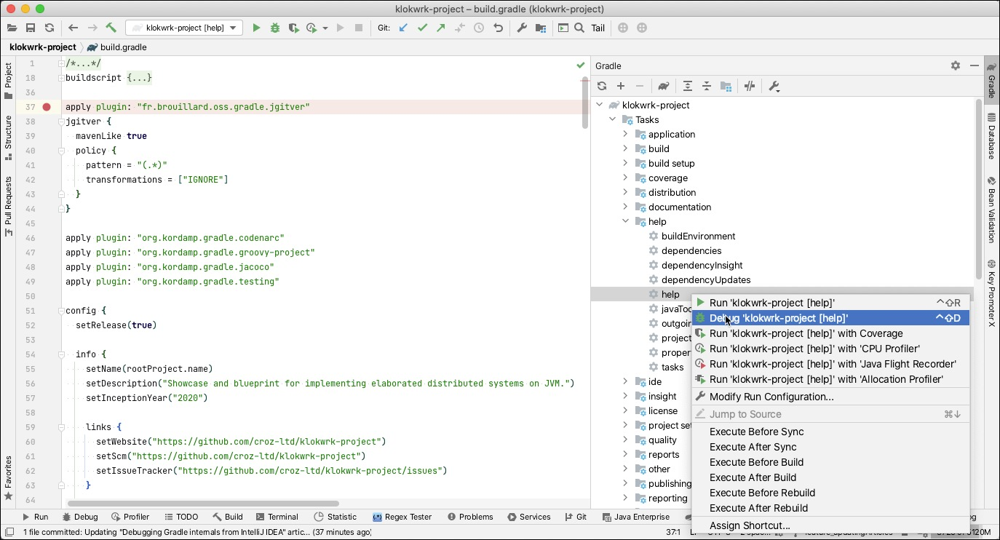
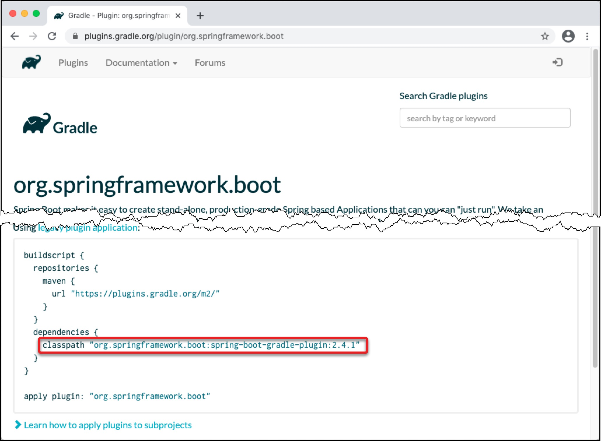
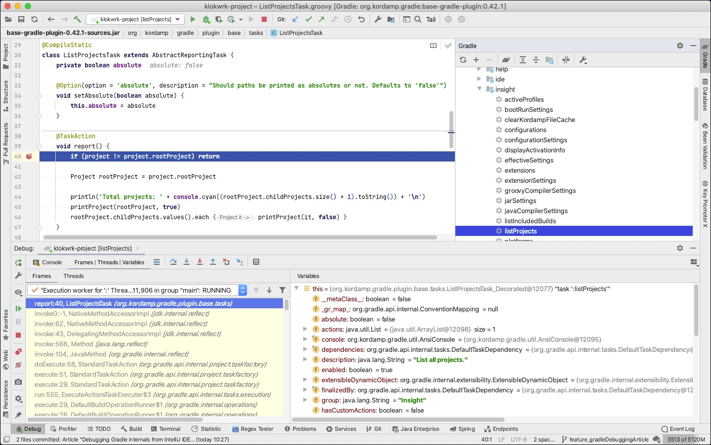
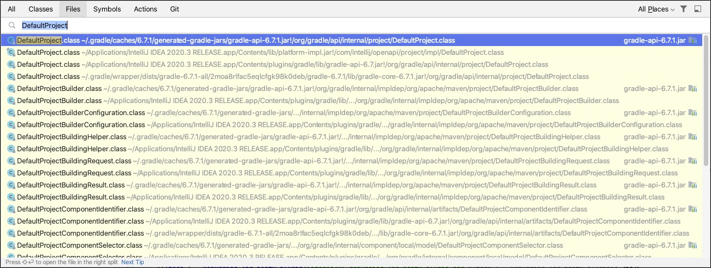

# Debugging Gradle internals from IntelliJ IDEA
* **Author:** Damir Murat
* **Created:** 24.12.2020.
* **Updated:** 26.01.2021.

Debugging is an essential developer's tool, especially when exploring and exercising an unknown codebase. With powerful IDE like IntelliJ IDEA, it commonly boils down to a few clicks.

When it comes to debugging your Gradle build scripts, IDEA gets you covered. Just put a breakpoint in your Gradle script and execute it in debug mode. However, if you try to expand your investigation
on Gradle internal classes, you will probably encounter several obstacles. You may also want to debug some 3rd party Gradle plugins. While it works, there are few preparation steps required.

This article will explore practical ways to debug custom Gradle scripts, Gradle 3rd party plugins, and Gradle internal classes from IDEA and overcome some problems to make the debugging experience as
smooth as possible. Since the topic is not entirely trivial, readers are expected to be developers with some Gradle and IDEA experience. Familiarity with the Groovy language is a plus but not
required.

If you are in a hurry and don't need all the details, feel free to skip to the [Summary](debugging-gradle-from-idea.md#summary) section.

## Introduction
Here at [CROZ](https://croz.net/), we recently started working on [Project Klokwrk](https://github.com/croz-ltd/klokwrk-project). One of many premises that we are trying to follow is returning as
often as possible to the open-source community. An essential part of this is [issue reporting](../../misc/klokwrkRelatedIssuesInTheWild.md) for tools and libraries that we use.

As Klokwrk uses Gradle as a build tool, exploratory debugging of Gradle build scripts, 3rd party plugins, and internal Gradle classes is a prerequisite for any issue report related to the Gradle or
its plugins.

## Debugging Gradle in IDEA
### Basic setup
Before trying any example below, you must configure IDEA to use Gradle as a default build and run tool. Go to `"Preferences > Build, Execution, Deployment > Build Tools > Gradle"` and make sure
`"Gradle"` is selected in `"Build and run using"` and `"Run tests using"` dropdowns. Also, check if `"Use Gradle from"` is configured to `"gradle-wrapper.properties"` and that `"Gradle JVM"` matches
your project's JVM as shown in the picture.

 <br/>
*Image 1 - Gradle settings*

With basic setup behind us, let's quickly see how debugging custom Gradle build scripts works in IDEA.

### Debugging Gradle scripts
Debugging your own Gradle scripts is seamless. Put a breakpoint in the script, and run the desired Gradle task in debug mode.

In the following picture, we are using the main [build.gradle](../../../../build.gradle) script from Klokwrk. As our breakpoint will be hit during Gradle's configuration phase, we can run any Gradle
task to stop at that concrete breakpoint. For starting a task, right-click on it from IDEA's `"Gradle tool window"` and select `"Debug"` action.

 <br/>
*Image 2 - Debugging custom Gradle scripts*

### Debugging 3rd party Gradle plugins
To debug the 3rd party Gradle plugin, you'll have to know something about the plugin's internals. For example, you will need to know classes that implement a task of interest to put breakpoints in
there. Besides knowing the plugin's internals, there are also a few required preparation steps.

First, we need to configure [Gradle plugin portal](https://plugins.gradle.org/) as a repository of a module that will be a context under which you run and debug the 3rd party Gradle plugin. To do
this, just add `gradlePluginPortal()` in the relevant `repositories` configuration block. Make sure it is configured as a first repository in the list:
```
repositories {
  gradlePluginPortal()
  ...
}
```

The second preparation step is configuring the 3rd party plugin as a code dependency of the module. This can be done by adding the plugin's GAV (Group, Artifact, Version) coordinates as a
`runtimeOnly` dependency of the module:
```
dependencies {
  ...
  runtimeOnly "[GAV coordinates of the 3rd party plugin]"
}
```

To find exact GAV coordinates for a plugin, go to the [Gradle plugin portal](https://plugins.gradle.org/), find your plugin, and look at the `buildscript > dependencies > classpath` setting as shown
in the picture for Spring Boot Gradle plugin:

 <br/>
*Image 3 - Plugin GAV coordinates*

After applying changes, do not forget to reload your Gradle project (use the `"Reload All Gradle Projects"` button from IDEA Gradle Tool Window). Otherwise, IDEA will not be aware of the new Gradle
configuration.

Now, let's quickly look at the more concrete example. The Klokwrk project uses [kordamp-gradle-plugins](https://github.com/kordamp/kordamp-gradle-plugins), a versatile collection of Gradle plugins
for various purposes. Kordamp contains a base plugin (implemented by `org.kordamp.gradle.plugin.base.BasePlugin` class) consumed and applied by many other plugins from the Kordamp collection.

Let's now assume that we want to debug the `listProjects` task provided by the `BasePlugin`. At the Gradle plugin portal, we can find out that the GAV coordinates of `BasePlugin` are
`org.kordamp.gradle:base-gradle-plugin:0.42.1`. We need to add this as `runtimeOnly` dependency. After configuring `gradlePluginPortal()` repository and reloading our Gradle project, we are ready
to continue.

Task `listProjects` is implemented in `org.kordamp.gradle.plugin.base.tasks.ListProjectsTask`. After opening the class in IDEA, we can add a breakpoint at the start of the `report()` method
(annotated with `@TaskAction`). Finally, we can now execute the `klokwrk-project > Tasks > insight > listProjects` task in debug mode and see that execution is stopped at the breakpoint.

 <br/>
*Image 4 - Debugging 3rd party plugin*

### Debugging Gradle internals
While debugging custom Gradle scripts is almost trivial, and debugging 3rd party plugins is fairly easy, seamless debugging of Gradle internal classes require more effort.

First, we need to add a special `gradleApi()` dependency. This `gradleApi()` dependency is commonly used as a compile-time dependency during the development of custom Gradle plugins or tasks. For
our purposes, it is enough to add it as a `runtimeOnly` dependency in the module's Gradle script.
```
dependencies {
  ...
  runtimeOnly gradleApi()
}
```

As soon as Gradle sees `gradleApi()` dependency, it will dynamically generate `gradle-api-[gradle-version].jar` at the `[user-home]/.gradle/caches/[gradle-version]/generated-gradle-jars` location
(for example, `~/.gradle/caches/6.7.1/generated-gradle-jars/gradle-api-6.7.1.jar`). Normally, this should be enough. At this point, you should be able to open some internal Gradle class and put a
breakpoint in its source code.

Unfortunately, this is not the case because there is no `gradle-api-[gradle-version]-sources.jar` available in any repository. The JAR was dynamically generated. If you try to open an internal Gradle
class, for example, `org.gradle.api.internal.project.DefaultProject`, IDEA will try to help by listing all locations where IDE can find that class as shown in the picture. Do note that the picture
demonstrates the opening of a **file** corresponding to the class, so we can see the whole location.

 <br/>
*Image 5 - Opening Gradle internal class in IDEA*

In my opinion, although IDEA tries its best, such a variety of choices only increases confusion. It should display only a class from a JAR that we just included as a `runtimeOnly` dependency of our
module. Nevertheless, the first class in the list is from our dynamically generated JAR (note the JAR name and icon on the right side of the list). If you open that class, you will see that IDEA
displays decompiled source, as there are no real sources available. Debugging with generated sources is very problematic as it is hard to correlate a specific line in the generated source file with
the line in the real source file. We really want to use actual source files instead of decompiled ones.

#### Actual problem
But still, it is not yet clear why IDEA does not use real source files. We are using Gradle **`all`** distribution that includes sources (instead of default `bin` distribution), and if you look
carefully at the previous picture, IDEA is aware of that `all` distribution (look at the locations that start with `~/.gradle/wrapper/dists/gradle-6.7.1-all/...`). The most probable cause is that
IDEA can not work with source files organized in multiple source roots as Gradle sources are (take a look at `~/.gradle/wrapper/dists/gradle-6.7.1-all/[hash]/gradle-6.7.1/src`). IDEA expects a single
source root for any dependency present in the classpath.

There were several attempts by the Gradle team to [[resolve]](https://github.com/gradle/gradle/issues/1003) [[those]](https://github.com/gradle/gradle/pull/11751)
[[issues]](https://github.com/gradle/gradle/pull/11772). Unfortunately, they were not ended up in official Gradle releases. Hopefully, this will change in the future, and the debugging of Gradle
internals will work out-of-the-box. In the meantime, you can use the solution presented below.

#### Solution
To resolve problems, we can repack Gradle sources under a single source root and provide that repacked archive to IDEA. However, this is not that easy as it sounds. Gradle includes more than 80
internal modules, and manually repacking all of them is not something that you want to do regularly, especially if you're going to keep up with the latest Gradle versions that are released
[quite often](https://gradle.org/releases/).

It is possible to create an involved shell script that will do all the necessary work. Alternatively, you can try
[klokwrk-tool-gradle-source-repack](../../../../modules/tool/klokwrk-tool-gradle-source-repack/README.md). Despite its complicated name,
this little tool is straightforward to use. All you need to provide is a Gradle version for which you want to create a JAR archive with repacked Gradle sources.

> As a side note, it is worth mentioning that `klokwrk-tool-gradle-source-repack` served another useful purpose. It was a playground for exploring possible usage of GraalVM native images with
> non-trivial Groovy applications, with particular emphasis on minimal reflection configuration. However, this is a subject of [another article](../groovy-graalvm-native-image/groovy-graalvm-native-image.md).
> You can find some starting tips in `klokwrk-tool-gradle-source-repack`'s [README.md](../../../../modules/tool/klokwrk-tool-gradle-source-repack/README.md).

With the correct Gradle version supplied, `klokwrk-tool-gradle-source-repack` will:
- download Gradle `all` distribution corresponding to the supplied Gradle version
- check SHA-256 of downloaded Gradle distribution file
- repack Gradle source files under a single root in a new `gradle-api-[gradle-version]-sources.jar` archive
- place the `gradle-api-[gradle-version]-sources.jar` archive into `[user-home]/.gradle/caches/[gradle-version]/generated-gradle-jars/` directory if that directory exists, or in the current directory
  otherwise.

Once we have repacked Gradle sources, we can supply them to the IDEA. More concretely, open that decompiled `DefaultProject` class we have used previously, click on the `"Choose Sources..."` action
in the top right corner and supply repacked archive. If IDEA prompts you with the `"Choose libraries to attach sources to"` popup, select `"All"` from the list. Wait a few moments while IDEA finishes
indexing new sources, and the `DefaultProject.class` file should be replaced with the `DefaultPoject.java` file (note the extensions).

Now you can go ahead by adding your breakpoints and start debugging Gradle internals with real sources.

## Summary
- Configure IDEA to use Gradle as a default build and run tool (`"Preferences > Build, Execution, Deployment > Build Tools > Gradle"`).

### Debugging Gradle scripts
- Put a breakpoint in the script, and run the desired Gradle task in debug mode.

### Debugging 3rd party Gradle plugins
- Configure the Gradle plugin portal as a first repository of the module.
  ```
  repositories {
    gradlePluginPortal()
    ...
  }
  ```
- Add the plugin as a `runtimeOnly` dependency of the module.
  ```
  dependencies {
    ...
    runtimeOnly "[GAV coordinates of the 3rd party plugin]"
  }
  ```
- Reload Gradle project in IDEA.
- Put breakpoints in the plugin classes, and run the desired Gradle task in debug mode.

### Debugging Gradle internal classes
- Add `gradleApi()` as a `runtimeOnly` dependency of the module.
  ```
  dependencies {
    ...
    runtimeOnly gradleApi()
  }
  ```
- Reload Gradle project in IDEA.
- Use [klokwrk-tool-gradle-source-repack](../../../../modules/tool/klokwrk-tool-gradle-source-repack/README.md) for creating an archive
  with repacked Gradle sources under a single source root.
- Attach the repacked archive as a source to Gradle internal classes.
- Put breakpoints in the Gradle internal classes, and run the desired Gradle task in debug mode.

## Conclusion
This article shed some light on some lesser-known ways for debugging Gradle related stuff from IDEA. We described debugging for custom Gradle scripts, debugging 3rd party Gradle plugin, and debugging
Gradle internal classes. While debugging of 3rd party plugins and, especially, Gradle internal classes require specific preparation steps, in the end, after several usages, the procedure becomes
quick and easy.

Hopefully, the described procedures will help you in your Gradle endeavors, in the same way as helping us while working on the [klokwrk-project](https://github.com/croz-ltd/klokwrk-project).
