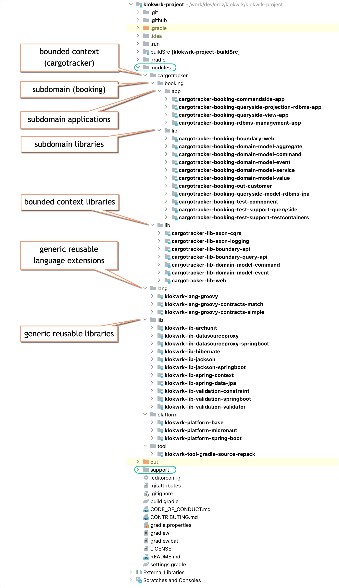
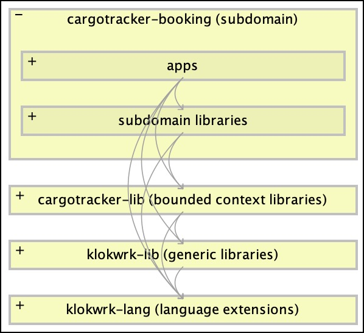
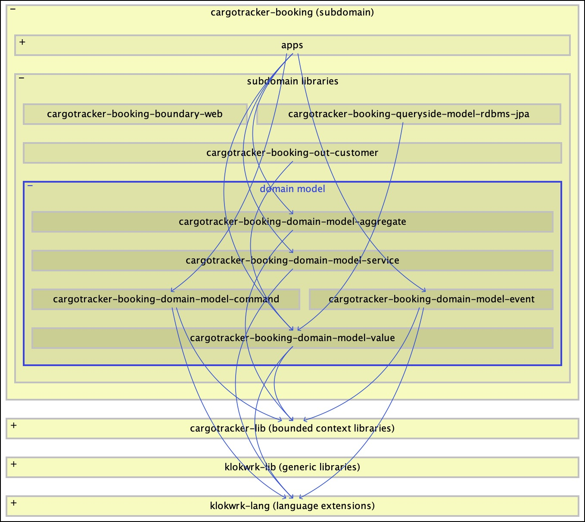
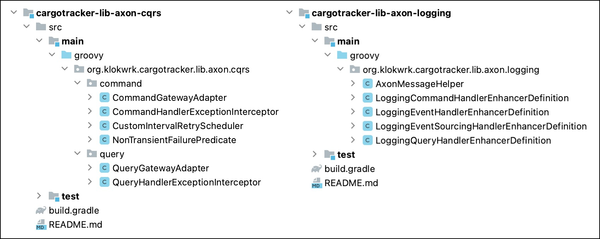
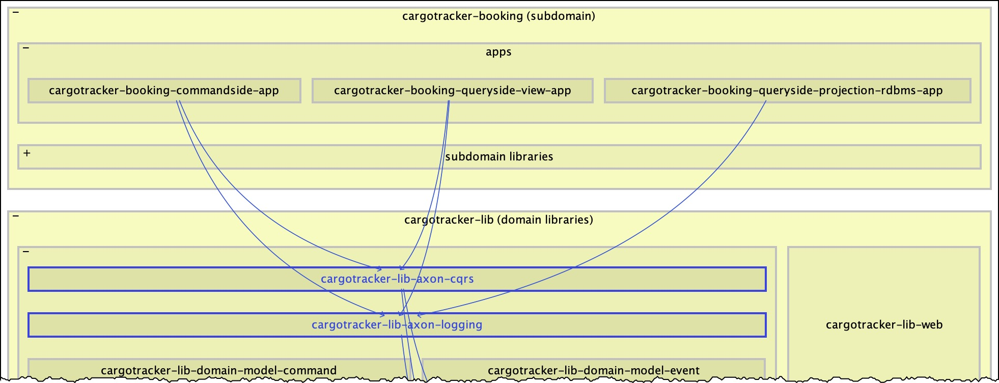
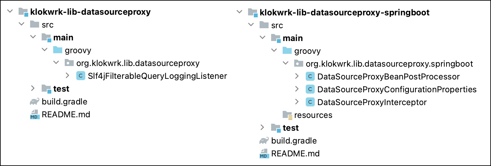
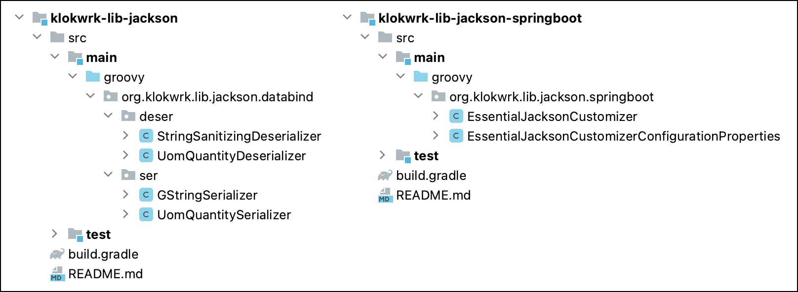
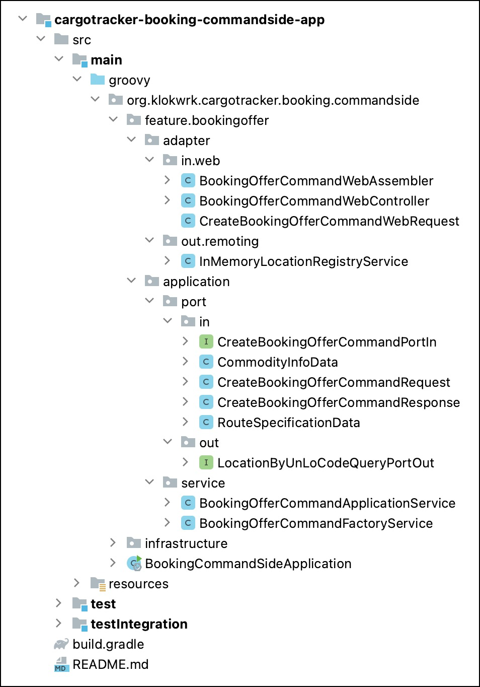
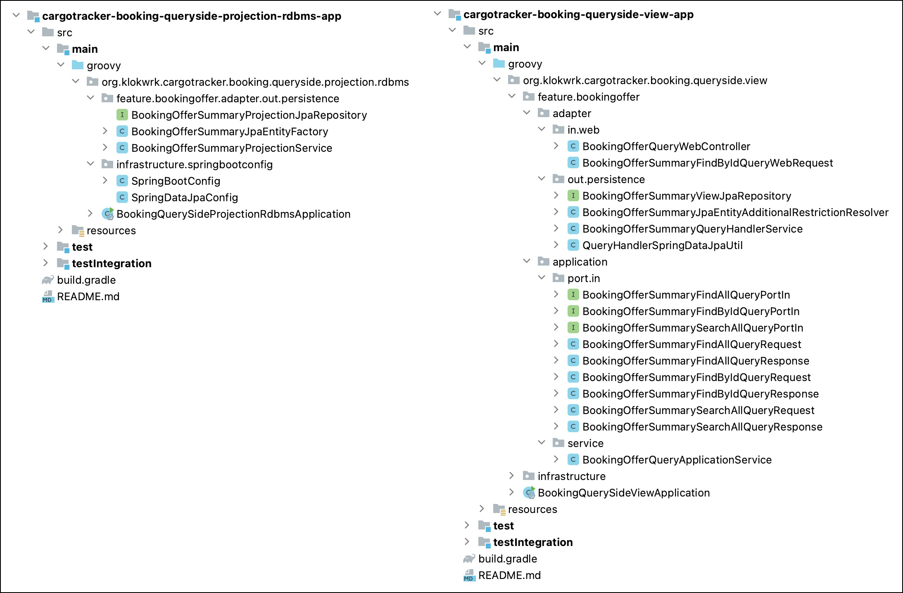

# Organizing modules and packages
* **Author:** Damir Murat
* **Created:** 13.05.2020.
* **Updated:** 03.10.2022.

## Introduction
In this article, we'll explore one specific way of structuring the project layout and organizing internal module packages on the larger multi-module project. As a concrete example, we'll use
[Project Klokwrk](https://github.com/croz-ltd/klokwrk-project).

For structuring high-level project layout, Klokwrk uses strategic DDD concepts of subdomain and bounded context together with differences in abstraction levels of separate modules. A sensible project
layout significantly improves orientation and navigation at the project level. This is a vital characteristic because we always look for things and navigate between them during development.
Furthermore, a meaningful project structure also supports and improves the management of dependencies, either direct dependencies between modules or between modules and 3rd party dependencies.

Going one step deeper, at the level of application module packages, Klokwrk follows hexagonal architecture ideas. It also introduces CQRS/ES (Command Query Responsibility Segregation/Event Sourcing)
flavor to the architecture when appropriate.

When combined, we believe that strategic DDD and hexagonal architecture provide suitable organizational constructs with exact placeholders for tactical DDD artifacts like aggregates, entities,
value objects, etc.

It is not unusual concerns like these pop-up late in the development cycle, often after several releases are already in production. Even when they come to focus, it is typically hard to resolve them
since they might require dramatic refactorings. It might be easier if we have a suitable structure in place from the start. It shouldn't excessively disturb development in the early phases, and it
should be flexible enough to support the system's growth.

With the recent industry move towards microservices, carefully organizing high-level development artifacts is even more critical since it can enable efficient usage of mono repositories. Otherwise,
you may end up with a project per microservice that is hard to manage on a larger scale.

This article explores issues that commonly don't exist in simpler projects. It will be best if readers have some experience working on mid to complex projects comprising multiple modules. Familiarity
with DDD concepts, hexagonal architecture, and CQRS/ES is a plus, although some of these ideas are briefly explained in the article. Project and package organization are based on constructs from the
Java language but can be translated in any other environment. Although demonstrated code examples use the Groovy language, they should be readable enough for all readers.

### Main goals
After the brief discussion above, we can try to enumerate the main goals of our targeted project structure:

- Provide means for organizing modules that will support future system growth and enable controlled management of dependencies between modules and dependencies on 3rd party libraries.
- Provide a way for organizing application and library packages that are flexible enough to support future development and feature expansion smoothly.
- Organization of application packages should adhere to the sound application architecture principles like those promoted by hexagonal architecture.

## Organizing modules
### Problems with traditional flat project structure
The primary technique for organizing modules in multi-module projects is using an appropriate project layout. Many multi-module projects start by placing all modules directly under the project root.
We'll name such a structure a *traditional flat project structure* or just the **flat structure**.

While the flat structure is appropriate for simpler projects, when the project grows and the number of modules increases, the flat structure suffers from many drawbacks:
- The flat structure does not scale when the project and number of modules grow.
- The flat structure is hard and confusing to navigate with numerous modules at the same directory hierarchy level.
- The flat structure relies only on module names to explain the relationship between modules. It does not use any high-level constructs for that purpose.
- The flat structure does not suggest the abstraction level of a specific module or group of modules.
- The flat structure often requires extracting modules in separate repositories just because confusion becomes unbearable with numerous modules.
- When developing microservices, the flat structure practically forces us to use one project per microservice.

### Strategic DDD briefly
Since our improvements to the flat project structure are based on several strategic DDD constructs, we'll first start with their brief description. But even before that, it is helpful to describe the
general concept of a *model* - that mental thing we use (often unconsciously) every time we create, analyze, or learn about anything.

#### Model
A model is a simplified representation of a thing or phenomenon that intentionally emphasizes certain aspects while ignoring others. Put differently, a model is an abstraction with a specific use in
mind. An abstraction that helps us to solve a particular problem. A model does not copy the real world. Instead, it is a human construct helping us to simplify and make sense of real-world systems.

In business domains, a model has to reflect involved business entities, their behavior, cause and effect relationships, and invariants.

#### Subdomain
A subdomain is a DDD tool for making sense of a company's business activities. With subdomains, we establish boundaries around business capabilities or segments. By analyzing the business domain, we
**discover** subdomains and build a mental model to better comprehend a business's purpose.

From a technical perspective, the subdomain represents a set of interrelated, coherent use cases that usually involve the same actors and business entities and manipulate closely related data sets.

Not all subdomains are equal. Some of them are more important to the business than others. We distinguish **core**, **supporting**, and **generic** subdomains. Core subdomains contain business logic
that differentiates a company from its competitors, making them the most valuable artifact a company posses.

A subdomain is not a flat concept. Similar to the internal organizational structure of complex businesses, subdomains can be nested at multiple levels. Similarly, depending on nesting depth and the
complexity of related business processes, subdomains have different scales - macro, meso, and micro [1].

#### Ubiquitous language
The ubiquitous language is a DDD tool for effective communication, gathering, and sharing of knowledge. It strives to avoid any translation between the business and IT departments. As such, it is a
language of the business containing business-related terms only, avoiding any technical jargon. The goal of the ubiquitous language is to frame domain experts' mental models and understanding of the
business domain in terms that are easy to understand. In a sense, the ubiquitous language represents a model of a business - a simplified and constrained model targeted to solve a specific problem.

The ubiquitous language must be precise and consistent. It should not use any synonyms. It should eliminate the need for any assumptions, and it should make business domain logic explicit.

A single ubiquitous language is valid only inside its boundaries, the boundaries of a corresponding bounded context.

#### Bounded context
The bounded context represents a boundary of a model intended to solve a particular problem. Therefore, bounded contexts are explicitly **designed** to solve specific business needs across single or
multiple business subdomains. Consequently, we may require another bounded context for different problems spanning the same subdomains.

It is very convenient when bounded context matches subdomain in a one-to-one relationship. However, more often than not, the bounded context will include multiple subdomains, either entirely or only
some parts of them. The reverse is also possible. For example, a complex subdomain can contain multiple bounded contexts, each aiming to solve a different business problem.

The bounded context and the ubiquitous language are practically synonyms. Each bounded context has its own ubiquitous language that is not shared with any other bounded context. The language
terminology, principles, and business rules are only valid and consistent inside the boundaries of its bounded context.

The relationship between teams and bounded context is one-directional. A bounded context should be owned by only one team, but a single team can own multiple bounded contexts. The ownership of a
bounded context should never be split between multiple teams.

#### Implementation implications
Bounded contexts and their contained subdomains should be visible in the project structure. Similarly, ubiquitous language should be present in code-level artifacts, especially domain model artifacts.

This connection leads us to the concept of a *strategic DDD project structure*.

### Introducing strategic structure
The general solution principle for a flat project structure might be obvious. We just have to introduce some hierarchy in the project layout. The harder problem is how exactly we should organize that
hierarchy. After some tinkering and experimentation, we found the solution in strategic DDD concepts of bounded context and subdomain together with different abstraction levels that separate module
groups have. We'll name this structure a *strategic DDD project structure* or just a **strategic structure**.

The best way to describe strategic structure is by analyzing some example. Instead of using some artificial project, well dive into the structure of `klokwrk-project`. Here is what the strategic
structure of the `klokwrk-project` looks like:

 <br/>
*Image 1 - Strategic structure*

### Top-level organization
Right below the project's root, we have the `modules` directory. It contains actively developed software artifacts and their source code. During everyday work, we will spend most of the time here.
The hierarchy and organization of `modules` directory content are the primary focus of our strategic structure.

At the same hierarchy level, there is the second important directory - `support`. It contains things created to support other aspects of the project. This is the home for documentation, articles,
development notes, supportive scripts, git hooks, etc. The `support` directory has a free-form organization, and the strategic structure does not impose any rules here. If you want to see a concrete
example, look at the source of the `klokwrk-project`.

With just those two directories, we moved all of our day-to-day work from the clutter of other files in the project's root. Contrary to the flat project structure, finding starting points
for our work is much easier now.

While we are still at the top of the project hierarchy, it is worth mentioning the root project itself. It is essential just because of a fact it represents a system we are building - it is a system
artifact. Also, there are a few other things to note. For example, the root directory's name (or some parts of it) frequently appears in the names of other artifacts and their internals. Another
interesting thing is that the project's name often does not correspond to anything already known in the business domain. The marketing team or upper management may coin it, or it may be just a result
of the inspiration of the developer tasked to create the first commit. Nevertheless, if the project stays around for some time, its name will probably become a new noteworthy term in the domain.

Let's go back to the `modules` directory and start analyzing its organization and structure.

### The hierarchy of subdomains
The most valuable artifacts of our project implement a software model based on carefully selected business concepts. The strategic structure organizes such artifacts into bounded context and subdomain
hierarchies. In the example, we have the `cargotracker` directory corresponding to our bounded context. The bounded context is usually further divided into one or more subdomains. In the example,
we have a single subdomain - `booking`. It is a place for organizing modules specific to the concrete implementation of the corresponding "booking" part of our "cargotracker" bounded context.

The `booking` directory further divides its modules into **subdomain libraries** (the `booking/lib` directory) and **subdomain applications** (the `booking/app` directory). During development, it is
convenient to make this library-application distinction explicit.

The names of subdomain library modules follow a particular pattern - `[bounded_context_name]-[subdomain_name]-*`. For subdomain application modules, we additionally add `app` suffix to the name -
`[bounded_context_name]-[subdomain_name]-*-app`. Here, bounded context and subdomain names reflect the hierarchy of our strategic structure. Although that hierarchy is already expressed via
directories, it is helpful to have it in module names to avoid ambiguities and conflicts when building concrete artifacts (i.e., JAR archives).

Application modules are runnable artifacts, and they can use, depending on their needs, almost any other module from the system. The exception are modules from different subdomains or bounded contexts
if we have those. This characteristic positions application modules at the top of the abstraction and dependency hierarchy. As with many executables, application modules are not intended to be
directly reused. In general, if we have to reuse some part of application modules, we'll first extract a standalone module at the appropriate abstraction level and reuse that.

Similarly, subdomain libraries can also reuse modules from the lower abstraction levels, but the reverse does not hold. Subdomain libraries are reusable only inside the boundaries of their subdomain.
It is not just because of the high abstraction level. Subdomain libraries, together with subdomain applications, are the place where technology meets business requirements. This is where we have a
coupling between business and our technology choices. Since the business concepts are part of the bounded context, it does not make sense to reuse subdomain libraries from lower levels that are
technology-specific and not aware of a business. The klokwrk strategic structure has a typical example - `cargotracking-booking-lib-queryside-model-rdbms-jpa`, the module containing JPA entities
specific only for `booking` subdomain.

Despite this, it is not forbidden to have generic infrastructural code at the subdomain library level. It may be that a particular infrastructural code is not interesting in other subdomains, or we
have just created a temporary subdomain library destined to become a bounded context library or a generic reusable library at the end.

However, one particular set of business related subdomain libraries should be as free of technology as possible - the **domain model**.

#### Modules of the domain model
The domain model of klokwrk's `booking` subdomain looks unusual as it comprises five separate modules (modules with the `cargotracker-booking-domain-model-*` name pattern). We have a module for
aggregates and entities, a module for value objects, a module for commands, a module for events, and a module for domain services.

> An entity is an object whose internal state changes over time, but the identity always remains the same. Entities are usually long-lived and persisted.
>
> A value object is an immutable object whose properties define its identity. It can be replaced by another value object with the same properties.
>
> The aggregate is a cluster of entities and value objects. Any object inside the aggregate can be accessed only through the public interface defined by the aggregate's root entity. The aggregate is
> a consistency boundary for all inner objects and is responsible for maintaining all business invariants through the cluster of contained objects.

Typical applications will have only a single separate module for the domain model, or the domain model will be included directly in the corresponding application module. To understand the reasons for
separation in our example, we have to dive deeper into the chosen architecture and technology. As we do this, we'll uncover several principles guiding code separation into standalone modules.

The `booking` subdomain uses the [Axon framework](https://github.com/AxonFramework/AxonFramework) (and corresponding [infrastructure](https://axoniq.io/product-overview/axon-server)) as the
implementation of CQRS and event sourcing architectural patterns. In CQRS/Event sourcing, we have two major high-level components - the command model (or **commandside**) and the query model (or
queryside). The query model can be further divided into create/update (**queryside-projection**) and read-only (**queryside-view**) components.

> In CQRS/Event sourcing, the **commandside** is responsible for accepting commands intended to change the system's state. Commands are routed to specific aggregate instances, then aggregate verifies
> the command and publishes relevant events if the command is valid. Based on published events, aggregate first updates its own state and then makes events available to all other interested consumers.
>
> One or more **queryside-projection** components listen to published events and, based on their type and properties, create appropriate data views. It is not that important which concrete data
> storage technology is used, but the standard and traditional choice is the RDBMS system, a.k.a. conventional SQL database. Besides creating data views, queryside-projections can also invoke
> commands inside of a bounded context/subdomain or send **public** event notifications outside of a bounded context.
>
> The **queryside-view** component is responsible just for reading the data prepared by queryside-projections.

All CQRS/Event sourcing high-level components can be deployed as part of a single application. In the `booking` subdomain, however, we decided to have three separate applications, one for
commandside, one for queryside-projection, and one for queryside-view component. As a result, we have a single **logical microservice** - `cargotracker-booking`, split into three physical parts, each
running in a separate JVM. There are multiple reasons for such separation, including physically enforced separation of concerns, support for different operational requirements (i.e., read-write vs.
read-only database access), or support for different scalability configurations of each physical component.

However, the physical component split also introduced some consequences like the need for extracting a domain model into at least one separate standalone module to be able to reuse it in all three
applications. But we have five domain modules. Let's see why.

In CQRS/Event sourcing applications, aggregates (and contained entities) belong to the commandside. Queryside components should not have access to them. Further, when using the Axon framework, the
implementation of aggregates requires some Axon dependencies that are not needed in queryside components. Therefore, the commandside application is the sole consumer of aggregates. Then, aggregates
require unique 3rd party dependencies not needed elsewhere, and finally, we want to restrict access to the code implementing aggregates. Those three reasons are our guidelines and justification for
extracting aggregates and their contained entities into a standalone module.

Commands are another part of the commandside model. They model state-changing requests sent to the aggregate instances. Commands carry identifiers of aggregate instances (modeled as simple values or
as value objects) but cannot reference aggregate objects directly. One way to prevent those accidental references is to physically separate commands from aggregates into different standalone modules.
In that case, unidirectional dependency from aggregates toward commands can be modeled at the dependency level. In addition, we can use commands from queryside-projection components and from different
implementations of inbound ports (i.e., web or messaging controllers). Still, none of these components should have access to aggregates. We should also note that commands in Axon applications have a
different set of required 3rd party dependencies than aggregates. Therefore, the desire for physical and explicit control of dependencies between modules, a different set of consumers, and different
3rd party dependencies are the reasons to divide commands from aggregates into separate physical modules.

Events are created and published from aggregates at the commandside. At the same time, queryside-projection modules use events to create and update projected data, or to invoke command requests, or
to send notifications to other bounded contexts and subdomains. Since queryside-projection components should not have access to aggregates, we do not want to include events in the already extracted
aggregate module. Instead, we have to pull events into another standalone module.

Value objects are basic building blocks of the domain model. They are utilized across the whole domain model and in various other application parts and components. That broad reusability across the
entire subdomain is the primary reason for extracting value objects into a standalone module.

In the `booking` subdomain, domain services are part of the commandside model and are not exposed outside of it. They encapsulate concepts that are awkward to be expressed as either entities or value
objects. Thus, we could include domain services in the aggregate module, but for consistency with other parts of the domain model, they are pulled into the standalone module as well.

### The lower abstraction levels of strategic structure
#### Bounded context libraries
On the next level in the strategic structure, we can find bounded context libraries. Modules belonging to bounded context libraries contain infrastructural code at a **lower abstraction level** than
subdomain libraries. As infrastructural modules, bounded context libraries are related to the specific technology choices made for the bounded context in question. The naming pattern for bounded
context libraries is `[bounded_context_name]-lib-*`. In our example, `cargotracker-lib-*` names suggest that bounded context libraries are reusable across the whole `cargotracker` bounded context.

If we have multiple bounded contexts using the same tech stack, we can pull bounded context libraries into the generic libraries layer to make them more available. Similar to subdomain libraries,
bounded context libraries can also contain "incubating" libraries destined to be generic and widely reusable in the end. But for various reasons, it is sometimes more convenient to keep them at the
bounded context level temporarily.

Bounded context libraries will never contain code speaking the ubiquitous language of the bounded context. This is reserved only for subdomains. However, in bounded context libraries, we can have
infrastructure supporting the implementation of the domain model. One typical example is the `cargotracking-lib-boundary-api` module which formalizes general structures and exceptions of bounded
context boundary API that all inbound adapters (web, messaging, etc.) must know, understand and use to be able to speak with domain application services (a.k.a. domain facades).

Therefore, the boundary API defines essential building elements of a contract between the outside world and the domain. Domain application services use boundary API elements to define interfaces
exposed to the outside world. At the implementation level, domain application services handle all requests arrived at the boundary by converting them into appropriate internal commands and queries.

Some parts of the boundary API are used in other direction too. For example, *deep* domain artifacts like aggregates or value objects are allowed to throw common boundary exceptions. Since they are
part of the boundary API, the outside world can understand such exceptions without requiring any translation at the domain facade.

#### Generic libraries
Going further down the abstraction ladder of the strategic structure, we will find generic libraries. They typically contain infrastructural code with supportive additions for various commonly used
3rd party libraries. Hence, the reusability potential of these modules is very high and is not tied to any subdomain.

Generic libraries have high reusability potential and relatively low abstraction level. As such, they are commonly referenced and used from infrastructural modules at the higher abstraction levels.
However, domain model classes and modules are not expected to use them. The domain model should be free of technology as much as possible.

Successful generic libraries can be used all over the place. Thus, it is desirable to achieve the right level of implementation stability as soon as possible. In general, this will be easier to
accomplish with modules narrower in their scope. A high level of code coverage, proper and meaningful documentation, and several concrete usage scenarios (ideally demonstrated through tests) are some
tools that can improve stability.

#### Language extensions
Language extensions are the modules at the lowest abstraction level in our strategic structure. They comprise various language-level helpers and utilities that expand the features of the programming
language and the corresponding SDK library used in our system.

The reusability potential of language extensions is the widest in our strategic structure. We can use those modules everywhere. Moreover, contrary to generic libraries, even the domain model can use
language extensions in the same way it uses programming language and corresponding SDK functionalities. In fact, some language extensions might be designed purposely to support the more
straightforward implementation of particular aspects in domain classes.

### Architectural skeleton and dependencies management
Every software architecture describes relationships between different components and specifies dependencies and communication between them. Typically, architectural prescriptions focus on
relatively fine-grained constructs like classes and interfaces. There is nothing wrong with that approach, but the related story of more coarse-grained components like packages and modules is often
left out or just implied and not stated explicitly. As the system grows and the number of modules increases, the lack of high-level guidelines becomes more and more problematic.

Our strategic structure can fill that void. With its abstraction levels and rough classification of modules, we have the high-level **architectural skeleton** defining a general requirements for
module relationships and dependencies:
- general
  - Modules from lower abstraction levels must not depend on modules at higher abstraction levels.
  - Circular dependencies between modules are not allowed.
- subdomain modules
  - Business logic, vocabulary (ubiquitous language) and the domain model belong to subdomain modules (both applications and libraries).
  - Subdomain modules can generally depend on any infrastructural module from lower abstraction levels.
  - The notable exception is the domain model, which should be independent of technology as much as possible and practical.
- bounded context libraries
  - Bounded context libraries contain infrastructural code related to the set of technologies used in any contained subdomain.
  - Bounded context modules can generally depend on any infrastructural module from lower abstraction levels.
- generic libraries
  - Generic libraries contain infrastructural code that deals with widely used 3rd party dependencies or with technical aspects frequently occurring in any type of application.
  - Generic libraries can be used from any module or component at the higher abstraction level.
  - The domain model should not, in general, use generic libraries.
- language extensions
  - Language extensions contain extensions of programming language and SDK.
  - Language extensions are at the lowest abstraction level and can be used from any other part of the system.
  - The domain model can freely use language extensions.

The architectural skeleton works together with finer-grained application architectures like hexagonal architecture. While application architectures handle relationships between components close to
the implementation artifacts, the architectural skeleton takes care of the bigger picture, ensuring that modules are neatly organized and ordered.

While our strategic structure and architectural skeleton are intended to be applied to systems following DDD principles, they can be helpful for more traditional applications as well. Concepts are
universal and high-level and, with possible adjustments, can be applied in different environments.

To keep the organization of modules tidy, especially for a large number of modules, we will need help from specialized tools. There are two aspects those tools should cover - visualization and
automatic verification.

For visualization of module dependencies, we can use tools like [Structure 101](https://structure101.com) or [Sonargraph](https://www.hello2morrow.com/products/sonargraph/explorer). They will show us
module dependencies based on the bytecode of Java classes, so we can quickly grasp what depends on what in our system. For example, the following picture shows Structure 101 visualization of the
dependencies between different module categories in the klokwrk's architectural skeleton.

 <br/>
*Image 2 - Architectural skeleton dependencies*

We can easily dive in and focus on any level of details up to the classes and their fields and methods. In the following picture, we are still at the fairly high abstraction level while exploring
inbound and outbound dependencies of the `booking` subdomain's domain model.

 <br/>
*Image 3 - Domain model dependencies*

Once we see and understand dependencies, we can cover automatic verification with architectural tests. Those are just unit tests focused on some aspect of architecture verification. It is important
to have an appropriate library at hand that can easily explore dependencies at various abstraction levels. Klokwrk uses the [ArchUnit](https://www.archunit.org/) library for those purposes, together
with some specialized klokwrk extensions on top of it, as we'll see later.

### Summary of module organization
As described, the appropriate organization of modules in a large multi-module project can be helpful in many ways.

Starting with the **strategic structure**, we have introduced the organization and categorization of modules around DDD concepts of bounded context and subdomains, and
**coarse-grained abstraction levels**. Besides offering general placeholders for different module types, the strategic structure also helps with everyday tasks like sensible orientation and
navigation between a large number of artifacts.

Regarding dependencies, the strategic structure provides a high-level **architectural skeleton** that offers general guidelines for module relationships. The architectural skeleton also establishes
useful boundaries for any fine-grained application architecture applied on top of it. There are some tools to help with exploring module dependencies, but we should strive to encode the architectural
skeleton in the form of unit tests.

## Basic package organization principles
In the domain of separating **applications into packages**, several strategies are often mentioned. In most cases, we can hear about "packaging by layers" and "packaging by features" where
packaging by features usually dominates (at least on paper). Also, there is an approach that combines these two - "packaging by layered features" [2]. Also, if an application tries to follow a
well-defined architecture (like hexagonal architecture, for example), there will be more guidelines and rules to follow.

But what about **packages in standalone libraries**? There are no features, layers, or architecture to offer at least some guidance. We have to turn our attention to different abstractions like
"components" or "toolboxes" and even sometimes apply packaging by "kind" in a very narrow scope, despite its lousy reputation [3].

The main principles are striving for a reasonable level of cohesion inside a package, trying to minimize accidental and unnecessary dependencies between packages, and avoiding cyclic dependencies at
all costs (tools like [Sonargraph](https://www.hello2morrow.com/products/sonargraph/explorer) and [Structure 101](https://structure101.com) can be of great help here). Sometimes it is an easy and
natural thing to do, but often is not. Learning from others' experiences and being familiar with some formalized guidance can help [4][5]. However, you will commonly end up with your best judgment,
and if something does not feel right, it should probably be changed somehow.

When you are dealing with numerous modules, each containing a dozen of packages, applying some consistency rules can be a lifesaver. For example, in the `klokwrk-project`, each module's root package
name tries to use a hierarchy derived from a module name. With consistent and organized module layout and naming in place, we can end up with root packages that do not collide across the entire
system. For future maintenance and refactorings, this characteristic might be essential. Also, this is an excellent start for further packaging inside each module.

Let's look at how all this works in `klokwrk-project` on a few examples.

## Packaging for libraries
When organizing packages for libraries, the `klokwrk-project` tries to adhere to the principle of keeping high cohesion inside of module's packages while any circular dependencies are strictly
forbidden. At the module level, cohesion is not that important as on the package level, so we might have modules addressing different things. Yet these things still need to be close enough,
allowing a module to have a meaningful and concrete name (avoid modules containing words like "common", "misc", "utilities", etc.), and that required 3rd party libraries are not entirely
heterogeneous.

Since we are extending or customizing features of concrete libraries, it is quite important to monitor required 3rd party dependencies. If they are disparate, we might need more fine-grained modules.
On the other hand, if we target specific higher-level consumers, we might want to include more heterogeneous features to avoid too fine-grained modules that no one will use in isolation.

The first example (Image 4) shows the packaging of `cargotracking-lib-axon-cqrs` and `cargotracking-lib-axon-logging` modules dealing with different aspects of the Axon framework.

 <br/>
*Image 4 - Example of Axon libraries packaging comparison*

Without exploring Axon's internal workings, packages seem to be understandable and coherent, keeping the right level of cohesion. After all, it is hard to fail with cohesion for that small number of
classes. Subpackages in `cargotracking-lib-axon-cqrs` are a bit more elaborate and look slightly unrelated, which lowers the cohesion of a module, but they all deal with similar enough things.

 <br/>
*Image 5 - Dependencies of Axon libraries*

It might be surprising why these two modules are not combined into a single one. Putting aside that coming up with a meaningful name might be hard, if we look at consumers (Image 5), we can
see `cargotracking-lib-axon-cqrs` being used from `commandside` and `queryside-view` apps. At the same time, `cargotracking-lib-axon-logging` is also a dependency of the `queryside-projection` app. If
lowered module cohesion, problematic naming, and different consumers are not enough, taking into account that required 3rd party libraries are different gives us more than enough reasons for
justifying the existence of separate library modules.

Next, we have two low-level libraries supporting extension, customization, and configurability of 3rd party "datasource-proxy" library. Module `klokwrk-lib-datasourceproxy` provides extension itself,
while `klokwrk-lib-datasourceproxy-springboot` implements support and configurability for the Spring Boot environment.

 <br/>
*Image 6 - Datasourceproxy libraries packaging comparison*

After glancing over packages, one might think there is an error in `klokwrk-lib-datasourceproxy` since there are no subpackages. It's true. This is an error unless you take a less strict approach.
We have only a single class and no intention to add some more in the foreseeable future, so there is no real need for a subpackage. But it can be added if you really want it.

If you only target Spring Boot apps, both modules can be combined. But with separate modules, you are allowing for core functionality to be used outside of the Spring Boot environment. Although for
different reasons, approach with separate modules is usually taken from Spring Boot auto-configurable libraries, so we can justify our decision.

The last example is very similar, but now it's about the Jackson library.

 <br/>
*Image 7 - Jackson libraries packaging comparison*

This time, in the core `klokwrk-lib-jackson` library, we need separated subpackages for splitting different functions. It is worth noting the names of subpackages - `deser` and `ser`. They are the
same as for corresponding packages in the Jackson library. This is standard practice when you are extending existing libraries, which aids in understanding and maintenance.

## Packaging for applications
So far, we were exploring mainly infrastructural concerns of our system. There was no real business logic involved. What happens when we try to add it? How should we organize it into packages? Is
there a way to logically and conveniently separate infrastructure from the domain?

We can try organizing packages by architectural layers in the traditional "web-domain-persistence" style for simpler systems. And it might work just fine. But if our application is successful,
stakeholders will likely ask for more features. Suddenly what was working in our simple picture of the world becomes harder to maintain.

Then we might attempt to improve the situation with organizing packages by features. A fresh perspective and improved structure can quickly bring many benefits and ease the maintenance and addition
of new functionalities. While cramming all feature-related classes into a single feature-package will work for some, we might be desperately missing additional structures for categorizing our things.
Besides being somewhat easier to the eye, it can be a real necessity for bringing in support for new inbound channels and integrations with unexpected external systems.

Therefore, why not try to combine features and layers? We just might come up with a flexible and extensible structure that satisfies the needs of a complex system -
"**package by layered feature**" [2]. With such packaging, features are a primary organizational mechanism, while layers are secondary.

Although packaging by features is attractive for implementing use cases, it should not influence central domain classes (aggregates, entities, value objects, etc.). In the organizational view,
essential domain classes stand on its own. They are in their isolated universe and do not depend on their surroundings. All dependencies always point toward central domain classes, and never in the
opposite direction. That way, primary domain classes are isolated from technical challenges in outer circles as much as possible. No matter what happens with technical choices for inbound channels
and integration layers, business logic implemented in the domain should not change [6].

It should be noted that feature-ignorance does not necessarily apply to the non-primary domain classes closer to the outer circles, like domain application services (a.k.a. domain facades). It makes
sense to organize them by features. Application services are the first-line defense from technological influences but are also domain coordinators that directly support implementations of particular
use cases.

### Introducing hexagonal architecture
Implementing our custom scheme for application layers can be very fun and rewording since you can learn a lot. But sooner than later, various problems might emerge. You might find there are missing
features, or something is not entirely thought through. And for sure, there will be problems with passing intentions and ideas to fellow workers.

Anyone familiar with hexagonal, onion, or clean architectures, can easily find similarities with our desired characteristics of application packaging, as described in previous sections. Therefore,
it makes sense to embrace already existing well-known architecture.

Project Klokwrk uses hexagonal architecture as we find it to offer very concrete guidelines when it comes to translating into code-level artifacts. If you are not familiar with hexagonal architecture,
we can look at the picture taken from the article ["Hexagonal Architecture with Java and Spring"](https://reflectoring.io/spring-hexagonal/) by Tom Hombergs.

 <br/>
*Image 8 - Hexagonal architecture*

At the center, we have our domain code. It is isolated from its surroundings as much as possible. We are using inbound and outbound ports and adapters for that purpose.

Ports are just simple interfaces that are used by inbound adapters or implemented by outbound adapters. Typical inbound or driving adapters are web controllers or messaging handlers. Outbound, or
driven adapters, commonly implement concerns like remoting or persistence. Details of these concrete implementations should never be visible in their outbound port contracts as it should remain
hidden from the domain.

The most important characteristic of the architecture is that all dependencies always point inward, to the domain in the center.

If you want to know more, you can read the book ["Get your hands dirty on Clean Architecture"](https://reflectoring.io/book/) by Tom Hombergs. It is not written for CQRS/ES applications, but rather
for classical ones. However, in straightforward and very concrete terms, it explains hexagonal architecture very well.

### Applying hexagonal architecture
#### Structure
Let's take a look at how Project Klokwrk implements hexagonal architecture. We'll briefly explore the structure and organization of packages and classes for commandside, queryside-view, and
queryside-projection applications. The next image (Image 9) shows expanded packages of the commandside application.

 <br/>
*Image 9 - Commandside hexagonal architecture*

Top-level packages are `feature` and `infrastructure`. Package `infrastructure` contains glue-code with various responsibilities. As it is not subject to hexagonal architecture, we will not explore
it further.

The package `feature` is a placeholder for all features of our commandside application. You can think of a "feature" as a more coarse-grained concept than the use-case. All closely related use-cases
are contained in a single feature. In our case, we have a feature with the name `bookingoffer`.

Under the `bookingoffer` feature package, we can find packages and classes related to the hexagonal architecture - `adapter` and `application`. Package `application` contains inbound and outbound
port interfaces, together with corresponding data structure classes if those are necessary (i.e., `CreateBookingOfferCommandRequest`, `CreateBookingOfferCommandResponse`, and others). Under the
`service` package, we can find domain application services (i.e., `BookingOfferCommandApplicationService`) that implement inbound port interfaces.

Adapters live in the `adapter` package. There are inbound and outbound adapters. We can see here `BookingOfferCommandWebController` as an example of a **driving inbound** adapter. It depends on and
calls the `CreateBookingOfferCommandPortIn` inbound port, which is implemented by the application service `BookingOfferCommandApplicationService`. As an example of an **outbound**, or **driven**,
adapter, here we have `InMemoryLocationRegistryService`. It implements `LocationByUnLoCodeQueryPortOut` outbound port, which is also used by application service.

For comparison, the following picture (Image 10) shows the structure of queryside-projection and queryside-view applications.

 <br/>
*Image 10 - Queryside-projection and queryside-view hexagonal architecture*

In queryside-projection application we can observe some CQRS/ES and Axon specifics applied to the hexagonal architecture. For example, the queryside-projection application contains only an outbound
adapter responsible for persisting events. It even does not implement any outbound port since it is called indirectly by Axon Server infrastructural component.

On the other hand, the structure of the queryside-view application is more elaborate and very similar to the commandside application. However, it does not make any domain-specific business decisions
as the commandside does. Nevertheless, the queryside-view can still use classes from the domain model (typically value objects only) but only as convenient and dormant data carriers.

#### Architectural testing
Using hexagonal architecture might be an attractive idea as it looks like every significant component has a well-defined placeholder in the project structure. However, besides the structure,
any software architecture also imposes some rules, and hexagonal architecture is not the exception. When you add additional CQRS/ES flavor, there are even more rules to follow.

What are these rules, and what they enforce? Basically, in the application that follows some architecture, it is not allowed that a class or an interface accesses anything that it wants. Rules impose
constraints on dependencies that are permitted between code-level artifacts. For example, they regulate who can be called by some class or which interface a class should implement.

That leads us to the essential question. How can we control whether all rules are honored or not? How can we ensure that developers learning about CQRS/ES and hexagonal architecture can comfortably
work without breaking it? This is the point where architectural testing steps in the picture.

It would help if you had in place tests that verify all architectural invariants. Project Klokwrk uses the [ArchUnit](https://www.archunit.org/) library for this purpose. Building on top of the
ArchUnit, Klokwrk provides DSL for specifying hexagonal architecture layers for CQRS/ES applications. There is support for several subtypes of CQRS/ES flavored hexagonal architecture corresponding
to the commandside, queryside-projection, and queryside-view aspects.

To better understand how this works, we can look at the architectural test fragment for the commandside application (taken from `BookingCommandSideAppArchitectureSpecification` class).

```
  void "should be valid hexagonal commandside CQRS/ES architecture"() {
    given:
    ArchRule rule = HexagonalCqrsEsArchitecture
        .architecture(HexagonalCqrsEsArchitecture.ArchitectureSubType.COMMANDSIDE)
        .domainValues("..cargotracker.booking.domain.model.value..")
        .domainEvents("..cargotracker.booking.domain.model.event..")
        .domainCommands("..cargotracker.booking.domain.model.command..")
        .domainServices("..cargotracker.booking.domain.model.service..")
        .domainAggregates("..cargotracker.booking.domain.model.aggregate..")

        .applicationInboundPorts("..cargotracker.booking.commandside.feature.*.application.port.in..")
        .applicationOutboundPorts(
            "..cargotracker.booking.commandside.feature.*.application.port.out..",
            "..cargotracker.booking.out.customer.port.."
        )
        .applicationServices("..cargotracker.booking.commandside.feature.*.application.service..")

        .adapterInbound("in.web", "..cargotracker.booking.commandside.feature.*.adapter.in.web..")
        .adapterOutbound("out.inline.remoting", "..cargotracker.booking.commandside.feature.*.adapter.out.remoting..")
        .adapterOutbound("out.standalone.customer", "..cargotracker.booking.out.customer.adapter..")

        // ...

        .withOptionalLayers(false)

    // ...

    expect:
    rule.check(importedClasses)
  }
```

The architectural test is relatively simple as we only need to specify packages that belong to each layer of the CQRS/ES flavored hexagonal architecture. The DSL does the rest, meaning it checks all
the rules. To really get a grasp on this, we should look at the DSL implementation. The following listing displays a DSL fragment responsible for specifying rules intended for command side
applications (taken from `HexagonalCqrsEsArchitecture` class).

```
  private void specifyArchitectureCommandSide(LayeredArchitecture layeredArchitecture) {
    layeredArchitecture
        .layer(DOMAIN_VALUE_LAYER).definedBy(domainValuePackageIdentifiers)
        .layer(DOMAIN_EVENT_LAYER).definedBy(domainEventPackageIdentifiers)
        .layer(DOMAIN_COMMAND_LAYER).definedBy(domainCommandPackageIdentifiers)
        .layer(DOMAIN_SERVICE_LAYER).definedBy(domainServicePackageIdentifiers)
        .layer(DOMAIN_AGGREGATE_LAYER).definedBy(domainAggregatePackageIdentifiers)

        .layer(APPLICATION_INBOUND_PORT_LAYER).definedBy(applicationInboundPortPackageIdentifiers)
        .optionalLayer(APPLICATION_OUTBOUND_PORT_LAYER).definedBy(applicationOutboundPortPackageIdentifiers)
        .layer(APPLICATION_SERVICE_LAYER).definedBy(applicationServicePackageIdentifiers)

        .layer(ADAPTER_INBOUND_LAYER).definedBy(adapterInboundPackageIdentifiers.collect({ Map.Entry<String, String[]> mapEntry -> mapEntry.value }).flatten() as String[])
        .optionalLayer(ADAPTER_OUTBOUND_LAYER).definedBy(adapterOutboundPackageIdentifiers.collect({ Map.Entry<String, String[]> mapEntry -> mapEntry.value }).flatten() as String[])

        .whereLayer(DOMAIN_VALUE_LAYER)
            .mayOnlyBeAccessedByLayers(
                DOMAIN_EVENT_LAYER, DOMAIN_COMMAND_LAYER, DOMAIN_SERVICE_LAYER, DOMAIN_AGGREGATE_LAYER,
                APPLICATION_INBOUND_PORT_LAYER, APPLICATION_SERVICE_LAYER, APPLICATION_OUTBOUND_PORT_LAYER,
                ADAPTER_INBOUND_LAYER, ADAPTER_OUTBOUND_LAYER
            )
        .whereLayer(DOMAIN_EVENT_LAYER).mayOnlyBeAccessedByLayers(DOMAIN_AGGREGATE_LAYER)
        .whereLayer(DOMAIN_COMMAND_LAYER).mayOnlyBeAccessedByLayers(DOMAIN_AGGREGATE_LAYER, APPLICATION_SERVICE_LAYER)
        .whereLayer(DOMAIN_SERVICE_LAYER).mayOnlyBeAccessedByLayers(DOMAIN_AGGREGATE_LAYER)
        .whereLayer(DOMAIN_AGGREGATE_LAYER).mayOnlyBeAccessedByLayers(APPLICATION_SERVICE_LAYER)

        .whereLayer(APPLICATION_INBOUND_PORT_LAYER).mayOnlyBeAccessedByLayers(APPLICATION_SERVICE_LAYER, ADAPTER_INBOUND_LAYER)
        .whereLayer(APPLICATION_OUTBOUND_PORT_LAYER).mayOnlyBeAccessedByLayers(APPLICATION_SERVICE_LAYER, DOMAIN_AGGREGATE_LAYER, ADAPTER_OUTBOUND_LAYER)
        .whereLayer(APPLICATION_SERVICE_LAYER).mayNotBeAccessedByAnyLayer()

    adapterMayNotBeAccessedByAnyLayer(layeredArchitecture, adapterInboundPackageIdentifiers, ADAPTER_INBOUND_LAYER)
    adapterMayNotBeAccessedByAnyLayer(layeredArchitecture, adapterOutboundPackageIdentifiers, ADAPTER_OUTBOUND_LAYER)
  }
```

First, it defines all relevant layers, and then it defines rules for these layers. For example, if we look at the rules for events (`whereLayer(DOMAIN_EVENT_LAYER)`), we can see that only aggregates
can use them in command side applications. Then, commands (`whereLayer(DOMAIN_COMMAND_LAYER)`) can be used by aggregates and application services. And so forth.

By implementing appropriate architectural tests for each CQRS/ES application type, we can be sure that architectural invariants will hold.

## Conclusion
This article explored a method for structuring the complex multi-module project leveraging DDD concepts, hexagonal architecture and CQRS/ES. While doing this, we introduced strategic structure
for project artifacts categorization into subdomain applications and libraries, bounded context libraries, generic reusable libraries, and generic reusable language extensions.

We've seen how to leverage coarse-grained abstraction levels and architectural skeleton to deal with inter-module dependencies. We've also demonstrated some tools for monitoring and controlling them.

Next, we've explored principles for package organization and consistent naming, including an emphasized distinction between low-level libraries and high-level application artifacts.

At the application level, we introduced hexagonal architecture to structure the application's business features and seamless inclusion of CQRS/ES architecture implemented on top of the Axon framework
and Axon Server.

And finally, we ended with architectural tests for our hexagonal CQRS/ES architecture that verify our own rules for application dependencies at the package and class/interface level.

Although we've used quite specific architectural and technology choices, demonstrated principles and ideas should be applicable and helpful in other environments too.

## References
[1] [What is a Domain?](https://medium.com/nick-tune-tech-strategy-blog/what-is-a-domain-99f658b22d7d) <br/>
[2] [Package by type, by layer, by feature vs Package by layered features](https://proandroiddev.com/package-by-type-by-layer-by-feature-vs-package-by-layered-feature-e59921a4dffa) <br/>
[3] [Four Strategies for Organizing Code](https://medium.com/@msandin/strategies-for-organizing-code-2c9d690b6f33) <br/>
[4] [Package principles](https://en.wikipedia.org/wiki/Package_principles) <br/>
[5] [The Principles of OOD](http://butunclebob.com/ArticleS.UncleBob.PrinciplesOfOod) <br/>
[6] [The Clean Architecture](https://blog.cleancoder.com/uncle-bob/2012/08/13/the-clean-architecture.html)
