# Organizing modules and packages
* **Author:** Damir Murat
* **Created:** 13.05.2020.
* **Updated:** 07.09.2023.

## Introduction
In this article, we'll explore one specific way of structuring the layout of a complex multi-module project. As a concrete example, we'll use
[Project Klokwrk](https://github.com/croz-ltd/klokwrk-project).

For structuring the project's layout, Klokwrk uses strategic DDD pillars of subdomain, bounded context, and ubiquitous language to organize modules into appropriate categories. Successful project
structure can significantly reduce the cognitive load required for orientation, navigation, and lookup of desired artifacts. It is a vital characteristic because we always look for things and navigate
between them during development. We will call our project's layout - the **strategic structure**.

Going one step deeper, at the application architecture level, Klokwrk follows hexagonal architecture ideas. It also introduces CQRS/ES (Command Query Responsibility Segregation/Event Sourcing) flavor
to the architecture when appropriate.

Strategic structure does not require the usage of either hexagonal architecture or CQRS/ES. It can be applied to any kind of complex project. However, when combined, we believe they provide an ideal
mixture of organizational constructs with exact placeholders for modules and close-to-implementation tactical DDD artifacts like aggregates, entities, value objects, etc.

It is not unusual for concerns like these to pop up late in the development cycle, often after several releases are already in production. Even when they come to focus, it is typically hard to resolve
them since they might require dramatic refactorings. It might be easier to have a suitable structure from the start. It shouldn't excessively disturb development in the early phases and should be
flexible enough to support the system's growth.

With the recent industry move towards microservices, carefully organizing high-level development artifacts is even more critical since it can enable efficient usage of a single project for developing
complex systems. Otherwise, you may end up with a project per microservice that is hard to manage on a larger scale.

This article explores issues that commonly don't exist in simpler projects. It will be best if readers have some experience working on mid to complex projects comprising larger number of modules.
Familiarity with DDD concepts, hexagonal architecture, and CQRS/ES is a plus, although some of these ideas are briefly explained in the article. Project and package organization are based on
constructs from the Java language but can be translated in other environments. Although demonstrated code examples use the Groovy language, they should be easily understandable for all readers.

### Main goals
After the brief discussion above, we can try to enumerate the main goals of our strategic structure:

- It should provide apparent dependency direction for module categories.
- It should imply the abstraction levels of module categories.
- It should provide apparent system entry points.
- It should enable painless navigation and orientation.
- It should smoothly support the growing number of modules.
- It should provide a high-level architectural skeleton for module dependencies.

## Organizing modules
### Problems with traditional flat project structure
The primary technique for organizing modules in multi-module projects is using an appropriate project layout. Many multi-module projects start by placing all modules directly under the project root.
We'll name such a layout the **flat project structure**.

While the flat project structure is appropriate for simpler projects, when the project grows, and the number of modules increases, it suffers from many drawbacks:
- It does not scale well when adding new modules.
- It is hard and confusing to navigate.
- The flat structure can use only module names to indicate relationships between modules. It does not use any higher-level constructs for that purpose.
- It does not suggest the direction of dependencies between module groups.
- The flat structure does not suggest the abstraction levels of modules.
- The flat structure does not suggest where are the entry points of the system.
- Negative usage aspects are getting worse and worse as we add new modules.
- The flat structure often requires extracting modules in separate repositories just because confusion becomes unbearable with numerous modules.
- When developing microservices, the flat structure practically forces us to use one project per microservice.

In general, the flat project structure is not a good choice for complex projects because it requires a very high cognitive load, even for the simplest tasks.

### Strategic DDD briefly
Since our improvements to the flat project structure are based on several strategic DDD constructs, we'll first start with their brief description. But even before that, it is helpful to describe the
general concept of a *model* - that mental thing we use (often unconsciously) every time we create, analyze, or learn about anything.

#### Model
A model is a simplified representation of a real-world thing or phenomenon. However, that simplification is not random. It is always directed by the model purpose, where that purpose is a solution to
the given problem. With a focus on its purpose, the model intentionally emphasizes certain aspects, properties, and behaviors of the real-world thing while ignoring everything else.

That strong connection between the simplification and the purpose is the essential characteristic of a model. Taken to the extreme, we may say that models without the purpose just don't exist.

Models are human constructs that help us to simplify and make sense of real-world systems. In business domains, a model has to reflect involved business entities, their behavior, cause-and-effect
relationships, and invariants. And it includes only a subset of those things, a subset that is relevant for resolving a specific business problem at hand.

#### Subdomain
A subdomain is a DDD tool for making sense of a company's business activities. With subdomains, we establish boundaries around **existing** business capabilities or segments. By analyzing the
business domain, we **discover** subdomains and build a mental model to better comprehend a business's purpose.

From a technical perspective, the subdomain represents a set of existing, interrelated, and coherent use cases that usually involve the same actors and business entities and manipulate closely
related data sets.

Not all subdomains are equal. Some of them are more important to the business than others. DDD distinguishes **core**, **supporting**, and **generic** subdomains. Core subdomains contain business
logic that differentiates a company from its competitors, making them the most valuable artifact a company possesses.

A subdomain is not a flat concept. Similar to the internal organizational structure of complex businesses, subdomains can be nested at multiple levels. Subdomains also have different sizes or
scales - macro, meso, and micro [1].

#### Ubiquitous language
The ubiquitous language is a DDD tool for effective communication, gathering, and sharing knowledge. It strives to avoid any translation between the business and IT departments. As such, it is a
language of the business containing business-related terms only, avoiding any technical jargon. The goal of the ubiquitous language is to frame domain experts' mental models and understanding of the
business domain in terms that are easy to understand. In a sense, the ubiquitous language represents a model of a business - a simplified and constrained model targeted to solve a specific business
problem.

The ubiquitous language must be precise and consistent. It should not use any synonyms. It should eliminate the need for any assumptions, and it should make business domain logic explicit.

A single ubiquitous language is valid only inside its boundaries, the boundaries of a corresponding bounded context.

#### Bounded context
The bounded context represents a boundary of a model intended to solve a particular business problem. Therefore, bounded contexts are explicitly **designed** to solve specific business needs across
single or multiple subdomains. Consequently, for a different problem, we may require another bounded context spanning exactly the same subdomains.

It is very convenient when bounded context boundaries match subdomain boundaries in a one-to-one relationship. However, more often than not, the bounded context will include multiple subdomains,
either entirely or only some parts of them. The reverse is also possible. For example, a complex subdomain may be divided into multiple bounded contexts, each aiming to solve a different business
problem.

Each bounded context has its own ubiquitous language that is not shared with any other bounded context. The terminology, principles, and business rules are only valid and consistent inside the
boundaries of the corresponding bounded context.

The relationship between teams and bounded context is one-directional. A bounded context should be owned by only one team, but a single team can own multiple bounded contexts. The ownership of a
bounded context should never be split between multiple teams.

#### Implementation implications
Bounded contexts and their contained subdomains should be visible in the project structure. Similarly, ubiquitous language should be present in code-level artifacts, especially domain model artifacts.

This connection leads us to the idea of a project's strategic structure.

### Introducing strategic structure
The general idea for solving issues of flat project structure is simple. We just have to introduce a hierarchy of module categories. The real problem is how exactly we should organize that hierarchy
and which modules should go into what categories.

We may try to organize modules based on their technical similarities. Such an approach may be appropriate for simpler projects or when we are implementing a solution for a purely technical problem,
something like the administrative interface of some kind. However, for complex business problems, technically organized module categories will not be enough. We are missing the critical link here -
the link to the business itself.

In essence, we are trying to find a way to split a complex business domain into smaller parts. And that exact problem is the main topic of the strategic DDD. The strategic DDD provides concepts,
principles, and patterns for dividing complex business domains into simpler and more manageable components.

Therefore, we will leverage the three strategic DDD pillars - subdomain, bounded context, and ubiquitous language - to organize modules into appropriate hierarchy and categories. Since it is based on
strategic DDD ideas, we will call our project's layout - the **strategic structure**.

The best way to describe strategic structure is by analyzing an example. For this purpose, we will dive into the layout of the `klokwrk-project`. Here is what the fully expanded strategic structure
of the `klokwrk-project` looks like:

[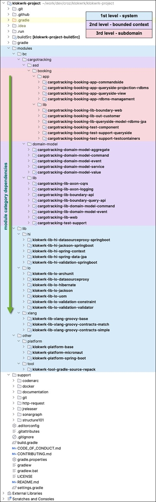](images/0001-expanded_strategic_structure.jpg "Fully expanded strategic structure") <br/>
*Image 1 - Fully expanded strategic structure (click for hi-res version)*

### Top-level organization
Right below the project's root, we have the `modules` directory. It contains actively developed software artifacts and their source code. During everyday work, we will spend most of the time here.
The hierarchy and organization of `modules` directory content are the primary focus of our strategic structure.

At the same hierarchy level, there is the second important directory - `support`. It contains things created to support other aspects of the project. It is the home for documentation, articles,
development notes, supportive scripts, git hooks, etc. The `support` directory has a free-form organization, and the strategic structure does not impose any rules here.

With just those two directories, we moved all our day-to-day work from the clutter of other files in the project's root. Compared to the flat project structure, finding starting points for our work
is already a bit easier.

While we are still at the top of the project hierarchy, it is worth mentioning the project's root directory. It is important because it is the equivalent of the system we are building. In the
strategic structure, the project's name will appear in the names of modules (and their packages) that are considered to be at the abstraction level of the whole system.

It is also interesting to note that the project's name often does not correspond to anything already known in the business domain. The marketing team or upper management may coin it, or it may be
just a result of the inspiration of the developer tasked to create the first commit. Nevertheless, if the project stays around for some time, its name will probably become a new noteworthy term in
the domain.

Let's return to the `modules` directory and start analyzing its organization and structure. From this point forward, the content of the `modules` directory will be our only focus.

### Strategic structure hierarchy
As you can see in the picture above, the strategic structure is organized into three hierarchy levels:
1. The system level
2. The bounded context(s) level
3. The subdomain(s) level

Let's explore them one by one, starting from the 3rd level.

#### 3rd level - subdomains
The entry point to the subdomain level of a hierarchy is the `asd` directory. Here, the `asd` stands for **A** **S**ub**D**omain. It is a home for all subdomains belonging to their corresponding
bounded context. In the example, we have a single subdomain - `booking`, which belongs to the `cargotracking` bounded context.

Every concrete subdomain is split into `app` and `lib` directories. The `app` directory contains **subdomain applications**, while the `lib` directory contains **subdomain libraries**. Together, we
call them - **subdomain modules**.

Subdomain applications are the system's entry points, and they stand at the top of the dependency and abstraction hierarchy. They can use any module from lower levels but cannot use modules from
other subdomains or other bounded contexts. Subdomain applications may contain any code, but typically, they include business orchestration logic, the configuration that wires together pieces from
other modules, and other similar things.

Subdomain libraries can be used only from subdomain applications. Modules belonging to the category of subdomain libraries contain subdomain-specific code, including reusable subdomain orchestration
logic, the subdomain's infrastructural code, the subdomain's technical adapters of domain logic (i.e., JSON serializers and deserializers, validation constraints, JPA entities, etc.), and so on. We
can also find subdomain-specific testing libraries there.

Subdomain libraries can use lower-level modules but cannot reach for dependencies outside their subdomain and bounded context.

> When discussing dependencies in the strategic structure, we only examine dependencies between module categories (if not stated otherwise). We are not considering relationships of dependencies
> inside any individual module category.

Subdomain modules (applications and libraries) can speak ubiquitous language, often including implementations for bits of it. However, the largest part of ubiquitous language lives in the domain
model, which resides at the bounded context level.

#### 2nd level - bounded contexts
The entry point for the bounded context level is the `bc` (**B**ounded **C**ontext) directory. Inside of it, we will have a separate directory for every bounded context in our system. The example
above has a single bounded context - `cargotracking`. Besides the entry point to the subdomains level (`asd` directory), each bounded context is divided into `domain-model` and `lib` directories.

The `domain-model` directory contains modules implementing the domain model of related bounded context. It is the primary implementation of the ubiquitous language and the core of the bounded
context's business logic. Domain model must be precise and consistent across the entire bounded context, including all bounded context's subdomains.

Domain model should be free of the technology as much as possible and practical. It does not mean that using 3rd party libraries is forbidden in all cases. However, any domain model dependency should
be intentionally and consciously added. No matter if it is toward other module categories or 3rd party libraries. An ideal way to control domain module dependencies is by writing suitable tests.

For organizing bounded context libraries, the strategic structure provides two variants. A default variant is presented in the above example, and we can call it - *infrastructure sharing variant*. It
brings a single `lib` directory for all bounded context libraries. As indicated by the name, corresponding modules can only contain infrastructural code. Such modules do not speak the ubiquitous
language and do not understand business logic. In general, they should not be used from the domain model. However, exceptions are allowed as long they are explicitly and carefully supervised.

The second variant of organizing bounded context libraries is called - *domain logic sharing variant*. It is helpful in cases when, besides infrastructural code, we also have to share business logic
at the bounded context level. In this variant we are replacing the single `lib` directory with two new directories - `blib` and `ilib`.

The `blib` directory contains modules with shareable business logic specific to the bounded context. Those modules speak the ubiquitous language, and they understand business logic. However, they are
at a higher dependency level than the domain model. Therefore, they can use the domain model as a dependency, but the reverse is not allowed.

The `ilib` directory contains modules with shareable infrastructural code. The `ilib` directory is equivalent to the `lib` directory from the default variant. It does not speak ubiquitous language,
but in exceptional and supervised cases, it can be used as a dependency of the domain model.

When using this second variant, you should also name the modules appropriately, meaning you should use `blib` and `ilib` suffixes instead of just the `lib` suffix. The following picture shows an
example of the "domain logic sharing variant" for bounded context libraries.

[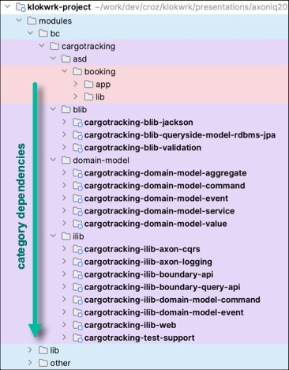](images/0002-bc_libraries_domain_logic_sharing_variant.jpg "Domain logic sharing variant of bounded context libraries") <br/>
*Image 2 - Domain logic sharing variant of bounded context libraries (click for hi-res version)*

It is worth mentioning that both subdomain and bounded context libraries can contain "incubating" modules destined to be more generic and more widely reusable in the end. But for whatever reason,
sometimes it is more convenient to develop and keep them temporarily at the level of subdomain or bounded context libraries. We can easily move them to the proper place when the right time comes.

#### 1st level - system
At the system level, we have three directories: `bc`, `lib`, and `other`. We have already covered the `bc` directory - an entry point to the 2nd level of the strategic structure hierarchy. So, let's
start with the `other` directory to move it quickly out of the picture.

Basically, the `other` directory contains leftovers. It is a place for modules that do not fit anywhere else. Those modules may be technically necessary, but they do not have a strong logical
connection with the business or infrastructural features of the system. There is no need to explain contained modules in detail. Just remember that there is a place to put some miscellaneous stuff.
Now, let's focus on the much more interesting `lib` directory.

The `lib` directory contains system-level libraries. We have two module categories here - **generic system-level libraries** and **language extensions**. They both have a very high reusability
potential, and they may be used even outside of our whole system in some other project, just as we will use typical 3rd party libraries. System libraries are not tied to any subdomain or bounded
context. They don't speak the ubiquitous language and are unaware of business logic.

*Generic system-level libraries* contain widely reusable infrastructural code. In general, they should not be used from the domain model, but once again, exceptions are allowed if they are
intentional.

In the example, we divided generic system libraries into two categories - high (`hi` directory) and low-level (`lo` directory) generic system libraries. Although such a division is somewhat
arbitrary, it may be useful in practice. The low-level generic system libraries deal with widely available 3rd party libraries that are at a relatively low abstraction level (i.e., Jackson,
Hibernate, Slf4j, etc.). We can have here some extensions and customizations of those 3rd party libraries. On the other hand, high-level generic system libraries deal with more general-purpose
libraries and frameworks like Spring, Spring Boot, Axon, and similar. They may provide additional functionalities for those frameworks or just prepare and configure low-level libraries for easier use
in frameworks.

The *language extensions* is a module category positioned at the very bottom of the dependency and abstraction hierarchy. The abstraction level of language extensions is the same as the abstraction
level of the programming language and corresponding SDK. Here, we can have various low-level generic utilities and extensions to the programming language or SDK.

Those modules can be used from everywhere, including the domain model, in the same way as we use programming language and SDK from the domain model. In fact, some language extensions might be
purposely designed to support the more straightforward implementation of particular domain model aspects.

### Strategic structure naming conventions
As you have probably noticed already, the names of modules reflect their position in the strategic structure. In addition, the module's hierarchy position should also be present in the names of
packages.

Since we have a hierarchy instead of a single directory for all modules, including bounded context and subdomain names inside module names is vital for avoiding naming conflicts.

However, the main goal of a naming scheme is to achieve a direct match between the direction of dependencies and the alphabetical order of module names. Even if we can pull out all modules from the
hierarchy and put them into a single directory, or if we can take all packages of all our modules and examine them as a single unique namespace. Actually, those alternative views on your project are
possible if your IDE supports it.

For example, in IntelliJ IDEA, you can take a look at the Packages view in the Project tool window. You can even define custom scopes to filter out unnecessary things for the current task.
Unfortunately, at the moment, custom scopes do not support packages-like view (please vote here: https://bit.ly/44yjikq), but they can still be handy. In complex projects, an option to see a
meaningful, compact, concise, and comprehensive perspective on the whole system is a huge benefit.

The following table summarizes strategic structure naming conventions:

| Module group           | Naming scheme                                                   | Example                                         |
|------------------------|-----------------------------------------------------------------|-------------------------------------------------|
| subdomain apps         | `bc-[bounded-context-name]-asd-[subdomain-name]-app-[app-name]` | `bc-cargotracking-asd-booking-app-commandside`  |
| subdomain libs         | `bc-[bounded-context-name]-asd-[subdomain-name]-lib-[lib-name]` | `bc-cargotracking-asd-booking-lib-boundary-web` |
| domain model           | `bc-[bounded-context-name]-domain-model-[model-part-name]`      | `bc-cargotracking-domain-model-aggregate`       |
| bounded context libs   | `bc-[bounded-context-name]-lib-[lib-name]`                      | `bc-cargotracking-lib-boundary-api`             |
| system high-level libs | `[system-name]-lib-hi-[lib-name]`                               | `klokwrk-lib-hi-spring-context`                 |
| system low-level libs  | `[system-name]-lib-lo-[lib-name]`                               | `klokwrk-lib-lo-jackson`                        |
| language extensions    | `[system-name]-lib-xlang-[lib-name]`                            | `klokwrk-lib-xlang-groovy-base`                 |

*Table 1 - Strategic structure naming conventions*

You may notice that in previous examples, we were not using the full module names as dictated by the table above. More precisely, we didn't use the `bc` and `asd` prefixes. The reason is that those
prefixes were not needed because, by lucky chance, the names of bounded context (`cargotracking`) and subdomain (`booking`) are already at the correct position in the alphabet for modules to still
follow the expected direction of dependencies.

If you are not so lucky and have multiple subdomains or bounded contexts, you must include those prefixes to have the exact match between module names and the direction of dependencies.

As already indicated, the same naming conventions should also apply to packages.

### Strategic structure simplifications
In general, a bounded context can contain multiple subdomains. However, there is a special case when bounded context boundaries exactly match the boundaries of a single subdomain. It is significantly
simpler and more convenient if you can express the relationship between bounded context and its only subdomain that way. Such a one-to-one match is relatively common in practice.

Translated to the strategic structure, it would feel very odd if you must use separate directories with the same names for bounded context and its single implied subdomain. Fortunately, the strategic
structure allows us to simplify the layout for that particular scenario. You can follow these refactoring steps:
- Move subdomain applications to the bounded context level.
- Merge subdomain libraries with bounded context libraries.
- Split bounded context libraries into `blib` and `ilib` directories, if necessary.
- Rename modules and packages as needed.

The following picture shows the example:

[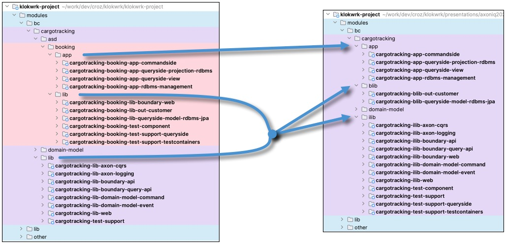](images/0003-strategic_structure_simplification.jpg "Strategic structure simplification") <br/>
*Image 3 - Strategic structure simplification (click for hi-res version)*

### Architectural skeleton
Software architectures generally describe relationships between different components, their mutual dependencies, and communication patterns among them.

Typically, architectural prescriptions focus on relatively fine-grained constructs like classes, interfaces, and their groups. There is nothing wrong with that approach, but the related story of
more coarse-grained artifacts like packages and modules is often left out or just implied and not stated explicitly. As the system grows and the number of modules increases, the lack of high-level
guidelines becomes more and more problematic.

The strategic structure can fill that void. With defined module categories, strict direction of dependencies, and indicated abstraction levels between those categories, strategic structure
characteristics can be interpreted as a high-level **architectural skeleton**. Therefore, the architectural skeleton brings in a bit of formalism that can be expressed as a series of relatively
simple rules:

- general
  - Circular dependencies between modules are not allowed.
  - Dependencies between module groups should always go from top to bottom. The reverse is not allowed.
- subdomain modules
  - Subdomain applications are at the top of the dependency hierarchy.
  - Subdomain modules can contain business and infrastructural logic.
  - Subdomain modules can use any module group from lower dependency levels.
  - Subdomain modules must not depend on a different subdomain or bounded context.
- domain model
  - Domain model must be consistent across its bounded context. That includes all enclosed subdomains.
  - Domain model outbound dependencies must be supervised carefully, best with tests.
  - Domain model must not depend on a different bounded context.
- bounded context libraries
  - In general, bounded context libraries should not be used from a domain model.
  - Bounded context libraries must not depend on a different bounded context.
  - By default, bounded context libraries contain only infrastructural code.
  - If needed, bounded context libraries can be split into business aware (`blib` directory) and infrastructural (`ilib` directory) variants.
- generic system libraries
  - In general, generic system libraries should not be used from a domain model.
  - Generic system libraries contain only infrastructural code.
  - Generic system libraries can extend and customize widely used 3rd party libraries or frameworks.
  - Generic system libraries can implement generic solutions to frequently occurring technical problems.
  - If helpful, generic system libraries can be used outside their system as 3rd party dependency.
- language extensions
  - Language extensions are at the lowest dependency and abstraction level in the system.
  - The abstraction level of language extensions is the same as the abstraction level of the programming language and SDK.
  - Language extensions contain low-level utilities and extensions of programming language and SDK.
  - Language extensions can be used from any other part of the system.
  - The domain model can freely use language extensions.
  - Language extensions can be used outside their system as 3rd party dependency.

The architectural skeleton works together with finer-grained application architectures. While application architectures handle relationships between components close to the implementation, the
architectural skeleton takes care of the bigger picture, ensuring that modules are neatly organized and ordered.

Strategic structure and architectural skeleton are designed for systems aware of strategic DDD principles. However, they can be helpful even if you don't want to bring in DDD explicitly. Strategic
DDD concepts are general enough to be used anywhere. You may wish to adjust terminology here and there, but the basic ideas should hold universally.

#### Visualization and verification
To keep module dependencies tidy, especially in the presence of many modules, we may need help from specialized tools. There are two aspects tools should cover - visualization and automatic
verification.

For visualization of module dependencies, we can use tools like [Structure 101](https://structure101.com) or [Sonargraph Explorer](https://www.hello2morrow.com/products/sonargraph/explorer). They
both determine dependencies based on the bytecode of your Java classes.

With those tools, we can quickly grasp what depends on what in our system. For example, the following picture shows Structure 101 visualization of the dependencies between different module categories
in the klokwrk's strategic structure.

[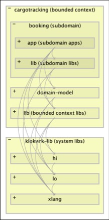](images/0004-strategic_structure_dependencies.jpg "Strategic structure dependencies") <br/>
*Image 4 - Strategic structure dependencies (click for hi-res version)*

We can easily dive in and focus on any level of details up to the classes and their fields and methods. In the following picture, we are still at the fairly high abstraction level while exploring
inbound and outbound dependencies of the bounded context's domain model.

[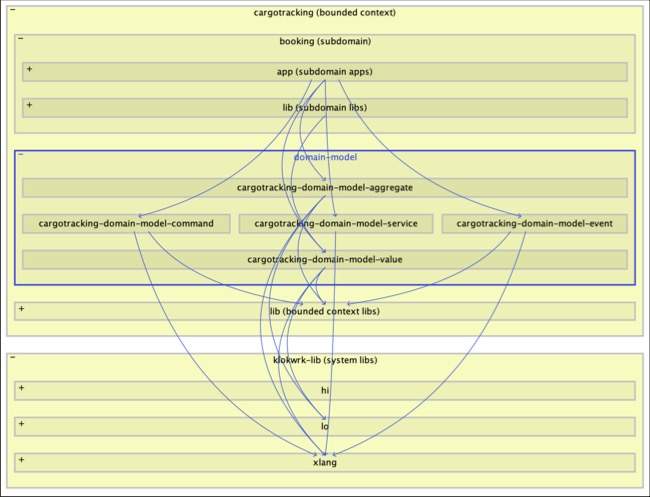](images/0005-domain_model_dependencies.jpg "Domain model dependencies") <br/>
*Image 5 - Domain model dependencies (click for hi-res version)*

Once we see and understand dependencies, we can cover automatic verification with architectural tests. Those are just unit tests focused on architecture verification. It is important to have an
appropriate library at hand that can easily explore dependencies at different levels. Klokwrk uses the [ArchUnit](https://www.archunit.org/) library for those purposes, together with some specialized klokwrk extensions on
top of it, as we'll see later.

### Summary of module organization
In complex projects, any kind of help is welcome. If it brings improvements for frequent tasks, the difference might be huge. When we are developing, we continuously navigate between different
artifacts. If orientation and navigation are backed up by a sensible project organization that always provides a clear and logical context, we can easily and efficiently find our way around.

Based on sound DDD theory, the strategic structure brings strategic DDD concepts into the project's layout. It strives to alleviate everyday tasks and improve development speed and comfort through
its valuable characteristics:
- Business oriented module categories
- Well defined hierarchy
- Strict direction of dependencies
- Indicated abstraction levels
- Apparent system entry points
- Consistent naming conventions

If needed, the strategic structure can be interpreted as a high-level architectural skeleton providing a bit of formalism via simple rules that can be expressed in tests.

As with anything else, the strategic structure is not a silver bullet. It is just a tool that can help you with your everyday work. It is up to you to decide if it is worth the effort. However, if
you are working on a complex project, you could consider it to gain the benefits of smooth project growth, easier maintenance, and significantly reduced cognitive load of your team.

## Basic package organization principles
When separating **applications into packages**, several strategies are usually mentioned. We often hear about "packaging by layers" and "packaging by features", where packaging by features usually
dominates in theory. Also, there is an approach that combines these two - "packaging by layered features" [2]. In addition, if an application tries to follow a well-defined architecture, there will
be even more guidelines and rules to follow.

But what about **packages in standalone libraries**? There are no features, layers, or architecture to offer at least some guidance. We have to turn our attention to different abstractions like
"components" or "toolboxes" and even sometimes apply packaging by "kind" in a very narrow scope despite its lousy reputation [3].

The main principles are striving for a reasonable level of cohesion inside a package, trying to minimize accidental and unnecessary dependencies between packages, and avoiding cyclic dependencies at
all costs (tools like [Sonargraph](https://www.hello2morrow.com/products/sonargraph/explorer) and [Structure 101](https://structure101.com) can be of great help here). Sometimes it is an easy and
natural thing to do, but often is not. Learning from others' experiences and being familiar with some formalized guidance can help ([4],[5]). However, you will commonly end up with your best judgment,
and if something does not feel right, it should probably be changed somehow.

When you are dealing with numerous modules, each containing a dozen of packages, applying some consistency rules can be a lifesaver. For example, in the `klokwrk-project`, each module's root package
name tries to use a hierarchy derived from a module name. With consistent and organized module layout and naming in place, we can end up with root packages that do not collide across the entire
system. For future maintenance and refactorings, this characteristic might be essential. Also, this is an excellent start for further packaging inside each module.

Let's look at a few examples.

## Packaging for libraries
When organizing packages for libraries, the `klokwrk-project` tries to adhere to the principle of keeping high cohesion inside the module's packages while any circular dependencies are strictly
forbidden.

At the module level, cohesion is a bit less important than at the package level so we might have modules addressing different things. Yet these things still need to be related and close enough,
allowing a module to have a meaningful purpose and concrete name (avoid modules containing words like "common", "misc", "utilities", etc.). It also helps when required 3rd party libraries are not
entirely heterogeneous.

When we are extending or customizing features of concrete libraries, it is quite essential to monitor 3rd party dependencies. If they are disparate, we might need more fine-grained modules. On the
other hand, if we target very particular higher-level consumers, we might want to include more heterogeneous features to avoid too fine-grained modules that no one will use in isolation.

The first example (Image 6) shows the packaging of `cargotracking-lib-axon-cqrs` and `cargotracking-lib-axon-logging` modules dealing with different aspects of the Axon framework.

[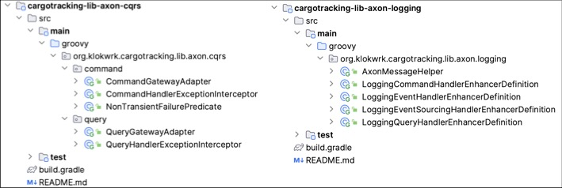](images/0006-axon_modules_packaging_comparison.jpg "Axon-related modules packaging comparison") <br/>
*Image 6 - Axon libraries packaging comparison (click for hi-res version)*

Without exploring Axon's internal workings, packages seem to be understandable and coherent, keeping the right level of cohesion. After all, it is hard to fail with cohesion for that small number of
classes. Subpackages in `cargotracking-lib-axon-cqrs` are a bit more elaborate and look slightly unrelated, which lowers the cohesion of a module, but they all deal with similar enough things.

[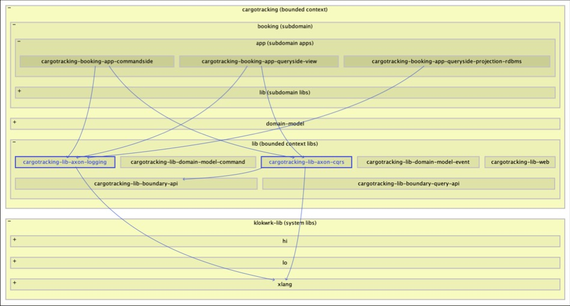](images/0007-axon_modules_dependencies.jpg "Dependencies of Axon-related modules") <br/>
*Image 7 - Dependencies of Axon-related modules (click for hi-res version)*

It might be surprising why these two modules are not combined into a single one. Putting aside that coming up with a meaningful name might be hard, if we look at consumers (Image 7), we can
see `cargotracking-lib-axon-cqrs` being used from `commandside` and `queryside-view` apps. At the same time, `cargotracking-lib-axon-logging` is also a dependency of the `queryside-projection` app.
If lowered module cohesion, problematic naming, and different consumers are not enough, taking into account that required 3rd party libraries are different gives us more than enough reasons for
justifying the existence of separate library modules.

Next, we have two low-level libraries supporting the extension, customization, and configurability of 3rd party "datasource-proxy" library. Module `klokwrk-lib-lo-datasourceproxy` implements an
extension, while `klokwrk-lib-hi-datasourceproxy-springboot` adds support and configurability for the Spring Boot environment.

[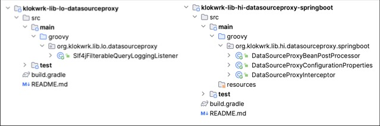](images/0008-datasourceproxy_modules_packaging_comparison.jpg "Datasourceproxy modules packaging comparison") <br/>
*Image 8 - Datasourceproxy modules packaging comparison (click for hi-res version)*

After glancing over the packages, one might think there is an error in `klokwrk-lib-lo-datasourceproxy` since there are no subpackages. It's true. This is an error unless you take a less strict
approach. We have only one class and no intention to add anything else in the foreseeable future, so there is no real need for a subpackage. But it can be added if you really want it.

If you only target Spring Boot apps, both modules can be combined. But with separate modules, you allow core functionality to be used outside the Spring Boot environment. Although for different
reasons, the approach with separate modules is usually taken from Spring Boot auto-configurable libraries, so we have enough to justify our decision.

The last example is very similar, but now it's about the Jackson library.

[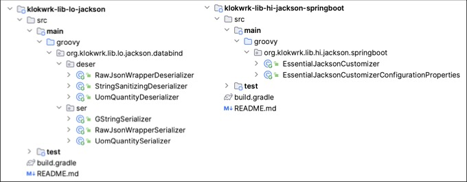](images/0009-jackson_modules_packaging_comparison.jpg "Jackson modules packaging comparison") <br/>
*Image 9 - Jackson modules packaging comparison (click for hi-res version)*

This time, in the core `klokwrk-lib-lo-jackson` library, we need separated subpackages for splitting different functions. It is worth noting the names of subpackages - `deser` and `ser`. They are the
same as for corresponding packages in the Jackson library. This is standard practice when you are extending existing 3rd party libraries, which aids in understanding and maintenance.

## Packaging for applications
Regarding packaging, we have been exploring mainly infrastructural concerns of our system so far. What happens when we try to add business domain logic? How should we organize it into packages?
Is there a way to logically and conveniently separate infrastructure from the domain?

We can try organizing packages by architectural layers in the traditional "web-domain-persistence" style for simpler systems. And it might work just fine. However, if our application is successful,
stakeholders will likely ask for more features. Suddenly, what worked in our simple picture of the world becomes harder to maintain.

Then, we might attempt to improve the situation with organizing packages by features. A fresh perspective and improved structure can quickly bring many benefits and ease the maintenance and addition
of new functionalities. While cramming all feature-related classes into a single feature package will work for some, we might miss additional structure for categorizing our things. Besides being
somewhat easier to the eye, it can be a real necessity when, for example, we try bringing in support for new inbound channels and integrations with unexpected external systems.

Therefore, why not try to combine features and layers? We just might come up with a flexible and extensible structure that satisfies the needs of a complex system - "**package by layered feature**"
[2]. With such packaging, features are a primary organizational mechanism, while layers are secondary.

Although packaging by features is attractive for implementing use cases, it should not influence central domain classes (aggregates, entities, value objects, etc.). In the organizational view,
essential domain classes stand on their own. As a unit, they should support every use case. They are in their isolated universe and do not depend on their surroundings. All dependencies always point
toward central domain classes and never in the opposite direction. That way, primary domain classes are isolated from technical challenges in outer circles as much as possible. No matter what
happens with technical choices for inbound channels and integration layers, business logic implemented in the core domain model should not change [6].

It should be noted that feature-ignorance does not equally apply to the non-primary domain classes closer to the outer circles, like domain application services (a.k.a. domain facades). It makes
sense to organize them by features. Application services are the first-line defense from technological influences but are also domain coordinators that directly support implementations of particular
use cases.

### Introducing hexagonal architecture
Implementing our custom scheme for application layers can be very fun and rewarding since you can learn a lot. But sooner than later, various problems might emerge. You might find there are missing
features or something that is not entirely thought out. And for sure, there will be problems with explaining ideas to fellow workers.

Anyone familiar with hexagonal, onion, or clean architectures can easily find similarities with our desired characteristics of application packaging, as described in previous sections. Therefore,
it makes sense to embrace already existing well-known architecture.

Klokwrk uses hexagonal architecture since we find it to offer very concrete guidelines when it comes to translating into code-level artifacts. If you are not familiar with hexagonal architecture,
take a look at the following picture (taken from the article ["Hexagonal Architecture with Java and Spring"](https://reflectoring.io/spring-hexagonal/) by Tom Hombergs):

[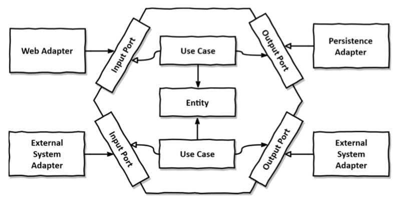](images/0010-hexagonal_architecture.jpg "Hexagonal architecture") <br/>
*Image 10 - Hexagonal architecture (click for hi-res version)*

At the center, we have our domain model. It is isolated from its surroundings as much as possible. We are using inbound and outbound ports and adapters for that purpose.

Ports are just simple interfaces that are used by inbound adapters or implemented by outbound adapters. Typical inbound or driving adapters are web controllers or messaging handlers. Outbound, or
driven adapters, commonly implement concerns like remoting or persistence. Details of these concrete implementations should not be visible in their outbound port contracts as it should remain
hidden from the domain.

The most important characteristic of the architecture is that all dependencies always point inward, to the domain model in the center.

If you want to know more, you can read the book ["Get your hands dirty on Clean Architecture"](https://reflectoring.io/book/) by Tom Hombergs. It is not written for CQRS/ES applications, but rather
for classical ones. However, in straightforward and very concrete terms, it explains hexagonal architecture very well.

### Applying hexagonal architecture
Let's take a look at how Klokwrk implements hexagonal architecture. We'll briefly explore the structure and organization of packages and classes for commandside, queryside-view, and
queryside-projection applications. The next image (Image 11) shows expanded packages of the commandside application.

[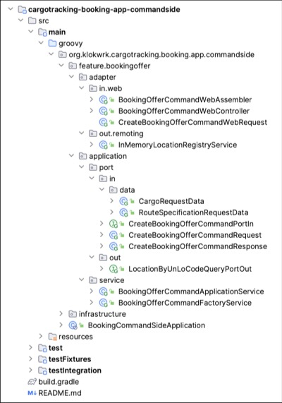](images/0011-commandside_hexagonal_architecture.jpg "Commandside hexagonal architecture") <br/>
*Image 11 - Commandside hexagonal architecture (click for hi-res version)*

Top-level packages are `feature` and `infrastructure`. Package `infrastructure` contains glue-code with various responsibilities. As it is not subject to hexagonal architecture, we will not explore
it further.

The package `feature` is a placeholder for all features of our commandside application. You can think of a "feature" as a more coarse-grained concept than the use-case. All closely related use-cases
are contained in a single feature. In our case, we have a feature with the name `bookingoffer`.

Under the `bookingoffer` feature package, we can find packages and classes related to the hexagonal architecture - `adapter` and `application`. Package `application` contains inbound and outbound
port interfaces, together with corresponding data structure classes if those are necessary (i.e., `CreateBookingOfferCommandRequest`, `CreateBookingOfferCommandResponse`, and others). Under the
`service` package, we can find domain application services (i.e., `BookingOfferCommandApplicationService`) that implement inbound port interfaces.

Adapters live in the `adapter` package. There are inbound and outbound adapters. We can see here `BookingOfferCommandWebController` as an example of a **driving inbound** adapter. It depends on and
calls the `CreateBookingOfferCommandPortIn` inbound port, which is implemented by the application service `BookingOfferCommandApplicationService`. As an example of an **outbound**, or **driven**,
adapter, here we have `InMemoryLocationRegistryService`. It implements `LocationByUnLoCodeQueryPortOut` outbound port, which is also used by application service.

For comparison, the following picture (Image 12) shows the structure of queryside-projection and queryside-view applications.

[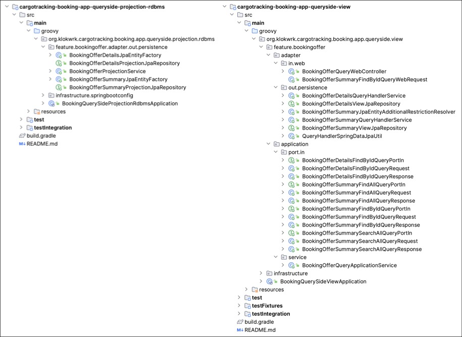](images/0012-queryside_projection_and_view_hexagonal_architecture.jpg "Queryside-projection and queryside-view hexagonal architecture") <br/>
*Image 12 - Queryside-projection and queryside-view hexagonal architecture (click for hi-res version)*

In queryside-projection application we can observe some CQRS/ES and Axon specifics applied to the hexagonal architecture. For example, the queryside-projection application contains only an outbound
adapter responsible for persisting events. It even does not implement any outbound port since it is called indirectly by Axon Server infrastructural component.

On the other hand, the structure of the queryside-view application is more elaborate and very similar to the commandside application. However, it does not make any domain-specific business decisions
as the commandside does. Nevertheless, the queryside-view can still use classes from the domain model (typically value objects only) but only as convenient and dormant data carriers.

### Architectural testing
Using hexagonal architecture might be an attractive idea as it looks like every significant component has a well-defined placeholder in the project structure. However, besides the structure,
any software architecture also imposes some rules, and hexagonal architecture is not the exception. When you add additional CQRS/ES flavor, there are even more rules to follow.

What are these rules, and what they enforce? Basically, in the application that follows some architecture, it is not allowed that a class or an interface accesses anything that it wants. Rules impose
constraints on dependencies that are permitted between code-level artifacts. For example, they regulate who can be called by some class or which interface a class should implement.

That leads us to the essential question. How can we control whether all rules are honored or not? How can we ensure that developers learning about CQRS/ES and hexagonal architecture can comfortably
work without breaking it? This is the point where architectural testing steps in the picture.

It would help if you had in place tests that verify all architectural invariants. Klokwrk uses the [ArchUnit](https://www.archunit.org/) library for this purpose. Building on top of the
ArchUnit, Klokwrk provides DSL for specifying hexagonal architecture layers for CQRS/ES applications. There is support for several subtypes of CQRS/ES flavored hexagonal architecture corresponding
to the commandside, queryside-projection, and queryside-view aspects.

To better understand how this works, we can look at the architectural test fragment for the commandside application (taken from `BookingCommandSideAppArchitectureSpecification` class).

```
  void "should be valid hexagonal commandside CQRS/ES architecture"() {
    given:
    ArchRule rule = HexagonalCqrsEsArchitecture
        .architecture(HexagonalCqrsEsArchitecture.ArchitectureSubType.COMMANDSIDE)
        .domainValues("..cargotracking.domain.model.value..")
        .domainEvents("..cargotracking.domain.model.event..")
        .domainCommands("..cargotracking.domain.model.command..")
        .domainServices("..cargotracking.domain.model.service..")
        .domainAggregates("..cargotracking.domain.model.aggregate..")

        .applicationInboundPorts("..cargotracking.booking.app.commandside.feature.*.application.port.in..")
        .applicationOutboundPorts(
            "..cargotracking.booking.app.commandside.feature.*.application.port.out..",
            "..cargotracking.booking.lib.out.customer.port.."
        )
        .applicationServices("..cargotracking.booking.app.commandside.feature.*.application.service..")

        .adapterInbound("in.web", "..cargotracking.booking.app.commandside.feature.*.adapter.in.web..")
        .adapterOutbound("out.remoting", "..cargotracking.booking.app.commandside.feature.*.adapter.out.remoting..")
        .adapterOutbound("out.customer", "..cargotracking.booking.lib.out.customer.adapter..")

        // ...

        .withOptionalLayers(false)

    // ...

    expect:
    rule.check(importedClasses)
  }
```

The architectural test is relatively simple as we only need to specify packages that belong to each layer of the CQRS/ES flavored hexagonal architecture. The DSL does the rest, meaning it checks all
the rules. To really get a grasp on this, we should look at the DSL implementation. The following listing displays a DSL fragment responsible for specifying rules intended for command side
applications (taken from `HexagonalCqrsEsArchitecture` class).

```
  private void specifyArchitectureCommandSide(LayeredArchitecture layeredArchitecture) {
    layeredArchitecture
        .layer(DOMAIN_VALUE_LAYER).definedBy(domainValuePackageIdentifiers)
        .layer(DOMAIN_EVENT_LAYER).definedBy(domainEventPackageIdentifiers)
        .layer(DOMAIN_COMMAND_LAYER).definedBy(domainCommandPackageIdentifiers)
        .layer(DOMAIN_SERVICE_LAYER).definedBy(domainServicePackageIdentifiers)
        .layer(DOMAIN_AGGREGATE_LAYER).definedBy(domainAggregatePackageIdentifiers)

        .layer(APPLICATION_INBOUND_PORT_LAYER).definedBy(applicationInboundPortPackageIdentifiers)
        .optionalLayer(APPLICATION_OUTBOUND_PORT_LAYER).definedBy(applicationOutboundPortPackageIdentifiers)
        .layer(APPLICATION_SERVICE_LAYER).definedBy(applicationServicePackageIdentifiers)

        .layer(ADAPTER_INBOUND_LAYER).definedBy(adapterInboundPackageIdentifiers.collect({ Map.Entry<String, String[]> mapEntry -> mapEntry.value }).flatten() as String[])
        .optionalLayer(ADAPTER_OUTBOUND_LAYER).definedBy(adapterOutboundPackageIdentifiers.collect({ Map.Entry<String, String[]> mapEntry -> mapEntry.value }).flatten() as String[])

        .whereLayer(DOMAIN_VALUE_LAYER)
            .mayOnlyBeAccessedByLayers(
                DOMAIN_EVENT_LAYER, DOMAIN_COMMAND_LAYER, DOMAIN_SERVICE_LAYER, DOMAIN_AGGREGATE_LAYER,
                APPLICATION_INBOUND_PORT_LAYER, APPLICATION_SERVICE_LAYER, APPLICATION_OUTBOUND_PORT_LAYER,
                ADAPTER_INBOUND_LAYER, ADAPTER_OUTBOUND_LAYER
            )
        .whereLayer(DOMAIN_EVENT_LAYER).mayOnlyBeAccessedByLayers(DOMAIN_AGGREGATE_LAYER)
        .whereLayer(DOMAIN_COMMAND_LAYER).mayOnlyBeAccessedByLayers(DOMAIN_AGGREGATE_LAYER, APPLICATION_SERVICE_LAYER)
        .whereLayer(DOMAIN_SERVICE_LAYER).mayOnlyBeAccessedByLayers(DOMAIN_AGGREGATE_LAYER)
        .whereLayer(DOMAIN_AGGREGATE_LAYER).mayOnlyBeAccessedByLayers(APPLICATION_SERVICE_LAYER)

        .whereLayer(APPLICATION_INBOUND_PORT_LAYER).mayOnlyBeAccessedByLayers(APPLICATION_SERVICE_LAYER, ADAPTER_INBOUND_LAYER)
        .whereLayer(APPLICATION_OUTBOUND_PORT_LAYER).mayOnlyBeAccessedByLayers(APPLICATION_SERVICE_LAYER, DOMAIN_AGGREGATE_LAYER, ADAPTER_OUTBOUND_LAYER)
        .whereLayer(APPLICATION_SERVICE_LAYER).mayNotBeAccessedByAnyLayer()

    adapterMayNotBeAccessedByAnyLayer(layeredArchitecture, adapterInboundPackageIdentifiers, ADAPTER_INBOUND_LAYER)
    adapterMayNotBeAccessedByAnyLayer(layeredArchitecture, adapterOutboundPackageIdentifiers, ADAPTER_OUTBOUND_LAYER)
  }
```

First, it defines all relevant layers, and then it defines rules for these layers. For example, if we look at the rules for events (`whereLayer(DOMAIN_EVENT_LAYER)`), we can see that only aggregates
can use them in command side applications. Then, commands (`whereLayer(DOMAIN_COMMAND_LAYER)`) can be used by aggregates and application services. And so forth.

By implementing appropriate architectural tests for each CQRS/ES application type, we can be sure that architectural invariants will hold.

## Conclusion
This article explored a method for structuring the complex multi-module project leveraging DDD concepts, hexagonal architecture and CQRS/ES. While doing this, we introduced strategic structure
for project artifacts categorization into subdomain applications and libraries, domain-model, bounded context libraries, generic libraries, and language extensions.

We've seen how to leverage coarse-grained module groups and architectural skeleton to deal with dependencies. We've also demonstrated some tools for visualizing and controlling them.

Next, we've explored principles for package organization and consistent naming, including an emphasized distinction between low-level libraries and high-level application artifacts.

At the application level, we introduced hexagonal architecture to structure the application's business features and seamless inclusion of CQRS/ES architecture implemented on top of the Axon framework
and Axon Server.

And finally, we ended with architectural tests for our hexagonal CQRS/ES architecture that verify our own rules for application dependencies at the package and class/interface level.

Although we've used quite specific architectural and technology choices, demonstrated principles and ideas should be applicable and helpful in other environments too.

## References
[1] [What is a Domain?](https://medium.com/nick-tune-tech-strategy-blog/what-is-a-domain-99f658b22d7d) <br/>
[2] [Package by type, by layer, by feature vs Package by layered features](https://proandroiddev.com/package-by-type-by-layer-by-feature-vs-package-by-layered-feature-e59921a4dffa) <br/>
[3] [Four Strategies for Organizing Code](https://medium.com/@msandin/strategies-for-organizing-code-2c9d690b6f33) <br/>
[4] [Package principles](https://en.wikipedia.org/wiki/Package_principles) <br/>
[5] [The Principles of OOD](http://butunclebob.com/ArticleS.UncleBob.PrinciplesOfOod) <br/>
[6] [The Clean Architecture](https://blog.cleancoder.com/uncle-bob/2012/08/13/the-clean-architecture.html)
