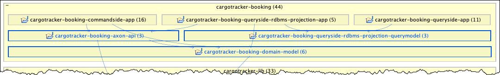
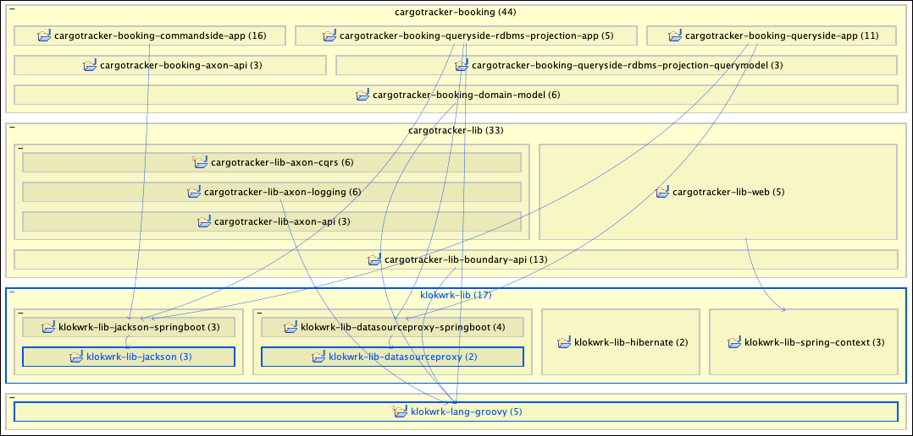
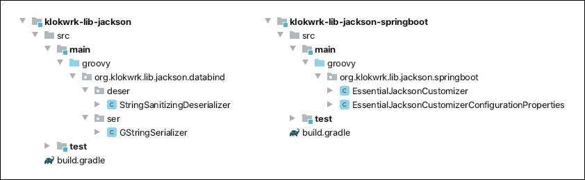
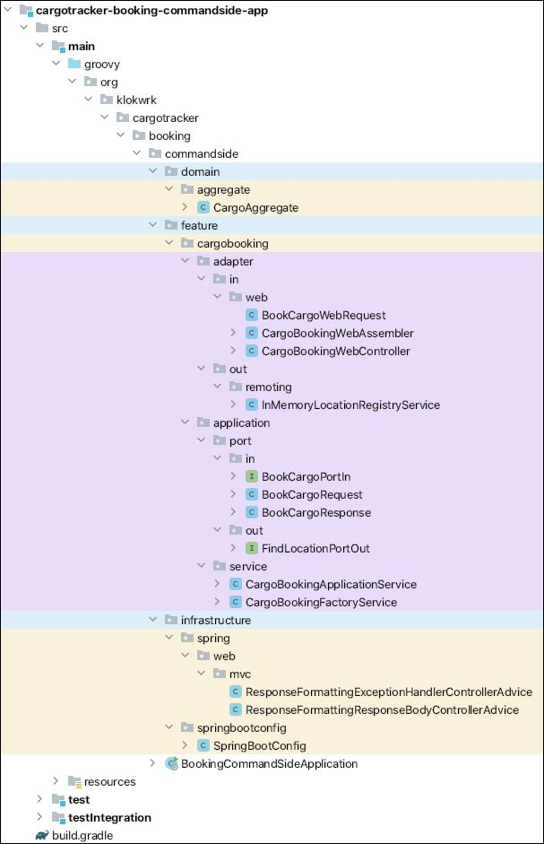
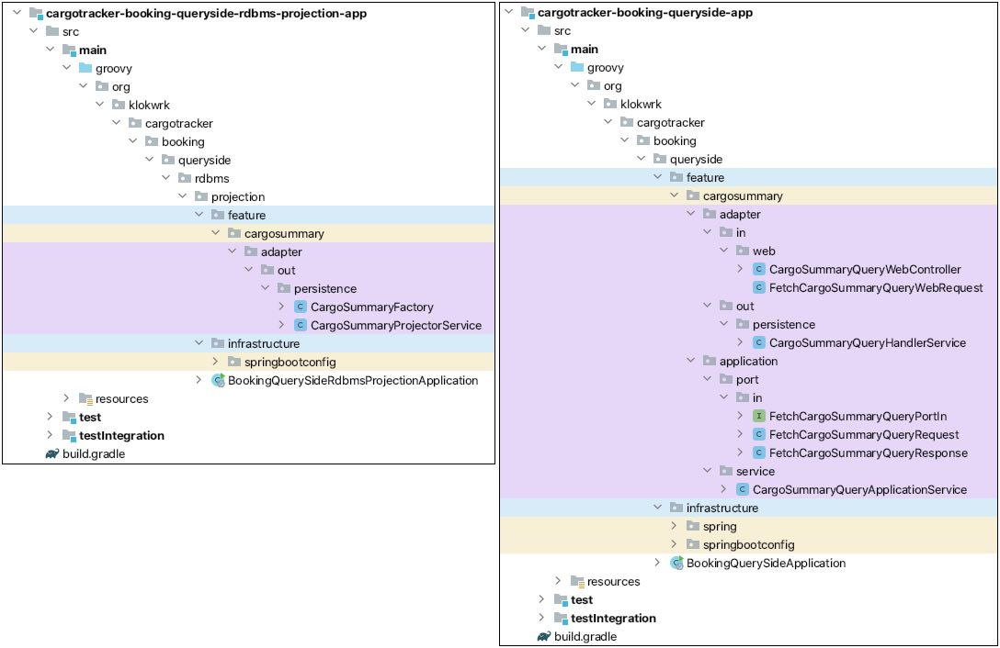

# Organizing modules and packages
* **Author:** Damir Murat
* **Created:** 13.05.2020.
* **Updated:** 01.04.2021.

## Introduction
In this article, we'll explore and describe one specific way of organizing and structuring artifacts of the larger project. As a concrete example, we'll use
[Project Klokwrk](https://github.com/croz-ltd/klokwrk-project).

For organizing high-level project artifacts, Klokwrk uses strategic DDD concepts like domains and subdomains. Besides other things, a meaningful organization can help manage dependencies between
modules and dependencies between modules and 3rd party libraries. It can also bring significant improvements in orientation and navigation at this level.

Going one step deeper at the **application** package level, Klokwrk mainly follows hexagonal architecture ideas. It also introduces some CQRS/ES (Command Query Responsibility Segregation/Event
Sourcing) flavor to the architecture when appropriate.

When combined, we believe that strategic DDD and hexagonal architecture provide suitable organizational constructs with exact placeholders for tactical DDD artifacts like aggregates, entities,
value objects, etc.

It is not unusual concerns like these pop-up late in the development cycle, often after several releases are already in production. Even when they come to focus, it is typically hard to resolve them
since they might require dramatic refactoring of applications. It might be easier if we have a suitable structure in place from the start. It shouldn't excessively disturb development in the early
phases, and it should be flexible enough to support the system's growth.

With the recent industry move towards microservices, carefully organizing high-level development artifacts has even more importance.

This article explores issues that commonly don't exist in more straightforward projects. For this reason, it will be best if readers were exposed and have some experience working on mid to complex
projects comprising multiple modules. Familiarity with DDD concepts, hexagonal architecture, and CQRS/ES is also a plus, although some of these ideas are introduced and briefly explained in the
article. Project and package organization are based on constructs from the Java language but can be translated in any other environment. Although demonstrated code examples use the Groovy language,
they should be readable enough for all readers.

### Main goals
After the brief discussion above, we can try to enumerate the **main goals** of our targeted project structure:

- Provide means for organizing modules that will support future system growth and enable controlled management of dependencies between modules and dependencies on 3rd party libraries.
- Provide a way for organizing **application** and **library** packages that are flexible enough to support future development and feature expansion smoothly.
- Organization of **application** packages should adhere to the sound application architecture principles like those promoted by hexagonal, onion, or clean architectures.

## Organizing modules
Let's start with modules of `klokwrk-project` that were available at the time of this writing (May 2020). Here is how they look in an IDE:

 <br/>
*Image 1 - Modules layout in an IDE*

### System
At the top is a **system artifact** `klokwrk-project` that represents a system being built. It maps to the whole problem space of our solution. As long as we have a single project for the entire
solution, all related artifacts are placed under the system directory.

### Domain
The `cargotracker` is the name of our domain. The corresponding directory does not represent an artifact by itself. Instead, it just groups all artifacts belonging to that domain. As system
implementation grows, additional domain grouping directories might be added. They can address essential and distinguishing business features, or be more supportive or non-functional in nature.

##### Implementation note
The Gradle build system does not support artifact-less directories out of the box. By default conventions, every directory known to the Gradle should produce some artifact (jar, war, etc.).
Fortunately, Gradle is flexible enough to support the described layout by some custom scripting in `settings.gradle`. The more elegant solution is to employ
[kordamp-gradle-plugins](https://github.com/kordamp/kordamp-gradle-plugins), the excellent portfolio of Gradle plugins with direct support for our desired project layout.

### Subdomain
As explained in DDD, each business domain can be divided into subdomains. When modeling a solution for it, the business-level "subdomain" concept is mapped into a modeling-level "bounded context".
In our example, names of implementation artifacts belonging to the bounded context are prefixed with the domain name followed by subdomain name. Therefore, for the `booking` subdomain of
`cargotracker` domain, we get `cargotracker-booking-*` modules.

If you want, you may also organize subdomains into grouping directories, in the same way we did for domains. However, even if you do this, it is recommended to keep the same naming convention.
That way, all potential naming conflicts at the level of concrete JAR files can be avoided.

There are multiple `cargotracker-booking` modules, but they are not all at the same abstraction level. Modules with the `app` suffix are highest-level modules, representing runnable artifacts
([Spring Boot](https://spring.io/projects/spring-boot) applications). The products of other `cargotracker-booking` modules are non-runnable jar archives that are used as dependencies by runnable
modules. Although producing jars, these non-runnable modules do not have reusability potential outside of the `booking` subdomain. They are specific to the `booking` subdomain.

With an increasing number of artifacts, it is quite important to control and monitor dependencies between them. If you don't, you might end up with undesired dependencies, or even with dependency
cycles in the worst case. This can be done in several ways. You can use specialized tools like [Structure 101](https://structure101.com) or
[Sonargraph](https://www.hello2morrow.com/products/sonargraph/explorer), or even better, write appropriate tests, for example, with the help of [ArchUnit](https://www.archunit.org/) library.

The abstraction level and direction of compile-time dependencies (directed blue arrows) for our `booking` subdomain are clearly shown in the following image (partial `klokwrk-project` model from
Structure101 Studio for Java):

 <br/>
*Image 2 - Abstraction level and dependencies of booking subdomain modules*

Let's take a look at the purpose of each `cargotracker-booking` module. First, we have `*-app` modules that utilize CQRS and event sourcing via
[Axon framework](https://github.com/AxonFramework/AxonFramework) and [related infrastructure](https://axoniq.io/product-overview/axon-server). Each of these apps implements a single high-level
CQRS/Event sourcing architectural component, so we ended up with `commandside` (command processing), `queryside` (query processing), and `queryside-rdbms-projection` (translating events into RDBMS
tables) applications.

Next we have `cargotracker-booking-axon-api` and `cargotracker-booking-queryside-rdbms-projection-model`. Both modules are at a similar abstraction level. They logically belong to the
**subdomain's** internal infrastructure and serve as a layer adapting to and using selected concrete technologies, and that requires compile-time access to some 3rd party libraries (not shown in the
picture).

Classes from these modules are not exposed to the world outside of the subdomain. Module `cargotracker-booking-axon-api` defines commands and events that are data structures supporting Axon's
implementation of CQRS/ES. Commands and events are considered the primary internal APIs of Axon CQRS/ES applications, which explains the name. Although commands and events are very close to the
simple data structure objects, it is allowed for them to use Axon API at compile-time. Module `cargotracker-booking-axon-api` is used by the command side application (commands and events) and
projection application (events only).

Module `cargotracker-booking-queryside-rdbms-projection-model` hosts JPA-related classes responsible for implementing requirements of subdomain queries. Since the `booking` subdomain has selected
an RDBMS system for building its primary projections and JPA as a database access technology, the module will have a compile-time dependency on the JPA APIs. This module can be used from the
projection application and queryside application.

Therefore, both modules require quite different 3rd party libraries (Axon or JPA) and are used by different modules. Even if you think that both modules can be combined into one, significant
differences in the usage and differences in 3rd party libraries should convince you otherwise.

Module `cargotracking-domain-model-value` contains subdomain's value objects. In CQRS applications, aggregates and entities belong only to the command side. They cannot be used either from
projections or query side. But domain value objects can be shared among all of these. In one part, value objects are used for expressing the internal state of aggregates. They are also used as
building blocks for modeling events. Query side can also use domain value objects while describing query requirements.

That broad reusability potential across subdomain is the main reason for extracting domain value objects into a standalone module.

### Domain libraries
The expanded compile-time dependency graph containing `cargotracker` domain libraries is shown in the next picture.

 <br/>
*Image 3 - `cargotracker` domain libraries and dependencies*

Modules belonging to domain libraries contain infrastructural code at the lower abstraction level then subdomain libraries. That code is reusable across the whole `cargotracker` domain.
As infrastructural modules, they are related to the specific technology choices made for the domain in question. That can be seen in their names to some extent, and the selection of 3rd party
libraries used by each module (not shown in the picture).

If we have multiple domains using the same tech stack, domain libraries can be pulled out into the generic libraries layer to make them more available. Besides, domain libraries can also contain
"incubating" libraries that are destined to be generic and widely reusable at the end. But for various reasons, it is more convenient to keep them at the domain level temporarily.

Let's look quickly at what each of these modules contains. `cargotracking-lib-axon-cqrs` includes helpers that ease some aspects of working with Axon APIs. Module `cargotracking-lib-axon-logging`
provides logging infrastructure that gives more insight into the inner working of various Axon components. `cargotracker-lib-axon-api` brings in base classes and interfaces for working with commands
and events.

You may wonder why so many Axon related library modules? As we decided to have microservices for each significant runnable component in CQRS/Event sourcing application, it might be expected for them
to use different Axon dependencies (Axon framework is not delivered as a single jar, but instead contains multiple modules addressing different concerns). Beside high cohesion and low coupling,
differences in 3rd party dependencies are usually a significant hint for creating independent modules, even when high cohesion and low coupling attributes are not yet clearly visible and apparent.

We have two modules left. `cargotracker-lib-web` contains classes related to the handling of HTTP requests and responses. For example, here we deal with the formatting and localization of successful
and exceptional JSON responses. Module `cargotracking-lib-boundary-api` formalizes general structures of domain boundary API that all inbound adapters (web, messaging, etc.) must follow to be able to
speak with domain application services (a.k.a. domain facades).

Boundary API refers to classes defining the data structures and exceptions that are part of the contract between the outside world and domain hidden behind domain application services. They are
allowed to be shared between them. Domain facade handles all boundary requests by converting them into appropriate internal commands or queries. On the other side, deep domain artifacts like
aggregates are allowed to throw boundary exceptions understood by the outside world without any facade-level translation necessary.

### Generic libraries and language extensions
Going further down the abstraction ladder, we will find generic reusable libraries and, even further down, language extensions. The reusability potential of these modules is high and is not tied to
any domain. Here we can discover supportive additions for various commonly used 3rd party libraries and language-level helpers that expand features of programming languages used in our system.

 <br/>
*Image 4 - `klokwrk` generic libraries and language extensions*

These modules are used as direct compile-time dependencies from higher levels. Still, we can also have runtime-only modules that need to be available in the classpath but are not directly referenced
from higher-level code (`klokwrk-lib-hibernate` is an example).

As the reusability of generic libraries is high and the abstraction level relatively low, it is standard for infrastructural code at the higher abstraction level to reference these modules.
In contrast, it is not expected that business-level domain classes (i.e., aggregates, entities, and value objects) use them. However, language extensions are different. As they expand the
capabilities of the programming language, the same language in which domain classes are written, then it is allowed for domain classes to use these language extensions. In fact, some language
extensions might be designed purposely to support the more straightforward implementation of domain classes.

Another aspect worth keeping in mind is the potential number of dependencies that higher-level code might have on these modules. Successful reusable libraries can be used all over the place. Thus,
it is desirable to achieve the right level of implementation stability as soon as possible. In general, this will be easier to accomplish with modules narrower in their scope. A high level of code
coverage, proper and meaningful documentation, and several concrete usage scenarios are some tools that can all improve stability.

There are several modules in the group of reusable libraries. `klokwrk-lib-jackson` provides some custom serializers and deserializers not available in the
[Jackson](https://github.com/FasterXML/jackson) distribution. `klokwrk-lib-jackson-springboot` brings an opinionated way of setting Jackson's defaults and means for configuring them, if needed, from
the Spring Boot environment. Opinionated selection of Jackson defaults tries to provide Jackson configuration suitable for avoiding usage of Jackson annotations as much as possible.

Another pair of related modules deal with the excellent [datasource-proxy](https://github.com/ttddyy/datasource-proxy) library. `klokwrk-lib-datasourceproxy` introduces useful extensions to the
library like the implementation of a logging suppression filter that can ignore not-interesting queries (i.e. Axon's token store polling). `klokwrk-lib-datasourceproxy-springboot` provides support
for setting up and configuring the library in the Spring Boot context.

Module `klokwrk-lib-spring-context` contains customized extensions to the classes from the [Spring framework's](https://spring.io/projects/spring-framework) `spring-context` module. Currently, there
is support for creating a list of message codes used when resolving localized messages from resource bundles. Finally, `klokwrk-lib-hibernate` deals with some peculiarities of the internal workings
of [Hibernate ORM](https://hibernate.org/orm/).

In the group of language extensions, we have a `klokwrk-lang-groovy` module. It contains some general-purpose constants, utility methods for convenient fetching of object's properties, and some
infrastructure helping with relaxing requirements of Groovy map constructor. The last two features can help create immutable objects and support simple mapping of data from one object into another.
Quite often, this is more than enough for data mapping purposes without requiring any additional library.

## Basic package organization principles
In the domain of separating **applications into packages**, several strategies are often mentioned. In most cases, we can hear about "packaging by layers" and "packaging by features" where
packaging by features usually dominates (at least on paper). Also, there is an approach that combines these two - "packaging by layered features" [1]. Also, if an application tries to follow a
well-defined architecture (like hexagonal architecture, for example), there will be more guidelines and rules to follow.

What about **packages in standalone libraries**? There are no features, layers, or architecture to offer at least some guidance. We have to turn our attention to different abstractions like
"components" or "toolboxes" and even sometimes apply packaging by "kind" in a very narrow scope, despite its lousy reputation [2].

The main principles are striving for a reasonable level of cohesion inside a package, trying to minimize accidental and unnecessary dependencies between packages, and avoiding cyclic dependencies at
all costs (tools like [Sonargraph](https://www.hello2morrow.com/products/sonargraph/explorer) and [Structure 101](https://structure101.com) can be of great help here). Sometimes it is an easy and
natural thing to do, but often is not. Learning from others' experiences and being familiar with some formalized guidance can help [3][4]. However, you will commonly end up with your best judgment,
and if something does not feel right, it should probably be changed somehow.

When you are dealing with numerous modules, each containing a dozen of packages, applying some consistency rules can be a lifesaver. For example, in the `klokwrk-project`, each module's root package
name tries to use a hierarchy derived from a module name. With consistent and organized module naming in place, we can end up with root packages that do not collide across the entire system. For
future maintenance and refactorings, this characteristic might be essential. Also, this is an excellent start for further packaging inside each module.

Let's look at how all this works in `klokwrk-project` on a few examples. We will start with packaging for libraries.

## Packaging for libraries
When organizing packages for libraries, the `klokwrk-project` tries to adhere to the principle of keeping high cohesion inside of module's packages while any circular dependencies are strictly
forbidden. At the module level, cohesion is not that important as on the package level, so we might have modules addressing different things. Yet these things still need to be close enough,
allowing a module to have a meaningful and concrete name (avoid modules containing words like "common", "misc", "utilities", etc.), and that required 3rd party libraries are not entirely
heterogeneous.

Since we are extending or customizing features of concrete libraries, it is quite important to monitor required 3rd party dependencies. If they are disparate, we might need more fine-grained modules.
On the other hand, if we target specific higher-level consumers, we might want to include more heterogeneous features to avoid too fine-grained modules that no one will use in isolation.

The first example (Image 5) shows the packaging of `cargotracking-lib-axon-cqrs` and `cargotracking-lib-axon-logging` modules dealing with different aspects of the Axon framework.

 <br/>
*Image 5 - general example of library packaging comparison*

Without exploring Axon's internal workings, packages seem to be understandable and coherent, keeping the right level of cohesion. After all, it is hard to fail with cohesion for that small number of
classes. Subpackages in `cargotracking-lib-axon-cqrs` are a bit more elaborate and look slightly unrelated, which lowers the cohesion of a module, but they all deal with similar enough things.

It might be surprising why these two modules are not combined into a single one. Putting aside that coming up with a meaningful name might be hard, if we look at consumers (Image 3), we can
see `cargotracking-lib-axon-cqrs` being used from `commandside` and `queryside` apps. At the same time, `cargotracking-lib-axon-logging` is also a dependency of the `projection` app. If lowered module
cohesion, problematic naming, and different consumers are not enough, taking into account that required 3rd party libraries are different gives us more than enough reasons for justifying the
existence of separate library modules.

Next, we have two low-level libraries supporting extension, customization, and configurability of 3rd party "datasource-proxy" library. Module `klokwrk-lib-datasourceproxy` provides extension itself,
while `klokwrk-lib-datasourceproxy-springboot` implements support and configurability for the Spring Boot environment.

 <br/>
*Image 6 - datasourceproxy library packaging comparison*

After glancing over packages, one might think there is an error in `klokwrk-lib-datasourceproxy` since there are no subpackages. It's true. This is an error unless you take a less strict approach.
We have only a single class and no intention to add some more in the foreseeable future, so there is no real need for a subpackage. But it can be added if you really want it.

If you only target Spring Boot apps, both modules can be combined. But with separate modules, you are allowing for core functionality to be used outside of the Spring Boot environment. Although for
different reasons, approach with separate modules is usually taken from Spring Boot auto-configurable libraries, so we can justify our decision.

The last example is very similar, but now it's about the Jackson library.

 <br/>
*Image 7 - jackson library packaging comparison*

This time, in the core `klokwrk-lib-jackson` library, we need separated subpackages for splitting different functions. It is worth noting the names of subpackages. They are the same as for
corresponding packages in the Jackson library. This is standard practice when you are extending existing libraries, which aids in understanding and maintenance.

## Packaging for applications
So far, we were exploring mainly infrastructural concerns of our system. There was no real business logic involved. What happens when we try to add it? How should we organize it into packages? Is
there a way to logically and conveniently separate infrastructure from the domain?

We can try organizing packages by architectural layers in the traditional "web-domain-persistence" style for simpler systems. And it might work just fine. But if our application is successful,
stakeholders will likely ask for more features. Suddenly what was working in our simple picture of the world becomes harder to maintain.

Then we might attempt to improve the situation with organizing packages by features. A fresh perspective and improved structure can quickly bring many benefits and ease the maintenance and addition
of new functionalities. While cramming all feature-related classes into a single feature-package will work for some, we might be desperately missing additional structures for categorizing our things.
Besides being somewhat easier to the eye, it can be a real necessity for bringing in support for new inbound channels and integrations with unexpected external systems.

Therefore, why not try to combine features and layers? We just might come up with a flexible and extensible structure that satisfies the needs of a complex system -
"**package by layered feature**" [1]. With such packaging, features are a primary organizational mechanism, while layers are secondary.

Although packaging by features is attractive for implementing use cases, it should not influence central domain classes (aggregates, entities, value objects, etc.). In the organizational view,
essential domain classes stand on its own. They are in their isolated universe and do not depend on their surroundings. All dependencies always point toward central domain classes, and never in the
opposite direction. That way, primary domain classes are isolated from technical challenges in outer circles as much as possible. No matter what happens with technical choices for inbound channels
and integration layers, business logic implemented in the domain should not change [5].

It should be noted that feature-ignorance does not necessarily apply to the non-primary domain classes closer to the outer circles, like domain application services (a.k.a. domain facades). It makes
sense to organize them by features. Application services are the first-line defense from technological influences but are also domain coordinators that directly support implementations of particular
use cases.

### Introducing hexagonal architecture
Implementing our custom scheme for application layers can be very fun and rewording since you can learn a lot. But sooner than later, various problems might emerge. You might find there are missing
features, or something is not entirely thought through. And for sure, there will be problems with passing intentions and ideas to fellow workers.

Anyone familiar with hexagonal, onion, or clean architectures, can easily find similarities with our desired characteristics of application packaging, as described in previous sections. Therefore,
it makes sense to embrace already existing well-known architecture.

Project Klokwrk uses hexagonal architecture as we find it to offer very concrete guidelines when it comes to translating into code-level artifacts. If you are not familiar with hexagonal architecture,
we can look at the picture taken from the article ["Hexagonal Architecture with Java and Spring"](https://reflectoring.io/spring-hexagonal/) by Tom Hombergs.

 <br/>
*Image 8 - hexagonal architecture (by Tom Hombergs)*

At the center, we have our domain code. It is isolated from its surroundings as much as possible. We are using inbound and outbound ports and adapters for that purpose.

Ports are just simple interfaces that are used by inbound adapters or implemented by outbound adapters. Typical inbound or driving adapters are web controllers or messaging handlers. Outbound, or
driven adapters, commonly implement concerns like remoting or persistence. Details of these concrete implementations should never be visible in their outbound port contracts as it should remain
hidden from the domain.

The most important characteristic of the architecture is that all dependencies always point inward, to the domain in the center.

If you want to know more, you can read the book ["Get your hands dirty on Clean Architecture"](https://reflectoring.io/book/) by Tom Hombergs. It is not written for CQRS/ES applications, but rather
for classical ones. However, in straightforward and very concrete terms, it explains hexagonal architecture very well.

### Applying hexagonal architecture
#### Structure
Let's take a look at how Project Klokwrk uses hexagonal architecture. We'll briefly explore structural manifestations at the level of packages and classes for commandside, queryside, and projection
applications.

The next image shows expanded packages of command side application. To make different nesting levels more apparent, packages and classes are displayed in colors.

 <br/>
*Image 9 - command side hexagonal architecture*

Top-level packages are `domain`, `feature`, and `infrastructure`. Package `infrastructure` contains glue-code with various responsibilities. As it is not subject to hexagonal architecture, we will
not explore it further.

In the case of the command side application, the `domain` package will contain aggregates and entities. If we have some domain services closely related to the aggregates in question, we can also put
them here. On the other hand, more general domain services with wider reusability should be pulled out into the subdomain or domain libraries.

The package `feature` is a placeholder for all features of our command side application. You can think of a "feature" as a more coarse-grained concept than the use-case. All closely related use-cases
are contained in a single feature. In our case, we have a feature with the name `cargobooking`.

Under the `cargobooking` feature package, we can find packages and classes related to the hexagonal architecture - `adapter` and `application`. Package `application` contains inbound and outbound
port interfaces, together with corresponding data structure classes if those are necessary (i.e., `BookCargoCommandRequest` and `BookCargoCommandResponse`). Under the `service` package, we can find
domain application services (i.e., `CargoBookingApplicationService`) that implement inbound port interfaces.

Adapters live in the `adapter` package. There are inbound and outbound adapters. We can see here `CargoBookingWebController` as an example of a **driving inbound** adapter. It depends on and calls
the `BookCargoPortIn` inbound port, which is implemented by the application service `CargoBookingApplicationService`. As an example of an **outbound**, or **driven**, adapter, here we have
`InMemoryLocationRegistryService`. It implements `LocationByUnLoCodeQueryPortOut` outbound port, which is called by application service `CargoBookingApplicationService`.

For comparison, the following picture shows the structure of projection and query side applications.

 <br/>
*Image 10 - projection and query side hexagonal architecture*

Besides obvious simplification over the command side application, we can also observe some CQRS/ES specifics applied to hexagonal architecture. For example, the projection application contains only
an outbound adapter responsible for persisting events. It even does not implement any outbound port since it is called indirectly by Axon Server.

On the other hand, the query side application is slightly more elaborate, but, for example, it does not do anything related to the core domain in the DDD sense. There are no domain aggregates or
domain entities on the query side.

#### Behavior and architectural testing
Using hexagonal architecture might be an attractive idea as it looks like every significant component has a well-defined placeholder in the project structure. However, besides the structure,
any software architecture also imposes behavioral rules, and hexagonal architecture is not the exception. When you add additional CQRS/ES flavor, there are even more rules to follow.

What are these rules, and what they enforce? Basically, in the application that follows some architecture, it is not allowed that a class or an interface accesses anything that it wants. Rules impose
constraints on dependencies that are permitted between code-level artifacts. For example, they regulate who can be called by some class or which interface a class should implement.

That leads us to the essential question. How can we control whether all rules are honored or not? How can we ensure that developers learning about CQRS/ES and hexagonal architecture can comfortably
work without breaking it? This is the point where architectural testing steps in the picture.

It would help if you had in place tests that verify all architectural invariants. Project Klokwrk uses the [ArchUnit](https://www.archunit.org/) library for this purpose. Building on top of the
ArchUnit, Klokwrk provides DSL for specifying hexagonal architecture layers for CQRS/ES applications. There is support for several subtypes of CQRS/ES flavored hexagonal architecture corresponding
to the command side, projections, and query side aspects.

To better understand how this works, we can look at the test fragment for command side application (taken from `BookingCommandSideAppArchitectureSpecification` class).

```
  void "should be valid hexagonal commandside CQRS/ES architecture"() {
    given:
    ArchRule rule = HexagonalCqrsEsArchitecture
        .architecture(HexagonalCqrsEsArchitecture.ArchitectureSubType.COMMANDSIDE)
        .domainValues("..cargotracker.booking.domain.model.value..")
        .domainEvents("..cargotracker.booking.domain.model.event..")
        .domainCommands("..cargotracker.booking.domain.model.command..")
        .domainAggregates("..cargotracker.booking.domain.model.aggregate..")

        .applicationInboundPorts("..cargotracker.booking.commandside.feature.*.application.port.in..")
        .applicationOutboundPorts("..cargotracker.booking.commandside.feature.*.application.port.out..")
        .applicationServices("..cargotracker.booking.commandside.feature.*.application.service..")

        .adapterInbound("in.web", "..cargotracker.booking.commandside.feature.*.adapter.in.web..")
        .adapterOutbound("out.remoting", "..cargotracker.booking.commandside.feature.*.adapter.out.remoting..")

        .withOptionalLayers(false)

    expect:
    rule.check(importedClasses)
  }
```

The test is relatively simple as we only need to specify packages that belong to each layer of the CQRS/ES flavored hexagonal architecture. The DSL does the rest, meaning it checks all the rules.
To really get a grasp on this, we should look at the DSL implementation. The following listing displays a DSL fragment responsible for specifying rules intended for command side applications (taken
from `HexagonalCqrsEsArchitecture` class).

```
  private void specifyArchitectureCommandSide(LayeredArchitecture layeredArchitecture) {
    layeredArchitecture
        .layer(DOMAIN_VALUE_LAYER).definedBy(domainModelPackageIdentifiers)
        .layer(DOMAIN_EVENT_LAYER).definedBy(domainEventPackageIdentifiers)
        .layer(DOMAIN_COMMAND_LAYER).definedBy(domainCommandPackageIdentifiers)
        .layer(DOMAIN_AGGREGATE_LAYER).definedBy(domainAggregatePackageIdentifiers)

        .layer(APPLICATION_INBOUND_PORT_LAYER).definedBy(applicationInboundPortPackageIdentifiers)
        .optionalLayer(APPLICATION_OUTBOUND_PORT_LAYER).definedBy(applicationOutboundPortPackageIdentifiers)
        .layer(APPLICATION_SERVICE_LAYER).definedBy(applicationServicePackageIdentifiers)

        .layer(ADAPTER_INBOUND_LAYER).definedBy(adapterInboundPackageIdentifiers.collect({ Map.Entry<String, String[]> mapEntry -> mapEntry.value }).flatten() as String[])
        .optionalLayer(ADAPTER_OUTBOUND_LAYER).definedBy(adapterOutboundPackageIdentifiers.collect({ Map.Entry<String, String[]> mapEntry -> mapEntry.value }).flatten() as String[])

        .whereLayer(DOMAIN_VALUE_LAYER)
            .mayOnlyBeAccessedByLayers(DOMAIN_EVENT_LAYER, DOMAIN_COMMAND_LAYER, DOMAIN_AGGREGATE_LAYER, APPLICATION_SERVICE_LAYER, APPLICATION_OUTBOUND_PORT_LAYER, ADAPTER_OUTBOUND_LAYER)
        .whereLayer(DOMAIN_EVENT_LAYER).mayOnlyBeAccessedByLayers(DOMAIN_AGGREGATE_LAYER)
        .whereLayer(DOMAIN_COMMAND_LAYER).mayOnlyBeAccessedByLayers(DOMAIN_AGGREGATE_LAYER, APPLICATION_SERVICE_LAYER)
        .whereLayer(DOMAIN_AGGREGATE_LAYER).mayOnlyBeAccessedByLayers(APPLICATION_SERVICE_LAYER)

        .whereLayer(APPLICATION_INBOUND_PORT_LAYER).mayOnlyBeAccessedByLayers(APPLICATION_SERVICE_LAYER, ADAPTER_INBOUND_LAYER)
        .whereLayer(APPLICATION_OUTBOUND_PORT_LAYER).mayOnlyBeAccessedByLayers(APPLICATION_SERVICE_LAYER, DOMAIN_AGGREGATE_LAYER, ADAPTER_OUTBOUND_LAYER)

        .whereLayer(APPLICATION_SERVICE_LAYER).mayNotBeAccessedByAnyLayer()

    adapterMayNotBeAccessedByAnyLayer(layeredArchitecture, adapterInboundPackageIdentifiers, ADAPTER_INBOUND_LAYER)
    adapterMayNotBeAccessedByAnyLayer(layeredArchitecture, adapterOutboundPackageIdentifiers, ADAPTER_OUTBOUND_LAYER)
  }
```

First, it defines all relevant layers, and then it defines rules for these layers. For example, if we look at the rules for events (`whereLayer(DOMAIN_EVENT_LAYER)`), we can see that only aggregates
can use them in command side applications. Then, commands (`whereLayer(DOMAIN_COMMAND_LAYER)`) can be used by aggregates and application services. And so forth.

By implementing appropriate architectural tests for each CQRS/ES application type, we can be sure that architectural invariants will hold.

## Conclusion
This article explored a method for structuring the complex project leveraging DDD concepts and hexagonal architecture. While doing this, we introduced project artifacts categorization into subdomain
applications and libraries, domain libraries, generic reusable libraries, and generic reusable language extensions.

We've also seen the way to deal with inter-module dependencies and how to monitor and control them.

Next, we've demonstrated principles for package organization and consistent naming, including an emphasized distinction between low-level libraries and high-level application artifacts.

At the application level, we introduced hexagonal architecture to structure the application's business features and seamless inclusion of CQRS/ES architecture implemented on top of the Axon framework
and Axon Server.

And finally, we ended with tests for our hexagonal CQRS/ES architecture that verify our own rules for application dependencies at the package and class/interface level.

Although we dealt with quite specific architectural and technology choices, hopefully, demonstrated principles and ideas could be helpful in other environments too.

## References
[1] [Package by type, -by layer, -by feature vs Package by layered features](https://proandroiddev.com/package-by-type-by-layer-by-feature-vs-package-by-layered-feature-e59921a4dffa) <br/>
[2] [Four Strategies for Organizing Code](https://medium.com/@msandin/strategies-for-organizing-code-2c9d690b6f33) <br/>
[3] [Package principles](https://en.wikipedia.org/wiki/Package_principles) <br/>
[4] [The Principles of OOD](http://butunclebob.com/ArticleS.UncleBob.PrinciplesOfOod) <br/>
[5] [The Clean Architecture](https://blog.cleancoder.com/uncle-bob/2012/08/13/the-clean-architecture.html)
