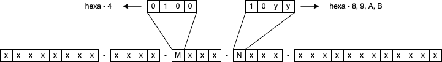
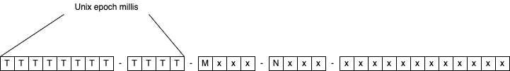
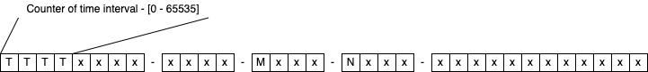
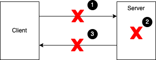

# Random UUID as a Primary Key in the Relational Database
* **Author:** Damir Murat
* **Created:** 22.03.2022.

## Introduction
This article explores the usage of random UUIDs (Universally Unique Identifiers) [1] as primary keys in RDBMS (Relational Database Management System) systems where we can safely expose such
identifiers publicly. It also discusses client-generated identifiers, including their validation and some typical usages like implementing idempotency.

My interest in the topic stems from the work at `klokwrk-project` [2], which is DDD (Domain Driven Design) driven CQRS (Command and Query Responsibility Segregation) and Event Sourcing system, based
on the Axon Framework [3]. In Axon-based applications, aggregate identifiers are usually random UUIDs that end up written in database projections as primary keys or unique identifiers of table rows
(at the database level, you can think of an individual projection as a single denormalized table).

It doesn't matter for discussion if you are unfamiliar with aggregates or projections, or DDD, CQRS, and Event Sourcing. The bottom line is that we want to use random UUIDs as primary keys. Just keep
in mind that some solutions and recommendations can be motivated by mechanisms used for handling the data in event-sourced projections like in `klokwrk-project`. Nevertheless, offered advice should
be equally applicable in other types of environments.

## Characteristics of random UUIDs
Random UUIDs are very popular identifiers, especially in distributed systems. Their base characteristics make them very attractive to be used as publicly exposed identifiers of the system's internal
entities and data.

### Advantages
#### Universal uniqueness
For distributed systems, the global uniqueness of identifiers is very interesting. It supports creating client-generated identifiers where the client can prepare identifiers upfront, without
contacting the server and without the risk of collisions. Such behavior can improve scalability and support various system and data integrity patterns like idempotency and retries. Of course,
these might be attractive for modern monolithic systems too.

When generating truly random UUIDs, the probability of collision is immensely small. As Wikipedia states, you can generate 1 billion UUIDs every second, and after 85 years, you will have a chance of
50% for a single collision [4]. Although this looks like a lot, you can get to the first collision much quicker in a massive system with millions of servers and devices. However, keep in mind that
we are not trying to generate UUIDs for the whole universe or not even for the entire extensive system. Instead, we just want to create primary keys for a single entity and table, which is a much
narrower scope. Therefore, the chance is that we will not have any collisions for the foreseeable future.

If somehow you still end up with a collision, the database's primary key will reject the request, and the application will raise an exception. And we can nicely present the problem to the user
instructing him to try again.

#### Unpredictability
Random UUIDs are unpredictable in terms of order and time. In contrast to classic sequence-based integer identifiers, you can not guess the previous or the next identifier, nor can you guess how many
entities are already stored in the system. Further, if you compare random UUIDs with time-based UUIDs, random UUID does not disclose order, time, or location (through MAC address) information.

In Java, random UUIDs are generated with Cryptographically Strong Pseudo-Random Number Generator (CSPRNG) by default. CSPRNG ensures UUID randomness, or in other words, UUID unpredictability and
uniqueness. CSPRNG is a pretty hard requirement for "true randomness" because without CSPRNG, random is not so random anymore, and you can end up with often collisions [5][6].

Although unpredictability makes random UUIDs more secure when exposed as public identifiers, do not rely just on that for security. You should always have additional access control security
mechanisms in place. Like any other type of publicly exposed identifier, UUIDs can be stolen [7].

Suppose you are not concerned about exposing unintended information (MAC address and exact creation time) to the clients and don't need client-generated identifiers. In that case, you can simply use
time-based v1 UUIDs. When properly constructed, they will not have collisions and are sorted by nature, eliminating database performance issues described later. You can even use client-generated
identifiers if clients agree to expose their unintended information to you.

#### Easy to generate
Practically all languages and platforms today can easily generate random UUIDs. Either through native features built in the platform or through additional libraries. Just make sure that proper CSPRNG
is used.

Traditional sequence-based integer primary keys will not provide mentioned advantages, making them much more cumbersome when exposed as public identifiers.

### Potential issues
Of course, there are disadvantages too. Let's try to enumerate some.

#### Human unfriendly
Although convenient and desirable from a technical perspective, UUIDs are notoriously hard for humans to handle. Just imagine reading it aloud when reporting an issue or trying to remember it.
Almost impossible. On the other hand, some may consider this an advantage because users are forced to copy-paste identifiers, which improves the reliability of reported issues.

If you are concerned about those problems, next to UUIDs, you may want to introduce additional identifiers that are more convenient for humans [8]. They should be generated by the system (not by the
client) since they will probably be unique only at the (sub)system level, not globally. At the same time, you should try to make them unpredictable as much as possible. Also, avoid using them in
query conditions whenever you can, as we don't want to replace our main UUID identifiers.

#### Size
UUID comprises 128 bits (16 bytes). As such, they are significantly larger than traditional integer keys (4 or 8 bytes). In the case of elaborate and normalized database schemas, this might be an
important issue as keys appear in indexes, in primary, and in foreign key columns.

You can mitigate the situation by using integer keys as primary and foreign keys, while UUIDs are stored in columns with unique and non-null constraints. Externally exposed identifiers are still
UUIDs, but related internal entities may use only integer keys. In addition, such a schema can simplify database management as we don't always have to deal with hard-to-remember UUIDs.

In the `klokwrk-project` (or any other CQRS/Event Sourcing system), database projections are purposely built for individual queries (table-per-query model). Therefore, we have denormalized tables
(with some possible data duplication between tables), and foreign keys are used less frequently, if at all. For such a schema, using only UUID keys (instead of combining them with integer keys) can
be more pragmatic (less need for navigation between tables and complex joins) and efficient in terms of data size (one unique index less and less need for foreign keys).

#### Performance
While previous problems might not be critical for your environment (or proposed solutions are good enough), performance issues related to random UUID keys are hard to ignore. In the following
sections, we will discuss them and describe a possible solution.

## Database performance of random UUIDs
In general, it looks like random UUIDs are pretty suitable to be used as exposed public identifiers. There are some issues, but we can probably circumvent them. But only if we can handle those
mentioned performance problems somehow. Let's see first what the problem is actually.

Say we have some simple table with random UUID as a primary key and possibly some additional columns containing arbitrary data. The existence of a primary key implies that the database has also
created a unique index for it. Such an index is typically implemented as a form of B-Tree [9] data structure, where leaf nodes contain keys and pointers to the actual table rows. To reduce the size
of the tree and to optimize data reading from a disk, leaf nodes do not contain a single key/pointer pair but rather a set of them packed in so-called pages. As B-Trees are sorted data structures,
the database performs a series of comparisons when navigating to the particular leaf node in search of a table row pointer.

### The problem
When **writing** data, adding a new row in the table is very simple. It can be just appended at the end. However, the index handling is a different story. The new key/pointer pair has to land at a
very particular place based on comparing our new key with already existing keys in the index. If we have a random UUID as a key, the location in the index will also be random with an equal chance to
end up in any of the index pages (uniform distribution).

Therefore, inserting random primary keys will break down any caching scheme that the database might have as there is no more benefit of recently used index pages available in memory. When the index
is large enough, there is a very high chance different index pages have to be loaded from the disk before the database can proceed. Additionally, there may be more problems depending on the concrete
database. In PostgreSQL, for example, random UUID also causes so-called WAL-write amplification [10][11][12].

With sequence-based integers keys, such problems do not exist. When a new key is required, the appropriate index page will probably wait in the memory already, prepared to be written.

With **reading**, we also have similar problems. Typically, interactive applications work with entities created or updated before a few moments. Regarding read access patterns, this means we will
access recently used data much more frequently than data created several weeks ago. With sequence-based integer identifiers, recently used index data will be on the same page or in pages with a very
close locality. Consequently, the cache hit ratio will be very high.

As you may guess, random identifiers will bust the cache and reduce the hit ratio as the database will often have to load index pages with the distant locality.

### The solution
The general solution principle for our problem is very well known and pretty old. In 2002, Jimmy Nilsson published an article describing it for Microsoft SQL Server 2000 [13]. The basic idea was to
add a sequential part into UUID as a prefix, making it sortable for the database. The term **COMB** UUID was coined, which stands for "Combined time" UUID.

If you read the article, you will notice that Jimmy uses a suffix instead of a prefix because Microsoft SQL Server uses a different sorting algorithm for UUIDs than any other database [14].

Before going into a few more details about the original solution, let's quickly detour to describe the basic structure of standard RFC 4122 random UUID [15].

#### Standard random UUID structure
UUIDs, including random UUIDs, comprise 128 bits of data in total. However, some of those bits are reserved for representing the version and variant of UUID. In the case of random UUID version is 4
while the variant is 2.

  
*Image 1 - Random UUID structure*

The picture above is a canonical text representation of UUID where 16 bytes (128 bits) are displayed with 32 hexadecimal numbers (each number corresponds to 4 bits). Therefore, **x** characters from
the picture can be any hexadecimal digit from 0 to F. The **M** character marks position for encoding a version, while **N** marks a place for variant. The version occupies 4 bits, while the
variant occupies 2 bits.

Any UUID complying with described bit patterns for version and variant represents a structure of a random UUID from the perspective of a standard. With random UUIDs, we have **122 random bits** in
total, while 6 bits are reserved for version and variant.

#### COMB UUID
COMB UUIDs replace the first 6 bytes with milliseconds of the moment of UUID creation. Again, the original article uses a suffix instead of a prefix because it is tied to the Microsoft SQL Server
database.

  
*Image 2 - COMB UUID structure*

All hexadecimal characters marked with **T** contain values related to time. Taking them together, we have creation time encoded in random UUID.

This solution resolves database performance problems nicely, but at a price. The randomness of our UUIDs is significantly reduced, **from 122 to only 74 bits** (48 bits are now reserved for time).
However, this is still good enough for our purposes, and with good CSPRNG, we should not experience collisions at the scope of a single system or a single database table.

But there is a much bigger problem if we want to expose UUIDs to the public. Now every UUID clearly says when some entity is created, and a series of UUIDs reveals the information of creation order.
Many organizations are very reluctant towards such easy disclosure of that information.

Fortunately, there is an improved COMB UUID variant that can help - Short prefix COMB UUID.

#### Short prefix COMB
The idea about "Short prefix COMB" UUIDs originates from Tomas Vondra's article - "Sequential UUID Generators" [11]. A very similar scheme did pop up at other places too [16]. Tomas did not use a
"Short prefix COMB" name, but it came up in some other sources [17][18]. As the `klokwrk-project` uses the `uuid-creator` library [18], which also refers to "Short prefix COMB" [19], I will stick
with the term.

The basic concept of the short prefix COMB is to reduce the randomness of UUID by introducing a prefix of a few bytes where that prefix will be constant for a predefined period o time, i.e., for one
minute. If we have a prefix of 2 bytes (16 bits or 4 hexa digits), our prefix can store 65535 (2^16 - 1) values. With this setup, the prefix is effectively a minute counter, whose values will be
incremented as the minutes pass by. When the counter reaches the maximum of 65535, it will roll over to 0 and start again.

  
*Image 3 - Short prefix COMB UUID structure*

The time-interval counter (or prefix) is calculated based on the current time at the moment of UUID creation. The general formula is (note that division is integer division):

    prefix = (time_intant_millis / interval_length_in_millis) % max_number_of_prefix_values

As we choose one minute for time interval and the total of 65536 values for a prefix (for 16 bits, there are 2^16 = 65536 possible values), we end up with the concrete formula below. Depending on the
moment of calculation, the prefix can be anything between 0 and 65535.

    prefix = (time_instant_millis / 60000) % 65536

There are a few more things to note here. First, for the interval of one minute and 2 bytes (16 bits) prefix, the prefix will flip over after approximately 45 days:

    65536 / 60 min / 24 hours = 45.5111 days

Second, note that there can be an infinite number of `time_instant_millis` with the exact same prefix. In other words, based on prefix alone, `time_instant_millis`, or the precise time of prefix
creation, cannot be derived. However, if someone knows when your system went into production, he can calculate the moment of prefix creation during the first 45 days and some more until prefixes
start to overlap.

If those 45 days are too much for you, the base interval length can be reduced, for example, at 30 or 15 seconds. However, be careful with this as it may influence database performance. For instance,
the prefix will update twice as fast with a 30-second interval for the same workload. So over your monitoring interval (45 days, for example), you will probably touch twice as many index pages than
before because the faster prefix will go two times over the range of all prefix values. In addition, the distribution of keys will be more dispersed, which can negatively influence writing and
reading data access patterns. On the opposite side, a slower rate of prefix changing can lead to more splits of index pages because of their higher population rate. Therefore, it all depends on the
characteristics of your application and the workload.

But there is another significant issue if you support externally generated UUIDs. Your identifier-generating clients will have to calculate externally generated UUIDs with a new algorithm (assuming
you have a proper validation in place).

In general, use the one-minute interval as default and change it only if you really have to, meaning you are experiencing performance issues that can be reduced by changing interval length. Now,
let's go back to other characteristics of short prefix COMBs.

The randomness of UUID is still reduced, but this time only by 16 bits, which leaves us with **106 random bits**. Previously, near the start of the article, we cited Wikipedia that with standard
random UUIDs, you can generate 1 billion UUIDs every second, and after 85 years, you will have a chance of 50% for a single collision [4]. If we use the same formula again, it turns out we can
generate 4 million short prefix UUIDs per second to get the same 50% chance of collision after 85 years.

To summarize, the short prefix COMB, similarly to the original COMB, resolves database performance issues with UUIDs [11][12][16]. The randomness, although reduced compared to standard random UUID,
is still excellent. Further, the short prefix COMB does not expose the time of the creation directly and completely hides it after enough time passes. For Java, there is also a library ready to be
used [18][19], while for other platforms, it can be implemented quickly enough, starting with standard random UUID as a base.

#### Dealing with Microsoft SQL Server issues
We have already mentioned Microsoft SQL Server's peculiar UUID sorting algorithm [14]. Because of it, using the short **prefix** COMB will not help you. So you have to use the short **suffix** COMB
instead.

If generated UUIDs are not exposed publicly, things are straightforward. Just replace short prefix COMB implementation with corresponding suffix variant, and MS SQL Server will happily sort them in
indexes. The `uuid-creator` library even offers a ready-made generator [20].

However, you may want to reconsider the approach for publicly exposed UUIDs and identifier-generating clients. For example, if you have a system built of multiple microservices, each of them can
freely choose its database. There is a chance not all services will use MS SQL Server. Suddenly the implementation of your identifier-generating clients complicates considerably. Not only they have
to deal with those "weird UUIDs you have invented", but now they even have to alternate between different variants. What's more, all clients will now be very well aware of a database you are using
in a particular service. Not ideal, really.

It would be better to stick with prefix variant publicly and convert it into suffix variant internally. From the client's perspective, all short COMBs in your system will be of a prefix variant, so
identifier-generating clients do not have to change their implementation based on a service they are using. In addition, your internals (concrete database you are using) remain hidden.

You can implement internal prefix-to-suffix-and-back conversion in a variety of ways. However, if you are using Hibernate library, probably the most transparent way is to introduce your custom
Hibernate type [21].

## Client generated identifiers
We have mentioned several times the possibility of using identifiers generated by clients. In distributed systems, even in monolithic ones, they can be helpful in various scenarios. But before we
dive deeper into how to use them (and if we want to use them at all), let's see first how to validate them because we should, in general, validate any data coming from the client. And
client-generated identifiers are no exception.

### Validation
We'll start with looking at standard random UUID first. What can you validate about it? If you receive it in canonical text representation, you can verify its format by checking if version and
variant markers are correct. Further, you can also confirm if all digits are actual hexadecimal digits and maybe if all dashes are in the right place. This is all you can do by examining only the
data itself. You can't verify randomness, and for uniqueness verification, you have to check with the database. As long as the identifier is unique in the desired scope (a primary key of a
particular table), the randomness is not so important, fortunately.

What about short prefix COMB UUIDs? Everything we have validated for standard random UUID, we should also validate for short prefix COMBs. However, now we have a significant difference - the prefix,
a sequential part dependent on time. We can't ignore the prefix because we don't want to undermine our database performance. So how to validate it?

The first thing coming to mind will be taking the server's current time and calculating the prefix. Then, if the calculated prefix matches with the incoming prefix, we are good to go. But,
unfortunately, things are not so simple.

What if our prefix increments between the moment of prefix calculation at the client and the moment of validation at the server? Well, we'll end up with a failed validation. The same might happen
when the current time is inaccurate, either on the client or the server. For these reasons, we must have some tolerance or a threshold baked in our validation procedure. For our purposes, that
threshold can be pretty forgiving, but it depends on the change frequency of our prefix. For example, if we chose the one-minute interval, we could probably tolerate +/- 10 minutes of inaccuracies.
For a 30-seconds interval, we should decrease the tolerance range to +/- 5 minutes, and so on. But there is more.

Whenever dealing with the current time, we should treat the current time as abstraction, not as a concrete thing. For example, we might want to fix it at a particular moment or want to offset it
(move it) for a specific duration in the past or the future. In Java, such possibilities are expressed via the `java.time.Clock` class, which is often used for testing.

However, the `Clock` abstraction is not useful only for tests. When dealing with the current time, it is just a question of time :-) when we will need the `Clock` abstraction for real business
scenarios. Consider the following example.

Say we have an external batch job that, for some reason, has to calculate identifiers upfront without contacting our server first. As batch jobs usually require some time to finish, there is a
likely chance identifiers will not pass validation once they are submitted to our server (even with a generous threshold). Another example is a failed job that we ran yesterday, and today we want to
retry it, hoping for a successful result. In both cases, the batch job should record its idea of the current time at the moment of identifier creation and submit it with other data to our server. At
the server, we can then leverage that submitted `Clock` to pinpoint the client's idea of "current time" and successfully pass validation.

It might be obvious, but there is one more point I want to emphasize here. It is essential to realize that the validation we discussed here is a validation used only for entity creation. The
client-generated identifiers discussed here are intended to become the permanent identifier of an entity we want to create. Once set, that identifier will never change for the entity's lifetime.
Therefore, we rarely require a similar validation for any subsequent operation on an already existing entity. As a first step, post-creation operations will try to find an entity based on its
identifier. If we cannot find the entity, we will inform the client about the invalid request. In a web environment, we'll probably use the HTTP status code of 404.

In the next section, we'll also discuss some other types of identifiers generated at the client-side. To avoid confusion and ambiguity, I'll use the term "client-generated **entity** identifier" for
all identifiers intended to become an entity's permanent and persistent identity.

If you want to see a code example of validating short prefix COMBs with `Clock` and threshold support, you can examine the `klokwrk-project`. Look for a `BookingOfferId` class and its
`postMapConstructorCheck` method [22].

### Idempotency and retries
Client-generated identifiers can be used in various contexts, but when talking about idempotency, they are inevitable. We'll start with a quick description of a problem.

  
*Image 4 - Network communication problems*

Each network communication can end up with an error of some kind. This is unavoidable, but we always somehow hope it will not happen to us. Unfortunately, it will.

In the picture above, we have some common scenarios. In scenario 1, the request does not arrive at the server at all. Scenario 2 represents an error at the server where a transaction is
**not committed**. Finally, scenario 3 illustrates a successfully **committed** transaction, but the response never arrives back at the client. From the server's perspective, scenarios 1 and 2 are
equivalents that do not change the server's state. In contrast, scenario 3 happens after the server's state is changed.

From the client's perspective, all three scenarios are equivalent, and the client cannot distinguish between them. To resolve the error, the client can not do much except maybe retrying the request.

Retrying is not an issue when querying the server's state but can be a severe problem for operations intended to change the state. We can say that queries are naturally idempotent, which means they
can be executed multiple times without affecting the stored state. On the other hand, commands (operations intended to change the state) are not idempotent. Therefore, to make retries possible, we
have to ensure idempotency of all our commands too. This is the moment when client-generated identifiers come into the picture.

#### Post-creation commands
Let's skip the act of entity creation for a moment (we'll be back to it quickly) and assume there is already a previously created fresh entity instance on the server-side. It didn't do anything yet
beyond being created and possibly populated with initial data and persisted. It is ready to receive its first post-creation command. The client knows the identifier of an entity as it was
communicated back to the client as a result of entity creation.

When sending the first post-creation command request, the client will populate the command with an entity instance identifier. Here the entity instance identifier serves as an address of an entity
instance to which we are routing command. However, for command idempotency, this is not enough. The client also generates and sends the identifier of a command itself. During server-side processing,
the entity instance executes whatever logic and state update the command requires, but it also stores the command identifier in the internal list. That list is stored as a part of the entity instance
state inside the same transaction.

Now, if scenario 3 from the picture above happens, the client can retry and send the command with the same command identifier again. During processing, the entity instance checks the received command
identifier against the previously persisted list. If command identifier is found, entity instance avoids further processing and, optionally, returns the current state in response. We have just
"implemented" an idempotent command.

There are a few more things to note here. First, post-creation command identifiers can be a standard random UUIDs. There is no need to use COMB UUIDs. We are not searching over the list via database
index, but rather in memory only. Further, the list of commands will be fairly small in most cases. It has to cover the reasonable possibility of retries which are limited by time. If you don't have
a very popular and busy entity instance, you can restrict the list to 15-20 entries, for example (or just leave it unbounded). If some retry is very late, meaning the corresponding command identifier
is no longer in the list, your business logic still applies. For example, you may reject the command (by throwing an exception) if the entity lifecycle is in the phase inappropriate for executing a
command (i.e., trying to ship and order which is already shipped). As an alternative, you can fall back to optimistic locking, if possible.

You've noticed we did not elaborate on scenarios 1 and 2. This is because they don't change any server state. From the server perspective, consecutive client-side retry is not different from the
first original request. As an additional note, it is worth mentioning you can encounter command identifiers under many names in the wild like transaction ID, request ID, idempotency ID, etc.

We are returning now to the entity instance creation.

#### Creation commands
You will be correct if you think this is the moment to engage **client**-generated **entity** identifiers. However, they are not the only way. You may go along with **server-side** generated entity
identifiers only. Nevertheless, we'll start with client-generated entity identifiers as they are probably the most intuitive and expected way to deal with the idempotency of creation commands.

##### Client-generated entity identifiers for creation idempotency
Let's consider scenario 3 again. As part of the preparation for sending the creation request, the client generates an entity identifier and adds it to the creation command. Since generated entity
identifier is intended to become permanent and persisted identity of an entity, it has to be short prefix COMB UUID (to avoid all database performance issues described before).

When the server receives the creation request, it is aware we are trying to create a new entity instance. Therefore, the server first tries to load an entity via the provided identifier, and when
the entity cannot be found, the server creates a fresh instance. Finally, the new entity is populated with provided data, including the client-generated entity identifier, and persisted.

Unfortunately, as per scenario 3, the server's response does not make it to the client, and the client retries the creation request, including the already generated entity identifier. This time
the server will find the entity with the provided identifier and will just return the response without repeating creation command processing again. In effect, we have the idempotent creation command.

Although not strictly necessary, the client can still send a command identifier too. This way, the implementation of both the client and the server can be simplified a bit as the processing will have
more similarity to the handling of post-creation commands.

But there are some issues with this approach. We are expecting from client to create short prefix COMBs. Of course, that requirement complicates the client's implementation, but also you can not
easily change short prefix COMB parameters if you want to. Instead, you have to change all existing clients. You may conclude this is not a problem for your system. But in general, we can describe
client-generated entity identifiers as suitable for trusted clients, especially if you can control their implementation.

If you are concerned with those issues, you may want to consider server-side-only alternatives.

##### Ignoring creation idempotency
What happens if we do nothing to support creation idempotency? Before you discard that possibility as frivolous, consider the consequences first.

The creation of an entity is a one-time operation in an entity's lifecycle. The number of post-creation commands will typically dominate through the entity's life. Nevertheless, it is not comforting
to know there are potential problems waiting, however small their relative number is. Instead, we really want to know how serious the problem will be once it happens.

This time the client sends a creation request without generated entity-identifier. To use post-creation commands later, the client first needs whatever entity identifier the server generates. That
identifier is sent to the client as a result of creation command handling at the server. But scenario 3 strikes again, leaving the client stranded. The client retries, and this time it receives
another newly generated identifier. Everything is fine from the client's perspective, and it can proceed happily with the work.

But what is with the server? Didn't we just end up with an entity that no client knows about? Yes, we are, and this is a consequence mentioned previously. We have an entity created and waiting in the
corner, likely to be not used anymore.

With interactive user-interface-driven clients, you can mitigate the situation to some extent if you want or have to. For example, you can skip automatic retries for creation commands and, on
failure, direct the user to the search page displaying all created entities the system knows. And take from there with post-creation commands or another creation command. Alternatively (or in
addition), you can arrange a background process to periodically look up unused entities and convert them into a permanently abandoned state (marked-as-deleted) after some time of inactivity.

For any of this to work, your creation commands should not have any additional side effects beyond generating the entity identifier and persisting initial data. For example, you should not send a
notification to the external system or execute some similar irreversible operation. Although this may sound limiting, I believe you should always try to arrange your entities like that, if possible.
Creation commands should focus only on entity creation and initial data persistence and nothing else. This supports the implementation of convenient user-interface patterns like saving incomplete
data entries or wizard-driven data collection. While gathering all required data, your entity is in a kind of sandbox, actively working on data collection. When that is finished, it should be
explicitly commanded to move forward in its lifecycle.

So, whether (or not) to ignore creation idempotency is a question for your concrete system. There should not be so many unused entities, but the chance is you will have some. Is this acceptable or
not, you have to decide for yourself. If not, take a look at the following section.

##### Command identifiers for creation idempotency
In this section, we'll try to organize the creation idempotency by leveraging only client-generated **command** identifiers. However, this time command identifiers should be **time**-based UUIDs,
**not random** ones. We'll see shortly why.

To support the process, the server introduces a new table containing creation command identifiers, server-side generated entity identifiers, and possibly the creation command's name. Suppose we
name the table as `creation_identifiers`.

The client starts the process by generating a time-based UUID for the command identifier. When the server receives the creation command, it first looks at the `creation_identifiers` table for the
received command identifier. If a command identifier cannot be found, the server creates a new entity instance, generates the entity identifier, populates the data, and persists the entity instance.
In the same transaction, the server also adds a new row in the `creation_identifiers` table with received command identifier and newly generated entity identifier. Finally, the server sends a new
entity identifier in the response.

When the client does not receive the response, it retries with the same command identifier used in the previous step. The server will now find the command identifier in the `creation_identifiers`
table together with the already generated entity identifier. The server can now load the entity and continue from there. Or it can simply just return the entity identifier found in
`creation_identifiers` (without loading the entity) if the client expects only entity identifier in the response.

The previous description implicitly suggests why command identifiers should be time-based UUIDs. We search the `create_identifiers` table by the command identifier, meaning the command identifier
should have a unique index. As time-based UUIDs are naturally sorted, a unique index will always be efficient. However, it is hard to expect that this concrete index will ever grow in size so much
it can not fit into memory. If you are confident this is your case, you can use random UUIDs instead of time-based ones.

In our scenario, the server never exposes time-based UUIDs, and we do not have unintentional information revealing. In addition, these time-based UUIDs are temporary. They can be deleted when the
entity instance receives the first post-creation command, or the number of remembered command identifiers can be limited per command name or globally.

In effect, we have the creation idempotency handling without client-generated entity identifiers or abandoned entities.

## Conclusion
Random UUIDs are quite fascinating. At first glance, it looks like they resolve all the needs we have related to identifiers. But if you don't look deeper, a bitter disappointment is waiting for you
as your RDBMS data set grows. Fortunately, as we described, there are multiple ways to resolve problems and keep all those nice features random UUIDs provide.

One of typical UUIDs usages is in the area of idempotency and retries. Commonly those problems are delegated to the pretty complex pieces of infrastructure. However, there are some not too
complicated ways for implementing idempotency yourself. We've described several approaches that may be suitable for different system requirements.

## References
- [1] Universally unique identifier - https://en.wikipedia.org/wiki/Universally_unique_identifier
- [2] klokwrk-project - https://github.com/croz-ltd/klokwrk-project
- [3] Axon Framework - https://developer.axoniq.io/axon-framework/overview
- [4] Universally unique identifier - Collisions - https://en.wikipedia.org/wiki/Universally_unique_identifier#Collisions
- [5] Everything about Java's SecureRandom - https://metebalci.com/blog/everything-about-javas-securerandom/
- [6] The Right Way to Use SecureRandom - https://web.archive.org/web/20220206210751/https://tersesystems.com/blog/2015/12/17/the-right-way-to-use-securerandom/
- [7] OWASP - Insecure Direct Object Reference Prevention Cheat Sheet - https://cheatsheetseries.owasp.org/cheatsheets/Insecure_Direct_Object_Reference_Prevention_Cheat_Sheet.html
- [8] Awesome Unique ID - https://github.com/grantcarthew/awesome-unique-id
- [9] B-Tree Tutorial - An Introduction to B-Trees - https://www.youtube.com/watch?v=C_q5ccN84C8
- [10] On the impact of full-page writes - https://www.2ndquadrant.com/en/blog/on-the-impact-of-full-page-writes/
- [11] Sequential UUID Generators - https://www.2ndquadrant.com/en/blog/sequential-uuid-generators/
- [12] Sequential UUID Generators on SSD - https://www.2ndquadrant.com/en/blog/sequential-uuid-generators-ssd/
- [13] The Cost of GUIDs as Primary Keys - https://www.informit.com/articles/article.aspx?p=25862 , https://www.informit.com/articles/printerfriendly/25862
- [14] How are GUIDs compared in SQL Server 2005? - https://docs.microsoft.com/en-us/archive/blogs/sqlprogrammability/how-are-guids-compared-in-sql-server-2005
- [15] A Universally Unique IDentifier (UUID) URN Namespace - https://datatracker.ietf.org/doc/html/rfc4122
- [16] UUIDs are Popular, but Bad for Performance — Let’s Discuss - https://www.percona.com/blog/2019/11/22/uuids-are-popular-but-bad-for-performance-lets-discuss/
- [17] How to Do UUID as Primary Keys the Right Way - https://dzone.com/articles/uuid-as-primary-keys-how-to-do-it-right
- [18] UUID Creator - https://github.com/f4b6a3/uuid-creator
- [19] UUID Creator - Short Prefix COMB - https://github.com/f4b6a3/uuid-creator/wiki/2.3.-Short-Prefix-COMB
- [20] UUID Creator - Short Suffix COMB - https://github.com/f4b6a3/uuid-creator/wiki/2.4.-Short-Suffix-COMB
- [21] Custom Types in Hibernate - https://www.baeldung.com/hibernate-custom-types
- [22] BookingOfferId class - https://github.com/croz-ltd/klokwrk-project/blob/master/cargotracker/cargotracking-domain-model-value/src/main/groovy/org/klokwrk/cargotracker/booking/domain/model/value/BookingOfferId.groovy#L129
