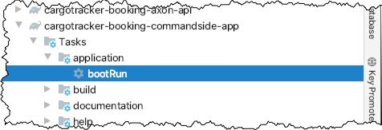
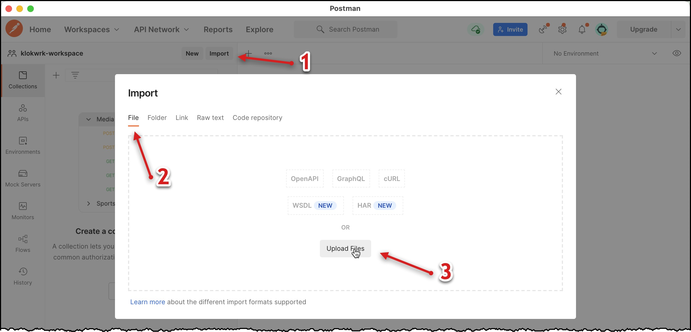
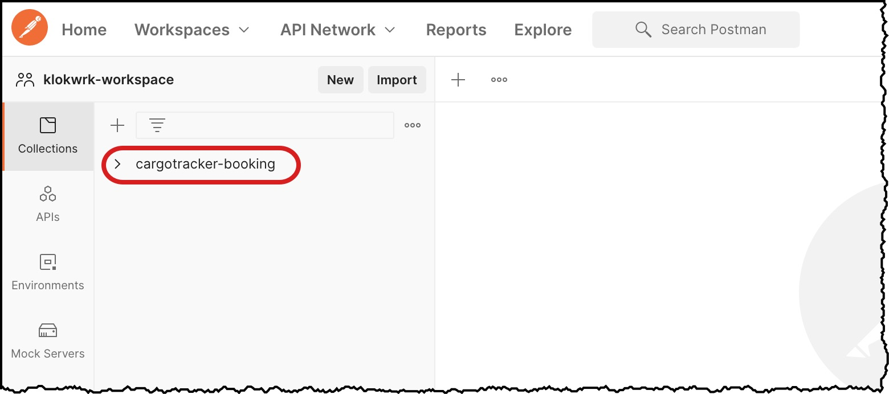
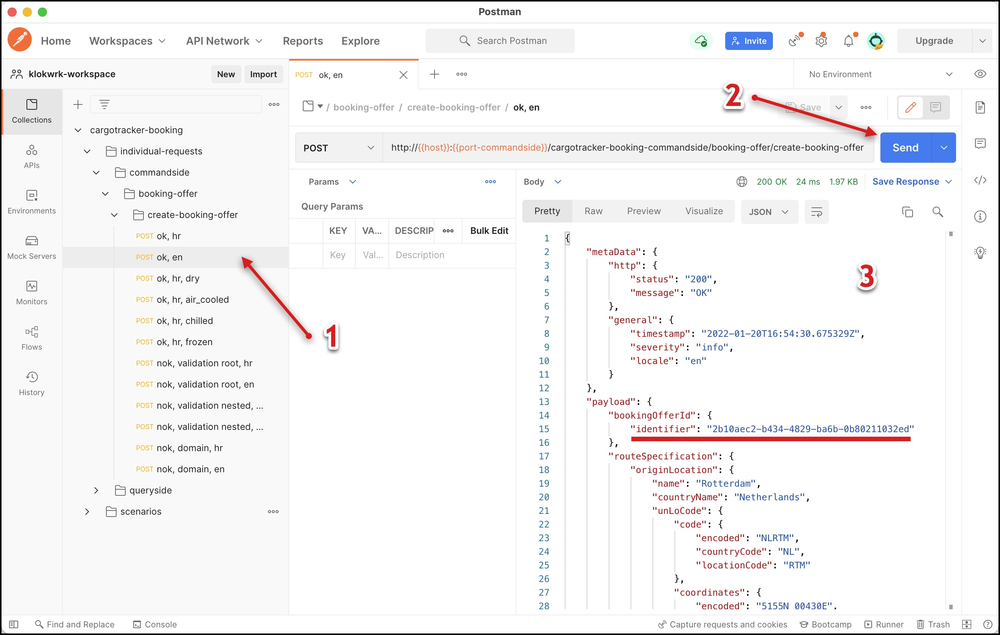
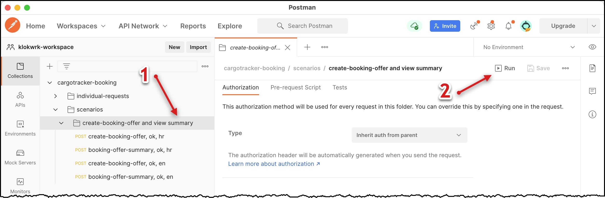
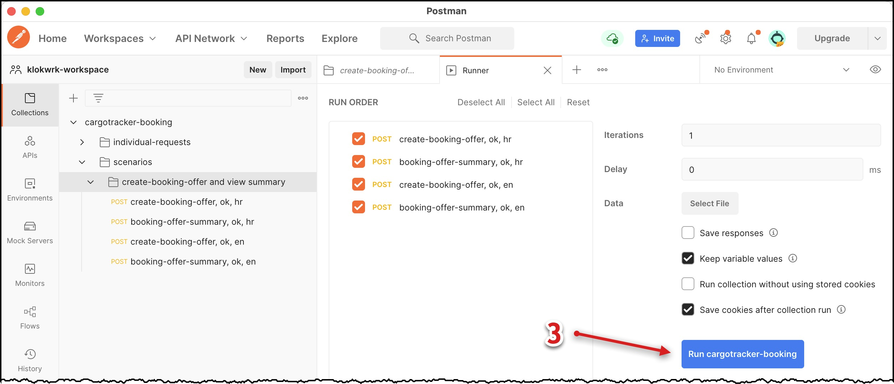
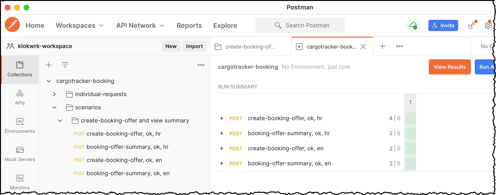
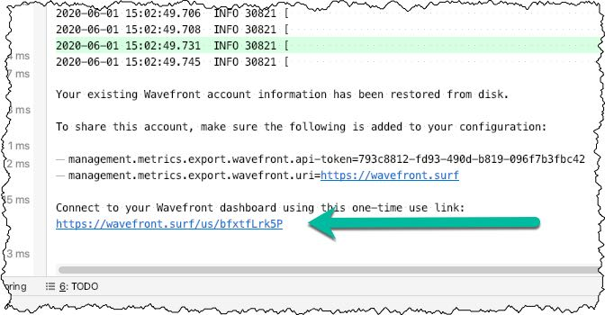

# Starting up and trying the whole thing
* **Author:** Damir Murat
* **Created:** 26.05.2020.
* **Updated:** 21.01.2022.

Environment:
- OSX (should work with any desktop Linux distro and with Windows with appropriate bash-shell like git-bash)
- JDK 11 (should work with JDK 8)
- Gradle 7.0.2
- IDEA Community/Ultimate 2021.3.1
- Docker
- Postman

## Compile and test
### Application artifacts
For **compiling classes and tests**, open your shell (shell-1) at the project root and execute the following command:

    ./gradlew assemble testClasses testIntegrationClasses testComponentClasses --parallel -x groovydoc

When the command finishes, we have all the necessary artifacts for running applications. Therefore, just for running applications, the following commands are not required, but you will need them to
develop or contribute to the `klokwrk-project`.

### Tests and other checks
For **running all tests**, execute the following command. Note that Docker daemon must be running to perform integration and component tests:

    ./gradlew test --parallel && ./gradlew bootBuildImage && ./gradlew testIntegration -PdisableTestRetry --parallel && ./gradlew testComponent -PdisableTestRetry --parallel

To **verify code conventions** compliance, execute the following command:

    ./gradlew aggregateCodenarc

To **generate and see the cumulative Groovydoc documentation**, execute the following commands:

    ./gradlew aggregateGroovydoc
    open build/docs/aggregate-groovydoc/index.html

To **generate and see the cumulative JaCoCo code coverage report**, execute the following commands:

    ./gradlew aggregateJacocoReport
    open build/reports/jacoco/aggregate/html/index.html

## Running and exercising applications
As in most distributed systems, we have multiple applications to run. Some of them are functional, while others have a supportive role. In addition, we also have required infrastructural pieces.

### Starting applications
In our case, infrastructure comprises Axon Server and PostgreSQL database. To **start those infrastructural components**, open the new shell (shell-2) at the project root and execute the following
commands:

    cd support/docker
    ./dockerComposeInfrastructureUp.sh

Open the next shell (shell-3) at the root of the project. We first have to **execute a database schema management application**. It will migrate the database schema to the state expected by other
applications (it wraps [flyway](https://flywaydb.org/) for implementing database migrations):

    ./gradlew -p cargotracker/cargotracker-booking-rdbms-management-app bootRun

Alternatively, you can use corresponding shell script:

    cd support/docker
    ./dockerComposeRdbmsMigration.sh

Now we are ready for **running functional applications**. First, please make sure you are at the root of the project, and then execute the following commands, each one from a separate shell (shell-3,
shell-4, and shell-5 where shell-3 is reused from the previous step). Wait until applications are fully started:

    ./gradlew -p cargotracker/cargotracker-booking-commandside-app bootRun
    ./gradlew -p cargotracker/cargotracker-booking-queryside-rdbms-projection-app bootRun
    ./gradlew -p cargotracker/cargotracker-booking-queryside-app bootRun

If you prefer, you might want to run applications from IDE. In that case, select the application's `bootRun` Gradle task as is shown in the picture for the `cargotracker-booking-commandside-app`
application.

### Stopping applications
Once experimenting is finished, you will want to stop applications. But, of course, do not do this yet if you intend to read the sections below.

If you've started applications from IDEA, you can stop them with the `CMD+F2` keyboard shortcut or via IDEA's "Run" tool window. For applications started from CLI, use the `CTRL+C` shortcut.

Since we started infrastructural components from CLI, `CTRL+C` will be handy again. However, this will only stop docker-compose log tailing. For a full stop of infrastructure components and cleaning
them up properly, execute `./dockerComposeInfrastructureDown.sh` shell script (from shell-2).

### Executing HTTP requests via Postman
For executing HTTP requests, we will use [Postman](https://www.postman.com/). Please [download](https://www.postman.com/downloads/) a free local application for your OS and install it if you don't
have it already.

First, you have to import `support/http-request/postman/klokwrk-workspace/cargotracker-booking.postman_collection.json` collection.

>  
> Note: Every time the collection source file changes, the collection must be deleted and reimported in Postman.  
>  

Inside your Postman workspace, click on `Import` button, select `File` tab in `Import` dialog, and click on `Upload Files` button:

Navigate to the `support/http-request/postman/klokwrk-workspace/cargotracker-booking.postman_collection.json` collection and open it. Then, in the `Import` dialog, click the `Import` button to finish
the process. Now, you should have your `cargotracker-booking` collection available.

#### Commandside requests
For executing some command requests, expand the collection and navigate to `cargotracker-booking/individual-requests/commandside/booking-offer/create-booking-offer`. Here `create-booking-offer`
folder corresponds to multiple variations of the `CreateBookingOfferCommand` command from the `cargotracker-booking-commandside-app` application.

For example, select the `ok, en` request and click the `Send` button. You should get the appropriate response:

The previous command request returns a response containing the **booking offer identifier** in the payload (`$.payload.bookingOfferId.identifier`). Utilizing some Postman scripting features, that
identifier is remembered and made available for subsequent queryside requests.

There are more commandside requests available. Feel free to experiment with them.

#### Queryside requests
Before executing queryside requests, remember they rely on identifiers returned from previously performed commandside requests.

Otherwise, queryside request execution is very similar to the commandside. In this case, navigate to the `cargotracker-booking/individual-requests/queryside/booking-offer/booking-offer-summary-find-by-id`
folder and pick and execute the request. Again, the results should be similar to commandside requests.

#### Scenarios
Besides individual request execution, Postman also supports the execution of scenarios. In that way, we can organize sequences of dependent requests to exercise complete use cases of the system.

To execute a scenario from our collection, navigate to `cargotracker-booking/scenarios`, click a folder corresponding to the scenario, and click on the `Run` button in the scenario's tab:

This will open the `Runner` tab, where you should click the `Run collection-name` button to execute it:

Each request from the scenario contains tests that verify if a particular request was successful or not:

### Exploring Wavefront integration
Since the 2.3.0 version, Spring Boot provides out-of-the-box free integration with Wavefront observability service. It offers zero-setup and feature-rich alternative to the standard observability
solutions like Prometheus (metrics collection), Zipkin (distributed tracing) and Grafana (visualization) combo. Wavefront is very convenient and effortless to use from a development environment.

Here is a very brief overview of Wavefront usage for a `klokwrk-project`:
- Start all applications as described previously. From the output of any application, copy the link to the Wavefront service.

  

- Execute a dozen of commandside and queryside requests as described above, to provide some data to the Wavefront.
- Open previously copied Wavefront link and start exploring. The following resources will get you quickly up to speed:  
  - [Tanzu Observability by Wavefront for Spring Boot Applications](https://www.youtube.com/watch?v=Jxwf-Iw-3T8)  
  - [Wavefront for Spring Boot](https://docs.wavefront.com/wavefront_springboot.html)  
  - [Wavefront for Spring Boot Tutorial](https://docs.wavefront.com/wavefront_springboot_tutorial.html)

### Supportive Gradle tasks
While working on a project, a developer often needs access to various pieces of information about the current state of a project. These reports might provide beneficial information about code quality
and can point to the areas which require some attention and improvements. Project Klokwrk has a dozen of Gradle tasks that provide such information. They can be run for each individual module, or
from the project's root.

>  
> Note: Before executing any of commands bellow, position your terminal prompt at the project's root.  
>  

- `./gradlew test --parallel`

  Executes all unit tests while providing convenient colored CLI output.

- `./gradlew testIntegration --parallel`

  Executes all Docker containerized integration tests (for more details, take a look at [ADR-0010 - Integration Testing with Containerized Infrastructure](../../adr/content/0010-integration-testing-with-containerized-infrastructure.md)).

- `./gradlew testComponent --parallel`

  Executes all Docker containerized component tests (for more details, take a look at [ADR-0011 - Component Testing](../../adr/content/0011-component-testing.md)).

- `./gradlew allTestReports`

  Creates a cumulative report of all unit, integration and component tests for all subprojects. You can open it from CLI with

      open build/reports/allTestReports/index.html

- `./gradlew allTestUnitReports`, `./gradlew allTestIntegrationReports`, `./gradlew allTestComponentReports`

  These commands create cumulative reports for each supported test type.

- `./gradlew aggregateJacocoReport`

  Creates a cumulative code coverage report accessible at `build/reports/jacoco/aggregate/html/index.html`

- `./gradlew aggregateCodenarc`

  Creates a cumulative CodeNarc report accessible at `build/reports/codenarc/aggregate.html`.

- `./gradlew aggregateGroovydoc`

  Creates a cumulative documentation for the whole project accessible at `build/docs/aggregate-groovydoc/index.html`.
