# Starting up and trying the whole thing
* **Author:** Damir Murat
* **Created:** 26.05.2020.
* **Updated:** 30.07.2023.

Environment:
- OSX (should work with any desktop Linux distro and with Windows with appropriate bash-shell like git-bash)
- JDK 17
- Gradle 7.6.1
- IDEA Community/Ultimate 2023.2.0
- Docker
- Postman

## Cloning
To **clone** the klokwrk project, open your shell (shell-1) at the desired location and execute the following command:

    git clone https://github.com/croz-ltd/klokwrk-project.git

You will end up with the new `klokwrk-project` directory created. Change your directory location into the `klokwrk-project`, which is, from now on, considered as a **root project directory** in the
rest of this document.

### Gradle wrapper helper
Klokwrk uses Gradle as a build system. In particular, executing each Gradle command assumes you are using the Gradle Wrapper (contained in the project's root `gradle` directory). You should not use
any other Gradle version for building the klokwrk.

However, the Gradle Wrapper can be cumbersome to use at times. Therefore, it is recommended to use one of the available Gradle Wrapper helper tools, like [gng](https://github.com/gdubw/gng) (used by
the klokwrk team) or [gum](https://github.com/kordamp/gm).

In the rest of the document, I will use the `gw` command as a convenient helper over the original `./gradlew` command. If you don't want to use such a helper, just substitute `gw` with `./gradlew`
and you should be fine.

## Compile and test
### Application artifacts
For **compiling classes and tests**, from the project root directory, execute the following command (when executed for the first time, this can take a while):

    gw assemble testFixturesClasses testClasses testIntegrationClasses testComponentClasses --parallel -x groovydoc

When the command finishes, we have all the necessary artifacts for running applications. Therefore, just for running applications, the following commands are not required, but you will need them to
develop or contribute to the `klokwrk-project`.

### Tests and other checks (optional)
For **running all tests**, execute the following command. Note that Docker daemon must be running to perform integration and component tests:

    gw test --parallel && gw bootBuildImage && gw testIntegration -PdisableTestRetry --parallel && gw testComponent -PdisableTestRetry --parallel

To **verify code conventions** compliance, execute the following command:

    gw aggregateCodenarc

To **generate and see the cumulative Groovydoc documentation**, execute the following commands:

    gw aggregateGroovydoc
    open build/docs/aggregate-groovydoc/index.html

To **generate and see the cumulative JaCoCo code coverage report**, execute the following commands:

    gw aggregateJacocoReport
    open build/reports/jacoco/aggregate/html/index.html

### Exploring the latest changelog (optional)
After cloning the klokwrk, you have likely checked out a snapshot version. Unfortunately, GitHub does not make public published changelogs for non-released versions. Therefore, you can not just
simply go to the website and explore what is happening lately.

However, if you are interested, there is a way to generate a changelog in a local environment:
- install the [jreleaser](https://jreleaser.org/) tool locally. The simplest way is to use [SdkMan](https://sdkman.io/):

      sdk install jreleaser

- execute the following commands:

      env JRELEASER_PROJECT_VERSION=1.7.0 JRELEASER_GITHUB_TOKEN=1 \
      jreleaser changelog --basedir=. --config-file=./support/jreleaser/jreleaser-draft.yml --debug

      open out/jreleaser/release/CHANGELOG.md

The changelog will not be rendered as lovely as on GitHub, but you can see the latest updates on the project.

## Importing the klokwrk in IDEA
This step is not mandatory but can be very useful if you want to explore the details.

From the welcome screen of IntelliJ IDEA, click on the Open button (upper right) and navigate to the `klokwrk-project` directory that you've checked out previously. Next, select the `klokwrk-project`
directory and click Open. You should wait until IDEA completes the import.

At the root level, klokwrk is pretty compact compared to what you might have seen in some other projects. This is because all code artifacts are organized under a single directory - `modules`. If you
start exploring, you will undoubtedly notice a very noisy way IDEA uses by default for rendering module names with so-called qualifiers.

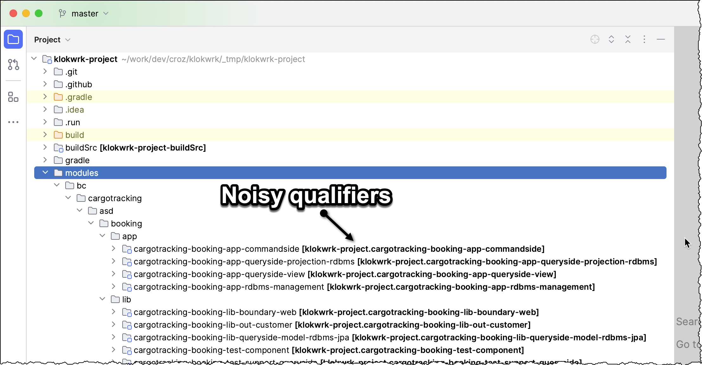

Luckily, there is an undocumented way to get rid of that noise. From IDEA, open the file `.idea/gradle.xml` in the editor. In that XML file, locate `project/component/option/GradleProjectSettings`
node. Now add the `useQualifiedModuleNames` option beneath it as shown in the following listing:

    <?xml version="1.0" encoding="UTF-8"?>
    <project version="4">
      ...
      <component name="GradleSettings">
        <option name="linkedExternalProjectsSettings">
          <GradleProjectSettings>
            <option name="useQualifiedModuleNames" value="false" />
            ...

After saving `.idea/gradle.xml`, you must reload all Gradle projects (use the Gradle Tool window and its Reload All Gradle Projects button), and unfortunate qualifiers will be gone.

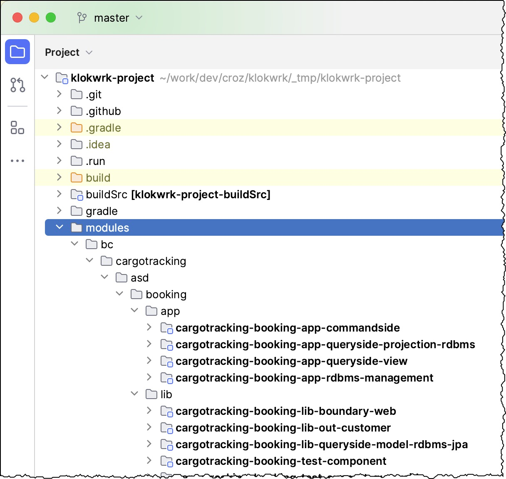

## Running and exercising applications
As in most distributed systems, we have multiple applications to run. Some of them bring actual functionality, while others have a supportive role. In addition, we also have required infrastructural
pieces.

### Starting applications
In our case, infrastructure comprises Axon Server and PostgreSQL database. To **start those infrastructural components**, open the new shell (shell-2) at the project root and execute the following
commands:

    cd support/docker
    ./dockerComposeInfrastructureUp.sh

Open the next shell (shell-3) at the root of the project. Before we run applications, we must **execute a database schema management application** first. It will migrate the database schema to the
state expected by other applications (it wraps [flyway](https://flywaydb.org/) for implementing database migrations):

    gw :cargotracker-booking-rdbms-management-app:bootRun

or

    gw -p modules/bc/cargotracking/asd/booking/app/cargotracker-booking-rdbms-management-app bootRun

Alternatively, you can use corresponding shell script:

    cd support/docker
    ./dockerComposeRdbmsMigration.sh

Now we are ready for **running functional applications**. First, please make sure you are at the root of the project, and then execute the following commands, each one from a separate shell (shell-3,
shell-4, and shell-5 where shell-3 is reused from the previous step). Wait until applications are fully started:

    gw :cargotracking-booking-app-commandside:bootRun
    gw :cargotracking-booking-app-queryside-projection-rdbms:bootRun
    gw :cargotracker-booking-queryside-view-app:bootRun

or

    gw -p modules/bc/cargotracking/asd/booking/app/cargotracking-booking-app-commandside bootRun
    gw -p modules/bc/cargotracking/asd/booking/app/cargotracking-booking-app-queryside-projection-rdbms bootRun
    gw -p modules/bc/cargotracking/asd/booking/app/cargotracker-booking-queryside-view-app bootRun

If you prefer, you might want to run applications from IDE. In that case, select the application's `bootRun` Gradle task as is shown in the picture for the `cargotracking-booking-app-commandside`
application.

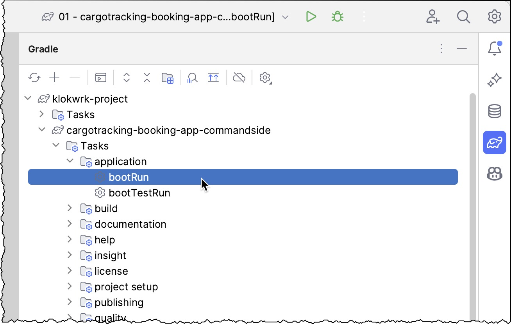

There is also an additional, more convenient, and easier way via the IDEA Run toolbar, which has been populated with appropriate run configurations during klokwrk import.

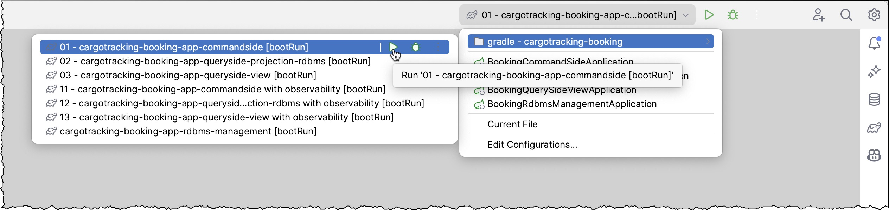

### Stopping applications
Once experimenting is finished, you will want to stop applications. But, of course, do not do this yet if you intend to read the sections below.

If you've started applications from IDEA, you can stop them with the `CMD+F2` keyboard shortcut or via IDEA's Run tool window. For applications started from CLI, use the `CTRL+C` shortcut.

Since we started infrastructural components from CLI, `CTRL+C` will be handy again. However, this will only stop docker-compose log tailing. For a full stop of infrastructure components and cleaning
them up properly, execute the following shell script (from shell-2):

    ./dockerComposeInfrastructureDown.sh

### Executing HTTP requests via Postman
For executing HTTP requests, we will use [Postman](https://www.postman.com/). Please [download](https://www.postman.com/downloads/) a free local application for your OS and install it if you don't
have it already.

First, you have to import `support/http-request/postman/klokwrk-workspace/cargotracker-booking.postman_collection.json` collection.

>  
> Note: Every time the collection source file changes, the collection must be deleted and reimported in Postman.  
>  

Inside your Postman workspace, click on `Import` button, select `File` tab in `Import` dialog, and click on `Upload Files` button:

Navigate to the `support/http-request/postman/klokwrk-workspace/cargotracker-booking.postman_collection.json` collection and open it. Then, in the `Import` dialog, click the `Import` button to finish
the process. Now, you should have your `cargotracker-booking` collection available.

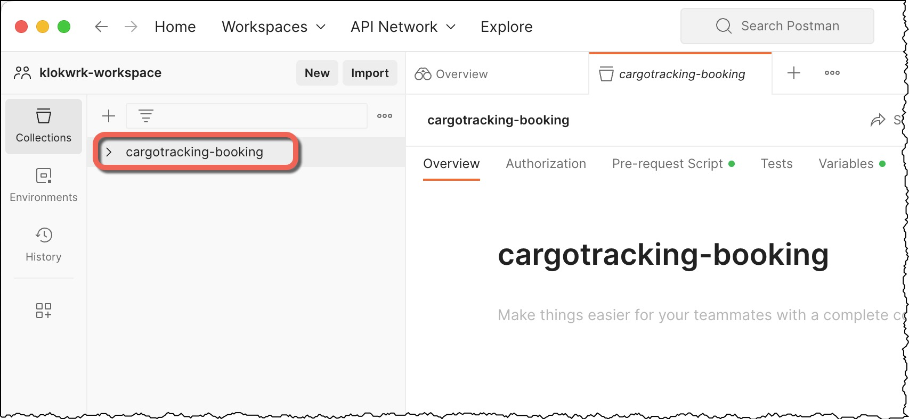

#### Commandside requests
For executing some command requests, expand the collection and navigate to `cargotracker-booking/individual-requests/commandside/booking-offer/create-booking-offer`. Here `create-booking-offer`
folder corresponds to multiple variations of the `CreateBookingOfferCommand` command from the `cargotracking-booking-app-commandside` application.

For example, select the `ok, en` request and click the `Send` button. You should get the appropriate response:

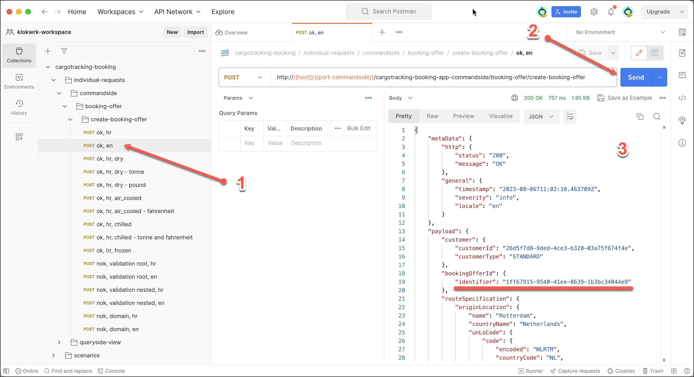

The previous command request returns a response containing the **booking offer identifier** in the payload (`$.payload.bookingOfferId.identifier`). Utilizing some Postman scripting features, that
identifier is remembered and made available for subsequent queryside requests.

There are more commandside requests available. Feel free to experiment with them.

#### Queryside requests
Before executing queryside requests, remember they rely on identifiers returned from previously performed commandside requests.

Otherwise, queryside request execution is very similar to the commandside. In this case, navigate to the
`cargotracker-booking/individual-requests/queryside-view/booking-offer/booking-offer-summary-find-by-id` folder and pick and execute the request. Again, the results should be similar to commandside
requests.

#### Scenarios
Besides individual request execution, Postman also supports the execution of scenarios. In that way, we can organize sequences of dependent requests to exercise complete use cases of the system.

To execute a scenario from our collection, navigate to `cargotracker-booking/scenarios`, click a folder corresponding to the scenario, and click on the `Run` button in the scenario's tab:

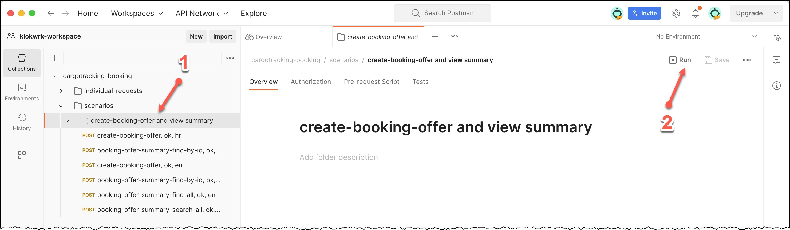

This will open the `Runner` tab, where you should click the `Run collection-name` button to execute it:

Each request from the scenario contains tests that verify if a particular request was successful or not:

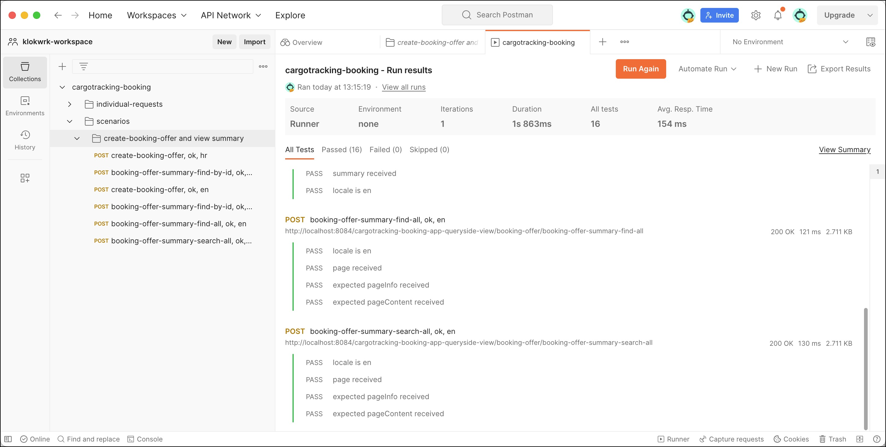

### Supportive Gradle tasks
While working on a project, a developer often needs access to various pieces of information about the current state of a project. These reports might provide beneficial information about code quality
and can point to the areas which require some attention and improvements. Project Klokwrk has a dozen of Gradle tasks that provide such information. They can be run for each individual module, or
from the project's root.

>  
> Note: Before executing any of commands bellow, position your terminal prompt at the project's root.  
>  

- `gw test --parallel`

  Executes all unit tests while providing convenient colored CLI output.

- `gw testIntegration --parallel`

  Executes all Docker containerized integration tests (for more details, take a look at [ADR-0010 - Integration Testing with Containerized Infrastructure](../../adr/content/0010-integration-testing-with-containerized-infrastructure.md)).

- `gw testComponent --parallel`

  Executes all Docker containerized component tests (for more details, take a look at [ADR-0011 - Component Testing](../../adr/content/0011-component-testing.md)).

- `gw allTestReports`

  Creates a cumulative report of all unit, integration and component tests for all subprojects. You can open it from CLI with

      open build/reports/allTestReports/index.html

- `gw allTestUnitReports`, `gw allTestIntegrationReports`, `gw allTestComponentReports`

  These commands create cumulative reports for each supported test type.

- `gw aggregateJacocoReport`

  Creates a cumulative code coverage report accessible at `build/reports/jacoco/aggregate/html/index.html`

- `gw aggregateCodenarc`

  Creates a cumulative CodeNarc report accessible at `build/reports/codenarc/aggregate.html`.

- `gw aggregateGroovydoc`

  Creates a cumulative documentation for the whole project accessible at `build/docs/aggregate-groovydoc/index.html`.

## Observability with Grfana Cloud (optional)
To support observability features (metrics, logs, and traces), klokwrk uses the free plan of [Grafana Cloud](https://grafana.com/) offering. The instrumentation of applications is based on
Spring Boot's micrometer support and OpenTelemetry. For integrating OpenTelemetry with Grafana, klokwrk uses the [grafana-opentelemetry-starter](https://github.com/grafana/grafana-opentelemetry-starter)
library, and for instrumenting Axon components, the [axon-micrometer](https://github.com/AxonFramework/AxonFramework/blob/master/metrics-micrometer/pom.xml) library.

The delivery of observability data to the Grafana Cloud leverages [Grafana Agent](https://github.com/grafana/agent), a single infrastructure component required to run locally (inside the Docker
container).

### Configuring observability infrastructure
As a first step, you have to assign for a [permanent free plan](https://grafana.com/products/cloud/) at Grafana Clod. Make sure you save your Grafana Cloud API key in a safe place.

Second, you must configure Grafana Agent for authorized access to all required components of your Grafana Cloud profile. That includes providing URLs and usernames for provisioned Grafana Cloud's
Prometheus, Loki, and Tempo servers and your Grafana Cloud API key. Assuming you have the API key already, other information can be found on the
[https://grafana.com/profile/org](https://grafana.com/profile/org) page.

Now, you must provide that information to the Grafana Agent on your machine. You can do this in the following way:
- create `support/docker/grafana/grafana-agent/agent.env` file. It will contain all necessary config data as environment variables. And do not worry; the `agent.env` is added to the git ignore list,
  so you will not accidentally commit it.
- copy the content of `support/docker/grafana/grafana-agent/agent.env.sample` file in the `agent.env`. The sample file contains comments with dummy URLs which should make it easy to guess the proper
  format of URLs (Grafana Cloud instructions are not always clear enough).

### Running with observability
Running the application with observability enabled is similar to running it [without observability](#running-and-exercising-applications). The differences are listed below:
- to run the infrastructure with Grafana Agent included, use the `dockerComposeInfrastructureUpWithObservability.sh` script:

      ./dockerComposeInfrastructureUpWithObservability.sh

- to run applications with required environment variables set up, use IDEA run configurations with names ending with "`with observability [bootRun]`" as shown in the following picture:
  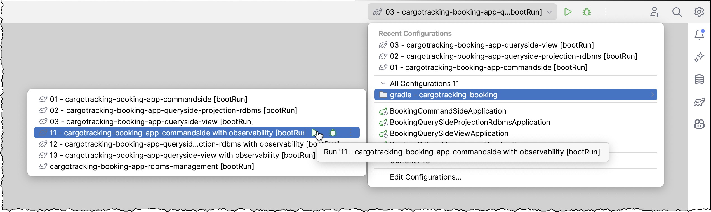

### Exploring observability data
After [executing some commands and queries](#executing-http-requests-via-postman), you can access Grafana Cloud UI at `https://your-org.grafana.net/a/cloud-home-app` and explore the collected data.
For example, you can analyze the logs and related traces as shown in the following picture:

[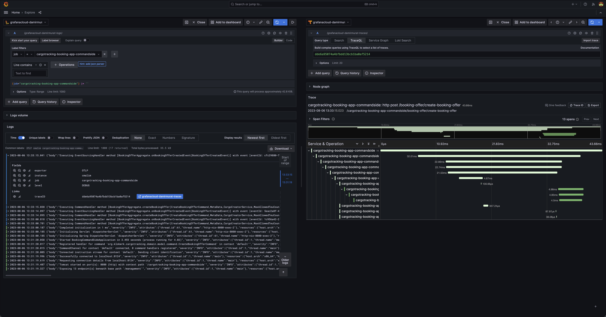](images/12-grafana-explore-logs-and-traces.jpg "Exploring logs and traces")

Another way is to import in Grafana some of the prepared dashboards from the `support/docker/grafana/dashboards` directory:

>  
> Note: Every time the dashboard source file changes, the dashboard should be reimported in Grafana.  
>  

- `klokwrk - Axon app - simple metrics.json` 
  The dashboard displays simple metrics for commands, events, and queries processed by the Axon application. This dashboard is a modification of the original AxonIQ's
  "[Axon Framework Application](https://grafana.com/grafana/dashboards/12963-axon-spring-boot-applications-statistics/)" dashboard, which didn't work correctly when writing this document.
  [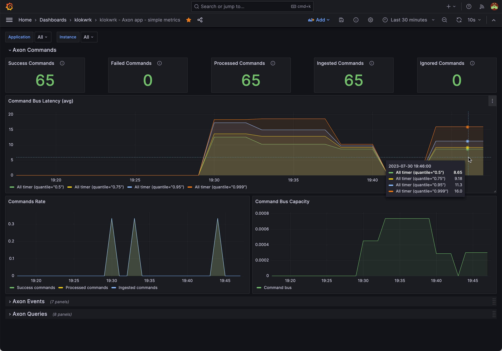](images/13-grafana-dashboard-axon-app-simple-metrics.jpg "Axon app simple metrics dashboard")
